# ARCHITECTURE.md - システム設計書

> 💡 **このドキュメントの目的**
> プロジェクトに初めて参加する方が、システム全体の設計思想を素早く理解できるようにすることです。
> 「なぜこの技術を選んだのか」「なぜこの構成にしたのか」を丁寧に説明します。

---

## 📋 目次

1. [プロジェクト概要](#1-プロジェクト概要)
2. [技術スタック](#2-技術スタック)
3. [システムアーキテクチャ](#3-システムアーキテクチャ)
4. [ディレクトリ構成](#4-ディレクトリ構成)
5. [アーキテクチャパターン（DDD）](#5-アーキテクチャパターンddd)
6. [TDD/テスト戦略](#6-tddテスト戦略)
7. [API設計](#7-api設計)
8. [認証・認可](#8-認証認可)
9. [データベース設計](#9-データベース設計)
10. [コード品質](#10-コード品質)
11. [開発ワークフロー](#11-開発ワークフロー)

---

## 1. プロジェクト概要

### プロジェクト名
**Twitter クローン - TDD/DDD 学習プロジェクト**

### 目的・ゴール
このプロジェクトは、以下を学ぶための実践的な教材です：

- ✅ **TDD（テスト駆動開発）**: テストを先に書いて品質を保証する開発手法
- ✅ **DDD（ドメイン駆動設計）**: ビジネスロジックを中心に据えた設計手法
- ✅ **モダンなフルスタック開発**: React + Laravel の実践的な組み合わせ
- ✅ **保守性の高いコード**: チームで開発しても破綻しないコードの書き方

### 主要な機能
- ユーザー認証（登録・ログイン・ログアウト）
- ツイート投稿・表示・削除
- いいね機能
- フォロー機能
- タイムライン表示

### 対象ユーザー
- 学習者（このプロジェクトを通じて技術を学ぶエンジニア）

---

## 2. 技術スタック

### 2.1. フロントエンド

| 技術 | バージョン | 選定理由 |
|-----|----------|---------|
| **React** | 18+ | - 宣言的UI、コンポーネントベース<br>- 豊富なエコシステム<br>- 学習リソースが充実 |
| **Vite** | 5+ | - 高速な開発サーバー起動<br>- HMR（ホットモジュールリプレースメント）<br>- モダンなビルドツール |
| **TypeScript** | 5+ | - 静的型チェックでバグを早期発見<br>- IDEのサポートが強力<br>- 大規模開発に適している |
| **Tailwind CSS** | 3+ | - ユーティリティファーストで開発速度向上<br>- デザインの一貫性を保ちやすい<br>- カスタマイズ性が高い |
| **Vitest** | 1+ | - Viteとの統合が優れている<br>- 高速なテスト実行<br>- Jest互換のAPI |
| **React Testing Library** | 14+ | - ユーザー視点のテストが書ける<br>- React公式推奨のテストライブラリ |

### 2.2. バックエンド

| 技術 | バージョン | 選定理由 |
|-----|----------|---------|
| **Laravel** | 11 | - PHPの最も人気のあるフレームワーク<br>- 規約が明確で保守しやすい<br>- 豊富な機能が標準搭載 |
| **PHP** | 8.2+ | - タイプヒンティング、列挙型など最新機能<br>- パフォーマンス向上<br>- Laravel 11の要件 |
| **PostgreSQL** | 16 | - **完全なオープンソース**（無料）<br>- 高い信頼性と堅牢性<br>- JSONサポートなど高機能<br>- Laravelで完全サポート |
| **Pest** | 2+ | - 可読性の高いテストコード<br>- Laravel専用に最適化<br>- モダンなテストフレームワーク |
| **Laravel Sanctum** | 4+ | - SPA認証に最適<br>- シンプルで設定が容易<br>- Laravel公式パッケージ |

### 2.3. インフラ・ツール

| 技術 | バージョン | 選定理由 |
|-----|----------|---------|
| **Docker Compose** | - | - 開発環境の統一<br>- 簡単なセットアップ<br>- 本番環境に近い構成 |
| **Nginx** | alpine | - リバースプロキシでCORS解決<br>- 高性能なWebサーバー<br>- 軽量なAlpineイメージ |
| **Biome** (フロントエンド) | 1+ | - ESLint + Prettierの代替（高速）<br>- 統合リンター&フォーマッター |
| **Laravel Pint** (バックエンド) | 1+ | - Laravel公式フォーマッター<br>- PSR-12準拠<br>- ゼロコンフィグ |

### 2.4. なぜこの組み合わせ？

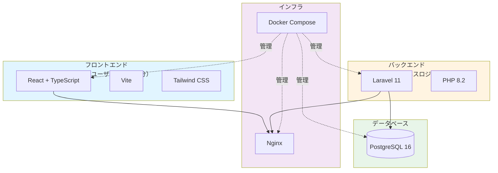

**選定理由のまとめ**:
- **React + Laravel**: 業界標準の組み合わせ、豊富な学習リソース
- **TypeScript**: 型安全性で大規模開発に対応
- **PostgreSQL**: 完全無料、高機能、信頼性
- **Docker**: 環境差異をなくし、誰でも同じ環境で開発できる

---

## 3. システムアーキテクチャ

### 3.1. 全体像

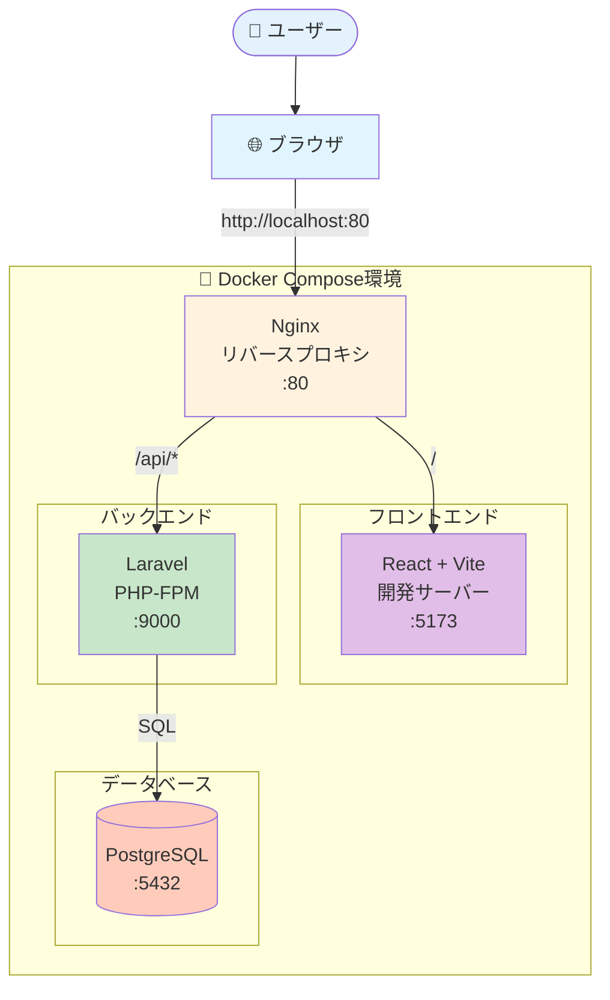

### 3.2. リクエストフロー

**ケース1: フロントエンドへのアクセス**

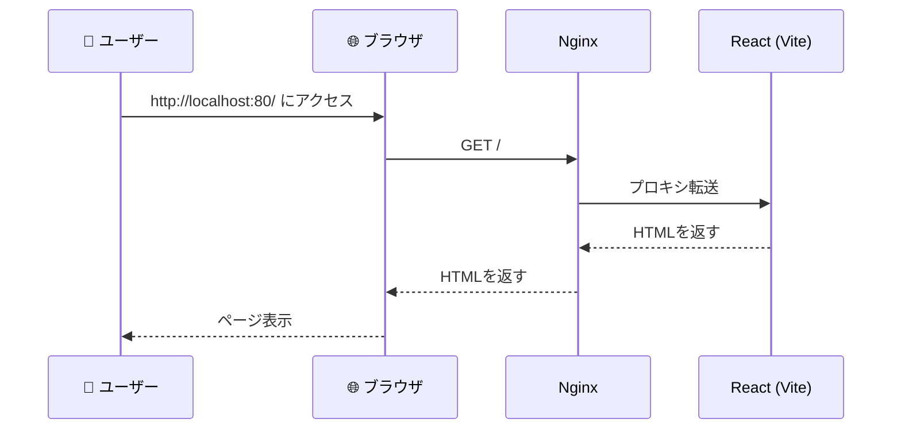

**ケース2: API呼び出し（ツイート一覧取得）**

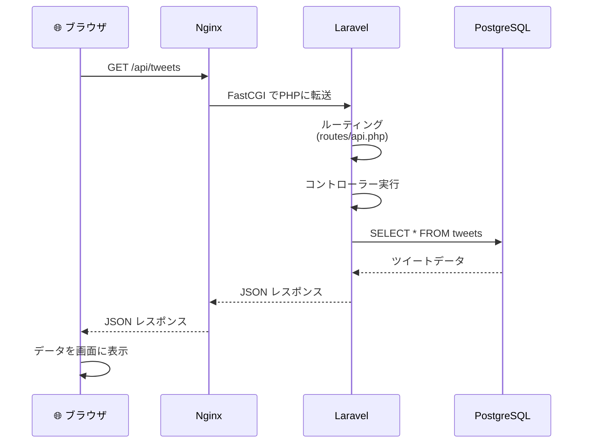

### 3.3. CORS問題の解決

> 💡 **CORS（Cross-Origin Resource Sharing）とは？**
> 異なるオリジン（ドメイン、ポート）間でのリクエストを制限するブラウザのセキュリティ機能です。

**従来の問題（Dockerなしの場合）**:
```
React (http://localhost:5173)
  ↓ APIリクエスト
Laravel (http://localhost:8000)
  ↓ ❌ CORS エラー！（オリジンが異なる）
```

**Nginxリバースプロキシによる解決**:
```
ユーザー
  ↓
Nginx (http://localhost:80) ← 単一のオリジン
  ├→ / → React
  └→ /api → Laravel

✅ すべて同じオリジンからアクセス！CORS問題なし！
```

---

## 4. ディレクトリ構成

### 4.1. プロジェクト全体

```
twitter-app/
├── backend/                    # Laravelプロジェクト
├── frontend/                   # Reactプロジェクト
├── docker/                     # Docker設定
│   ├── nginx/
│   │   └── default.conf       # Nginx設定
│   ├── laravel/
│   │   └── Dockerfile
│   └── react/
│       └── Dockerfile
├── docker-compose.yml          # Docker Compose設定
├── CLAUDE.md                   # 開発ガイドライン
├── ARCHITECTURE.md             # このファイル
└── README.md                   # プロジェクト概要
```

### 4.2. バックエンド（Laravel）- DDD対応

> 📖 **DDD（ドメイン駆動設計）とは？**
> ビジネスロジック（「何をするシステムか」）を中心に据えた設計手法です。
> 技術的な詳細（データベースなど）はビジネスロジックから分離します。

```
backend/
├── app/
│   ├── Http/                           # 🎨 Presentation Layer（表示層）
│   │   ├── Controllers/                # コントローラー（薄く保つ）
│   │   │   └── TweetController.php
│   │   ├── Requests/                   # バリデーションルール
│   │   │   └── StoreTweetRequest.php
│   │   └── Resources/                  # JSONレスポンス整形
│   │       └── TweetResource.php
│   │
│   ├── Application/                    # 📋 Application Layer（アプリケーション層）
│   │   ├── UseCases/                   # ユースケース（処理の流れ）
│   │   │   └── Tweet/
│   │   │       ├── CreateTweetUseCase.php
│   │   │       └── GetTimelineUseCase.php
│   │   └── DTOs/                       # データ転送オブジェクト
│   │       └── CreateTweetData.php
│   │
│   ├── Domain/                         # 💎 Domain Layer（ドメイン層）- 最重要
│   │   ├── Tweet/                      # Tweetコンテキスト
│   │   │   ├── Entities/               # エンティティ（IDを持つ）
│   │   │   │   └── Tweet.php
│   │   │   ├── ValueObjects/           # 値オブジェクト（不変）
│   │   │   │   ├── TweetBody.php      # ツイート本文（280文字制限）
│   │   │   │   └── TweetId.php
│   │   │   ├── Repositories/           # リポジトリインターフェース
│   │   │   │   └── TweetRepositoryInterface.php
│   │   │   ├── Services/               # ドメインサービス
│   │   │   │   └── TweetValidationService.php
│   │   │   └── Events/                 # ドメインイベント
│   │   │       └── TweetPosted.php
│   │   │
│   │   └── User/                       # Userコンテキスト
│   │       ├── Entities/
│   │       │   └── User.php
│   │       └── ValueObjects/
│   │           ├── EmailAddress.php
│   │           └── Username.php
│   │
│   └── Infrastructure/                 # 🔧 Infrastructure Layer（インフラ層）
│       ├── Eloquent/                   # Eloquent Models
│       │   ├── TweetModel.php
│       │   └── UserModel.php
│       └── Repositories/               # リポジトリ実装
│           └── EloquentTweetRepository.php
│
├── database/
│   ├── migrations/                     # マイグレーション
│   ├── factories/                      # テストデータ生成
│   └── seeders/                        # 初期データ投入
│
├── tests/
│   ├── Feature/                        # フィーチャーテスト（API統合テスト）
│   ├── Unit/                           # ユニットテスト
│   │   ├── Domain/                     # ドメインロジックのテスト
│   │   └── Application/                # ユースケースのテスト
│   └── Integration/                    # インテグレーションテスト
│
└── routes/
    └── api.php                         # APIルート定義
```

**各レイヤーの役割**:

| レイヤー | 役割 | 例 |
|---------|------|---|
| **Presentation** | ユーザーからの入力を受け取り、結果を返す | コントローラー、JSONレスポンス |
| **Application** | ユースケースの調整、トランザクション管理 | ツイート投稿処理の流れ |
| **Domain** | ビジネスルールの中核（最重要） | 「ツイートは280文字まで」 |
| **Infrastructure** | 技術的な詳細（DB、外部API） | Eloquent Model、DB操作 |

### 4.3. フロントエンド（React）

```
frontend/
├── src/
│   ├── components/                 # Reactコンポーネント
│   │   ├── common/                 # 共通コンポーネント
│   │   │   ├── Button.tsx
│   │   │   └── Input.tsx
│   │   ├── tweets/                 # ツイート関連
│   │   │   ├── TweetForm.tsx
│   │   │   ├── TweetList.tsx
│   │   │   └── TweetCard.tsx
│   │   └── auth/                   # 認証関連
│   │       ├── LoginForm.tsx
│   │       └── RegisterForm.tsx
│   │
│   ├── hooks/                      # カスタムフック
│   │   ├── useTweets.ts           # ツイート取得・投稿
│   │   └── useAuth.ts             # 認証状態管理
│   │
│   ├── services/                   # API通信
│   │   ├── api.ts                 # Axiosインスタンス設定
│   │   ├── tweetService.ts        # ツイートAPI
│   │   └── authService.ts         # 認証API
│   │
│   ├── types/                      # TypeScript型定義
│   │   ├── Tweet.ts
│   │   └── User.ts
│   │
│   ├── contexts/                   # React Context
│   │   └── AuthContext.tsx        # 認証コンテキスト
│   │
│   ├── utils/                      # ユーティリティ関数
│   │   └── dateFormatter.ts
│   │
│   ├── pages/                      # ページコンポーネント
│   │   ├── Home.tsx
│   │   ├── Login.tsx
│   │   └── Profile.tsx
│   │
│   ├── App.tsx                     # ルートコンポーネント
│   └── main.tsx                    # エントリーポイント
│
├── tests/                          # テスト
│   ├── components/
│   └── hooks/
│
└── vite.config.ts                  # Vite設定
```

**ディレクトリの使い分け**:

| ディレクトリ | 役割 | 例 |
|------------|------|---|
| `components/` | UIコンポーネント | ボタン、フォーム、カード |
| `hooks/` | ロジックの分離 | データ取得、状態管理 |
| `services/` | API通信 | Axios呼び出し |
| `types/` | 型定義 | Tweet型、User型 |
| `contexts/` | グローバル状態 | 認証状態 |

---

## 5. アーキテクチャパターン（DDD）

### 5.1. レイヤードアーキテクチャ

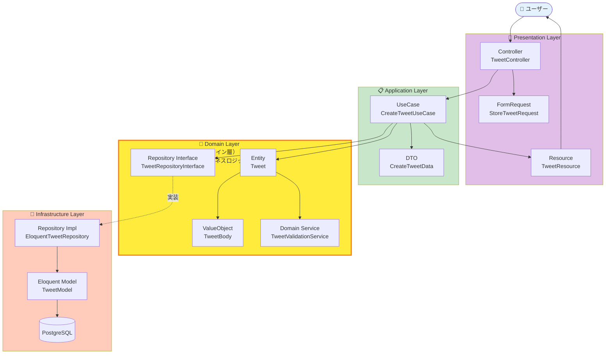

### 5.2. 依存関係の方向

> ⚠️ **重要な原則**: ドメイン層は何にも依存しない！

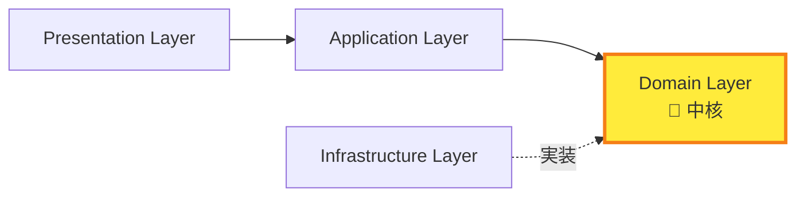

**なぜこの依存方向？**
- **ドメイン層はビジネスルールの中核**: データベースやフレームワークが変わっても、ビジネスルールは変わらない
- **テストしやすい**: ドメイン層はDBなしでテストできる
- **保守しやすい**: ビジネスロジックが一箇所に集約されている

### 5.3. 具体例: ツイート投稿の流れ

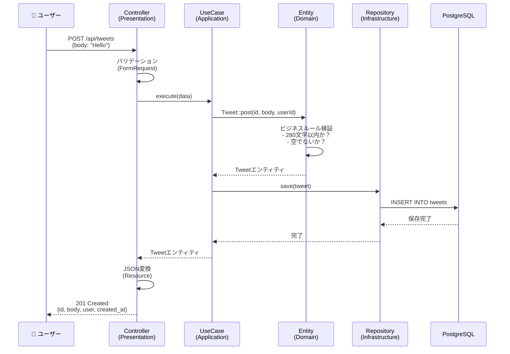

**各層の責務**:
1. **Controller**: リクエスト受付、バリデーション、レスポンス返却
2. **UseCase**: 処理の流れを調整、トランザクション管理
3. **Entity**: ビジネスルール（280文字制限など）
4. **Repository**: データの永続化

---

## 6. TDD/テスト戦略

### 6.1. TDDとは？

> 💡 **TDD（Test-Driven Development / テスト駆動開発）**
> 実装コードを書く**前に**テストを書く開発手法です。

**メリット**:
- ✅ バグの早期発見
- ✅ 仕様の明確化（テスト = 仕様書）
- ✅ リファクタリングしやすい（テストがあるから安心）
- ✅ 設計が良くなる（テストしやすい = 疎結合）

### 6.2. Red-Green-Refactor サイクル

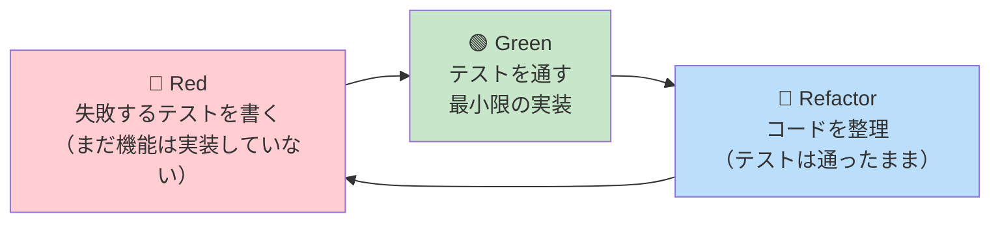

**具体的な流れ**:

**ステップ1: 🔴 Red（失敗するテストを書く）**

```php
// tests/Feature/TweetTest.php

it('認証済みユーザーはツイートを投稿できる', function () {
    $user = User::factory()->create();

    $response = $this->actingAs($user)->postJson('/api/tweets', [
        'body' => 'これはテストツイートです',
    ]);

    $response->assertStatus(201);
    expect($response->json('body'))->toBe('これはテストツイートです');
});
```

**テスト実行** → ❌ 失敗（まだエンドポイントが存在しないため）

**ステップ2: 🟢 Green（テストを通す最小限の実装）**

```php
// routes/api.php
Route::post('/tweets', [TweetController::class, 'store'])->middleware('auth:sanctum');

// app/Http/Controllers/TweetController.php
public function store(StoreTweetRequest $request, CreateTweetUseCase $useCase)
{
    $data = new CreateTweetData(
        body: $request->input('body'),
        userId: $request->user()->id
    );

    $tweet = $useCase->execute($data);

    return new TweetResource($tweet);
}
```

**テスト実行** → ✅ 成功

**ステップ3: 🔵 Refactor（コードを整理）**

- 重複コードを削除
- 変数名を分かりやすくする
- パフォーマンスを最適化

**テスト実行** → ✅ 成功（テストが壊れていないことを確認）

### 6.3. テストの種類

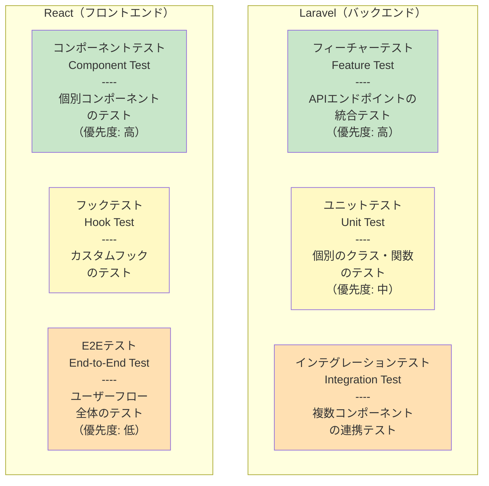

**テストの優先順位**:

| テスト種別 | 優先度 | 理由 |
|----------|-------|------|
| フィーチャーテスト（Laravel） | ⭐⭐⭐ | APIの動作を保証、実際の使用に近い |
| コンポーネントテスト（React） | ⭐⭐⭐ | UIの動作を保証、ユーザー視点 |
| ユニットテスト | ⭐⭐ | 複雑なロジックのみテスト |
| E2Eテスト | ⭐ | 主要フローのみ（実行時間が長い） |

### 6.4. テストカバレッジ目標

- **目標**: 80%以上
- **最重要**: ドメイン層は100%を目指す
- **測定**: Pest/Vitestのカバレッジレポート機能を使用

---

## 7. API設計

### 7.1. RESTful API の原則

> 📖 **REST（Representational State Transfer）とは？**
> HTTPメソッドとURLを使って、リソース（データ）を操作する設計原則です。

**HTTPメソッドの使い分け**:

| メソッド | 意味 | 用途 | 例 |
|---------|------|------|---|
| **GET** | 取得 | データを取得する | ツイート一覧取得 |
| **POST** | 作成 | 新しいデータを作成 | ツイート投稿 |
| **PUT/PATCH** | 更新 | 既存データを更新 | プロフィール編集 |
| **DELETE** | 削除 | データを削除 | ツイート削除 |

### 7.2. エンドポイント設計

**命名規則**:
- **複数形を使用**: `/api/tweets` (○) vs `/api/tweet` (✗)
- **階層構造**: リソースの関係を表現 `/api/users/{id}/tweets`
- **動詞を避ける**: `/api/get-tweets` (✗) → `/api/tweets` (○)

**エンドポイント一覧**:

#### 認証

| メソッド | エンドポイント | 説明 | 認証 |
|---------|--------------|------|-----|
| POST | `/api/register` | ユーザー登録 | 不要 |
| POST | `/api/login` | ログイン | 不要 |
| POST | `/api/logout` | ログアウト | 必要 |
| GET | `/api/user` | ログインユーザー情報取得 | 必要 |

#### ツイート

| メソッド | エンドポイント | 説明 | 認証 |
|---------|--------------|------|-----|
| GET | `/api/tweets` | ツイート一覧取得 | 必要 |
| POST | `/api/tweets` | ツイート投稿 | 必要 |
| GET | `/api/tweets/{id}` | 特定ツイート取得 | 必要 |
| DELETE | `/api/tweets/{id}` | ツイート削除 | 必要 |

#### いいね

| メソッド | エンドポイント | 説明 | 認証 |
|---------|--------------|------|-----|
| POST | `/api/tweets/{id}/like` | いいねする | 必要 |
| DELETE | `/api/tweets/{id}/like` | いいね解除 | 必要 |

#### フォロー

| メソッド | エンドポイント | 説明 | 認証 |
|---------|--------------|------|-----|
| POST | `/api/users/{id}/follow` | フォローする | 必要 |
| DELETE | `/api/users/{id}/follow` | フォロー解除 | 必要 |
| GET | `/api/users/{id}/followers` | フォロワー一覧 | 必要 |
| GET | `/api/users/{id}/following` | フォロー中一覧 | 必要 |

### 7.3. リクエスト/レスポンス例

**ツイート投稿（POST /api/tweets）**

**リクエスト**:
```json
{
  "body": "これは私の最初のツイートです！"
}
```

**レスポンス（成功）**:
```json
{
  "data": {
    "id": "123e4567-e89b-12d3-a456-426614174000",
    "body": "これは私の最初のツイートです！",
    "user": {
      "id": 1,
      "name": "太郎",
      "username": "taro123"
    },
    "likes_count": 0,
    "created_at": "2025-11-16T10:30:00Z",
    "updated_at": "2025-11-16T10:30:00Z"
  }
}
```

**レスポンス（バリデーションエラー）**:
```json
{
  "message": "The given data was invalid.",
  "errors": {
    "body": [
      "ツイート本文は必須です。",
      "ツイート本文は280文字以内である必要があります。"
    ]
  }
}
```

### 7.4. HTTPステータスコード

| コード | 意味 | 使用例 |
|-------|------|-------|
| **200** OK | 成功 | GET、PUT で正常にデータ取得・更新 |
| **201** Created | 作成成功 | POST でリソース作成成功 |
| **204** No Content | 成功（内容なし） | DELETE で削除成功 |
| **400** Bad Request | リクエストエラー | 不正なJSON形式 |
| **401** Unauthorized | 未認証 | ログインしていない |
| **403** Forbidden | 権限なし | 他人のツイートを削除しようとした |
| **404** Not Found | 見つからない | 存在しないツイートID |
| **422** Unprocessable Entity | バリデーションエラー | 本文が空、280文字超過 |
| **500** Internal Server Error | サーバーエラー | プログラムのバグ |

---

## 8. 認証・認可

### 8.1. Laravel Sanctum（SPA認証）

> 💡 **Laravel Sanctum とは？**
> LaravelでSPA（Single Page Application）向けのシンプルな認証を提供するパッケージです。

**なぜSanctumを選ぶ？**
- ✅ **シンプル**: 設定が簡単
- ✅ **Cookie ベース**: XSS攻撃に強い（localStorageよりも安全）
- ✅ **CSRF 保護**: Laravel標準の保護機能
- ✅ **公式推奨**: Laravel公式パッケージ

### 8.2. 認証フロー

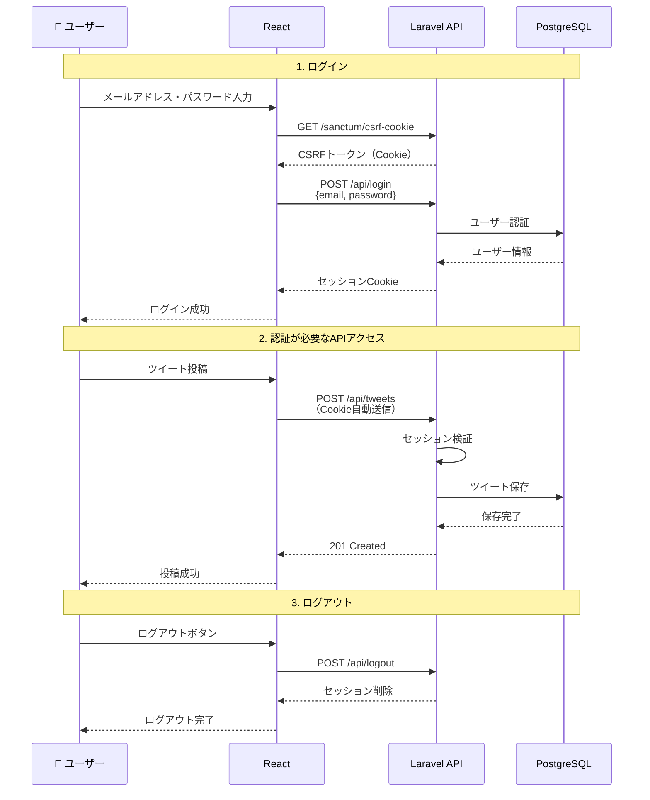

### 8.3. なぜCookieベース？

**Cookie vs localStorage（Token）**:

| 比較項目 | Cookie（Sanctum） | localStorage（Token） |
|---------|------------------|---------------------|
| **XSS対策** | ✅ `HttpOnly`で保護 | ❌ JavaScriptでアクセス可能 |
| **CSRF対策** | ✅ Laravel標準で対応 | 不要（同一オリジンのみ） |
| **自動送信** | ✅ ブラウザが自動で送信 | ❌ 手動でヘッダーに追加 |
| **有効期限管理** | ✅ サーバー側で管理 | ❌ クライアント側で管理 |

**結論**: Cookie（Sanctum）の方が**セキュリティが高い**

### 8.4. セキュリティ対策

| 脅威 | 対策 |
|-----|-----|
| **XSS（クロスサイトスクリプティング）** | - Cookie の `HttpOnly` フラグ<br>- React の自動エスケープ |
| **CSRF（クロスサイトリクエストフォージェリ）** | - Laravel の CSRF トークン<br>- Sanctum の自動検証 |
| **SQLインジェクション** | - Eloquent ORM の使用<br>- プリペアドステートメント |
| **パスワード漏洩** | - bcrypt によるハッシュ化<br>- パスワード強度の検証 |

---

## 9. データベース設計

### 9.1. ER図（主要テーブル）

```mermaid
erDiagram
    users ||--o{ tweets : "投稿する"
    users ||--o{ likes : "いいねする"
    users ||--o{ follows : "フォローする"
    users ||--o{ follows : "フォローされる"
    tweets ||--o{ likes : "いいねされる"

    users {
        bigint id PK
        string name
        string email UK
        string username UK
        string password
        timestamp email_verified_at
        timestamp created_at
        timestamp updated_at
    }

    tweets {
        uuid id PK
        bigint user_id FK
        text body
        timestamp posted_at
        timestamp created_at
        timestamp updated_at
    }

    likes {
        bigint id PK
        bigint user_id FK
        uuid tweet_id FK
        timestamp created_at
        unique(user_id, tweet_id)
    }

    follows {
        bigint id PK
        bigint follower_id FK "フォローする人"
        bigint following_id FK "フォローされる人"
        timestamp created_at
        unique(follower_id, following_id)
    }
```

### 9.2. テーブル設計の詳細

#### users（ユーザー）

| カラム | 型 | 説明 | 制約 |
|-------|---|------|-----|
| id | bigint | ユーザーID | PK, AUTO_INCREMENT |
| name | string(255) | 表示名 | NOT NULL |
| email | string(255) | メールアドレス | NOT NULL, UNIQUE |
| username | string(50) | ユーザー名（@xxx） | NOT NULL, UNIQUE |
| password | string(255) | パスワード（ハッシュ化） | NOT NULL |
| email_verified_at | timestamp | メール認証日時 | NULL |
| created_at | timestamp | 作成日時 | NOT NULL |
| updated_at | timestamp | 更新日時 | NOT NULL |

#### tweets（ツイート）

| カラム | 型 | 説明 | 制約 |
|-------|---|------|-----|
| id | uuid | ツイートID | PK |
| user_id | bigint | 投稿者ID | FK(users.id), NOT NULL |
| body | text | ツイート本文 | NOT NULL |
| posted_at | timestamp | 投稿日時 | NOT NULL |
| created_at | timestamp | 作成日時 | NOT NULL |
| updated_at | timestamp | 更新日時 | NOT NULL |

**インデックス**:
- `user_id, posted_at DESC` （ユーザーのツイート一覧取得を高速化）

#### likes（いいね）

| カラム | 型 | 説明 | 制約 |
|-------|---|------|-----|
| id | bigint | いいねID | PK, AUTO_INCREMENT |
| user_id | bigint | いいねしたユーザー | FK(users.id), NOT NULL |
| tweet_id | uuid | いいねされたツイート | FK(tweets.id), NOT NULL |
| created_at | timestamp | 作成日時 | NOT NULL |

**ユニーク制約**: `(user_id, tweet_id)` （重複いいね防止）

#### follows（フォロー）

| カラム | 型 | 説明 | 制約 |
|-------|---|------|-----|
| id | bigint | フォローID | PK, AUTO_INCREMENT |
| follower_id | bigint | フォローする人 | FK(users.id), NOT NULL |
| following_id | bigint | フォローされる人 | FK(users.id), NOT NULL |
| created_at | timestamp | フォロー日時 | NOT NULL |

**ユニーク制約**: `(follower_id, following_id)` （重複フォロー防止）
**チェック制約**: `follower_id <> following_id` （自分自身をフォロー禁止）

### 9.3. マイグレーション戦略

**マイグレーションとは？**
- データベースのスキーマ変更をコードで管理する仕組み
- 履歴管理、ロールバック（元に戻す）が可能

**命名規則**:
```
{timestamp}_create_{table_name}_table.php
例: 2025_11_16_000001_create_users_table.php
```

**実行コマンド**:
```bash
# マイグレーション実行
php artisan migrate

# ロールバック（1ステップ戻す）
php artisan migrate:rollback

# すべて削除して再実行
php artisan migrate:fresh
```

---

## 10. コード品質

### 10.1. コーディング規約

#### Laravel（PHP）

- **PSR-12**: PHP標準のコーディングスタイル
- **Laravel Pint**: 自動フォーマッター

**命名規則**:
```php
// クラス: PascalCase
class TweetController {}

// メソッド: camelCase
public function storeTweet() {}

// 変数: camelCase
$tweetBody = '...';

// 定数: UPPER_SNAKE_CASE
const MAX_TWEET_LENGTH = 280;
```

#### React（TypeScript）

- **Biome**: リンター + フォーマッター

**命名規則**:
```typescript
// コンポーネント: PascalCase
function TweetCard() {}

// フック: use + PascalCase
function useTweets() {}

// 変数・関数: camelCase
const tweetBody = '...';
const handleSubmit = () => {};

// 型: PascalCase
type TweetType = { id: string; body: string };

// 定数: UPPER_SNAKE_CASE
const MAX_TWEET_LENGTH = 280;
```

### 10.2. リンター/フォーマッター設定

#### Laravel Pint

**実行コマンド**:
```bash
# チェックのみ
composer lint

# 自動修正
composer lint:fix
```

#### Biome（React）

**実行コマンド**:
```bash
# リンター実行
npm run lint

# フォーマッター実行
npm run format

# 両方実行 + 自動修正
npm run check:fix
```

### 10.3. コードレビューの観点

**チェックリスト**:

- [ ] **テストが追加されているか**（TDDの原則）
- [ ] **テストが通っているか**
- [ ] **単一責任の原則を守っているか**（1つのクラス/関数は1つの責務）
- [ ] **命名が適切か**（意図が伝わる名前）
- [ ] **コメントは「なぜ」を説明しているか**（「何を」はコードで説明）
- [ ] **セキュリティ上の問題はないか**（SQLインジェクション、XSSなど）
- [ ] **パフォーマンスの問題はないか**（N+1問題など）

---

## 11. 開発ワークフロー

### 11.1. Gitブランチ戦略

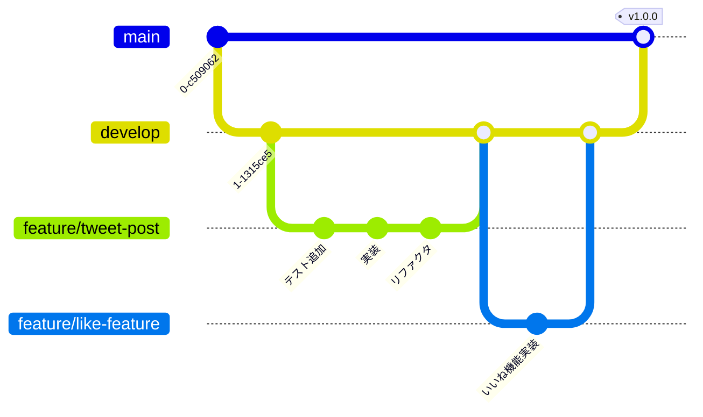

**ブランチの種類**:

| ブランチ | 役割 | マージ先 |
|---------|------|---------|
| `main` | 本番環境 | - |
| `develop` | 開発環境 | `main` |
| `feature/*` | 機能開発 | `develop` |
| `bugfix/*` | バグ修正 | `develop` |
| `hotfix/*` | 緊急修正 | `main` と `develop` |

**ブランチ命名規則**:
```
feature/tweet-post
feature/like-feature
bugfix/fix-login-error
hotfix/security-patch
```

### 11.2. コミットメッセージ規約

**フォーマット**:
```
<type>(<scope>): <subject>

<body>

<footer>
```

**type（種類）**:

| type | 意味 | 例 |
|------|------|---|
| `feat` | 新機能 | feat: ツイート投稿機能を追加 |
| `fix` | バグ修正 | fix: ログインエラーを修正 |
| `docs` | ドキュメント | docs: README更新 |
| `test` | テスト追加・修正 | test: ツイート投稿のテスト追加 |
| `refactor` | リファクタリング | refactor: TweetService を分割 |
| `style` | コードスタイル | style: Pint でフォーマット |
| `chore` | ビルド、ツール変更 | chore: Docker設定追加 |

**例**:
```
feat(tweet): ツイート投稿機能を追加

- TweetController に store メソッドを実装
- CreateTweetUseCase を作成
- フィーチャーテストを追加

Closes #123
```

### 11.3. CI/CD パイプライン

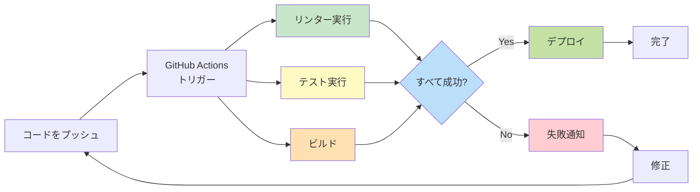

**パイプラインの流れ**:

1. **コードプッシュ**: `git push` すると自動実行
2. **リンター**: コードスタイルチェック
3. **テスト**: すべてのテストを実行
4. **ビルド**: アプリケーションをビルド
5. **デプロイ**: すべて成功したら本番環境へ

---

## 📚 参考リソース

### 公式ドキュメント
- [Laravel 11 公式ドキュメント](https://laravel.com/docs/11.x)
- [React 公式ドキュメント](https://react.dev/)
- [TypeScript 公式ドキュメント](https://www.typescriptlang.org/docs/)
- [Tailwind CSS 公式ドキュメント](https://tailwindcss.com/docs)

### DDD（ドメイン駆動設計）
- [エリック・エヴァンスのドメイン駆動設計](https://www.amazon.co.jp/dp/4798121967)
- [実践ドメイン駆動設計](https://www.amazon.co.jp/dp/479813161X)

### TDD（テスト駆動開発）
- [Test Driven Development: By Example - Kent Beck](https://www.amazon.com/dp/0321146530)

### ベストプラクティス
- [Laravel Best Practices](https://github.com/alexeymezenin/laravel-best-practices)
- [Clean Code - Robert C. Martin](https://www.amazon.com/dp/0132350882)

---

## 🎯 まとめ

このプロジェクトでは、以下の原則を守ります：

### 1. **TDD（テスト駆動開発）**
- 実装前にテストを書く
- Red → Green → Refactor サイクル
- テストカバレッジ80%以上

### 2. **DDD（ドメイン駆動設計）**
- ビジネスロジックをドメイン層に集約
- レイヤードアーキテクチャ
- ドメイン層は何にも依存しない

### 3. **保守性重視**
- 単一責任の原則
- わかりやすい命名
- 適切なコメント

### 4. **コード品質**
- リンター/フォーマッター活用
- コードレビュー
- CI/CD 自動化

---

**最終更新日**: 2025-11-16
**バージョン**: 1.0.0
**関連ドキュメント**: `CLAUDE.md`, `タスク1.md`, `タスク2.md`
