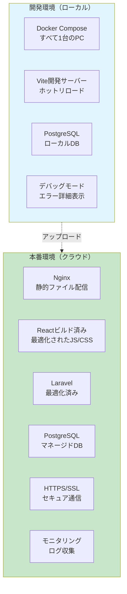
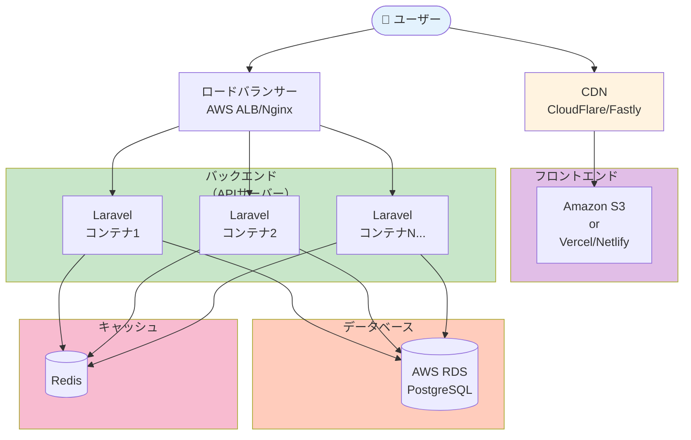
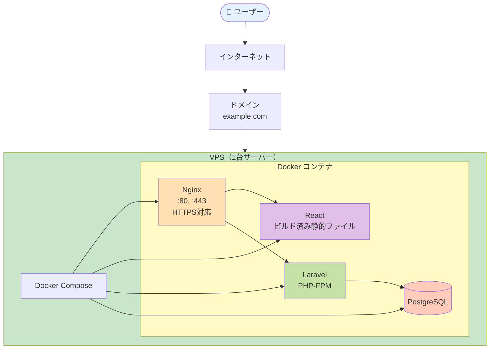
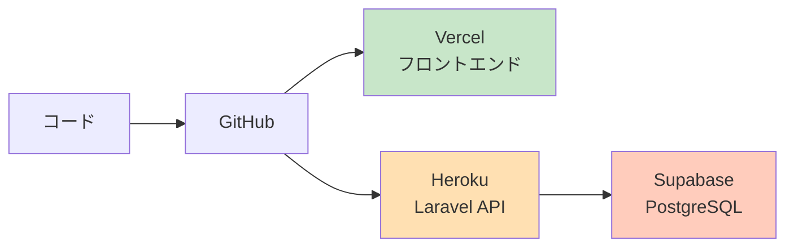
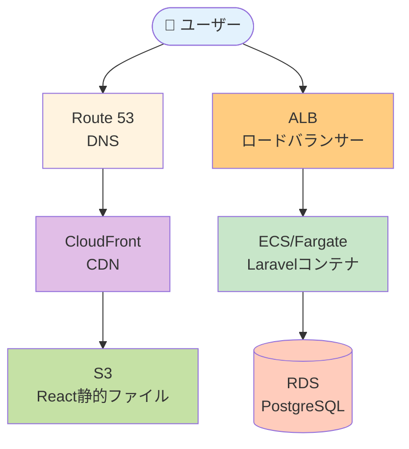
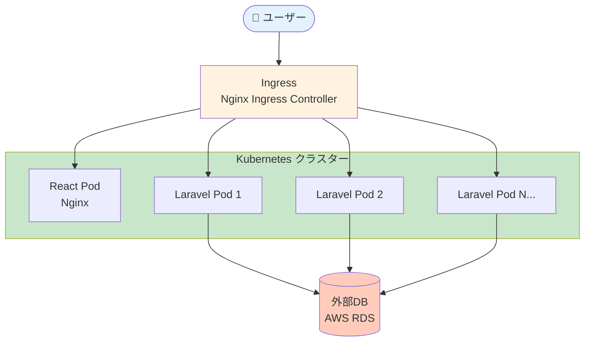
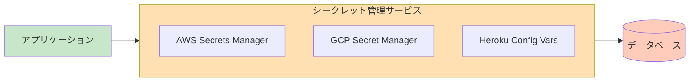
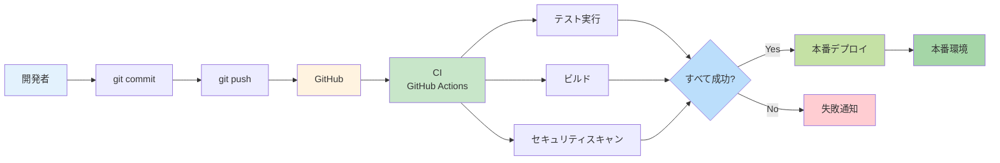
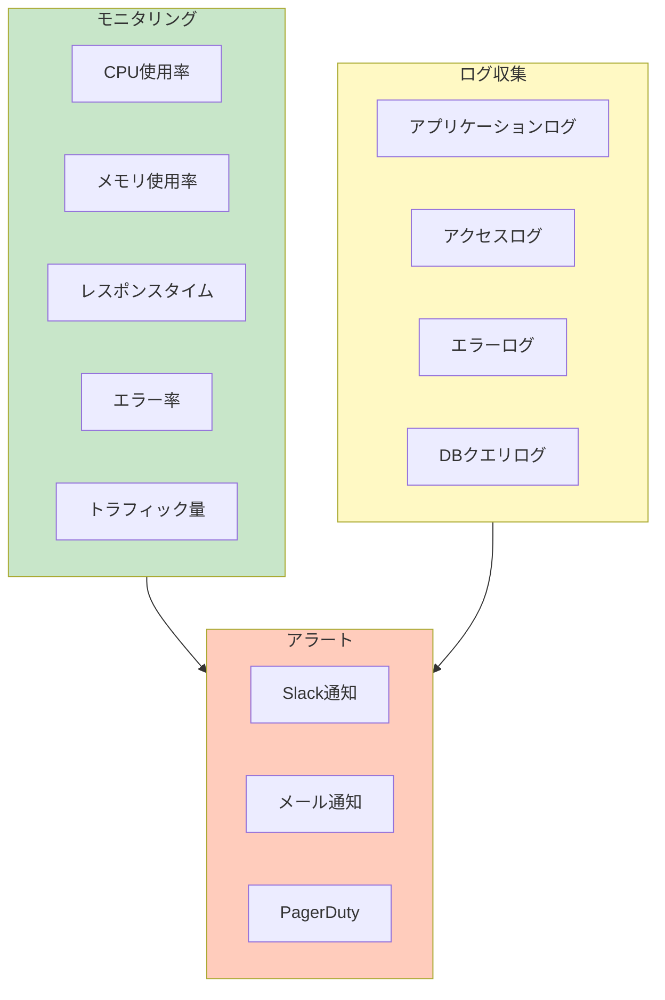

# タスク12: 本番環境へのデプロイ

## 📋 タスク概要

このドキュメントでは、開発環境（Docker Compose）で作ったアプリケーションを、本番環境にデプロイする方法を説明します。

> 💡 **重要な前提**
> 開発環境と本番環境は**別物**です。開発環境の `docker-compose.yml` をそのまま本番環境で使うことは**推奨されません**。

---

## 🤔 なぜ開発環境と本番環境を分けるのか？

### 開発環境の特徴
- ✅ **開発のしやすさ優先**: ホットリロード、デバッグ機能
- ✅ **すべてローカル**: 1台のマシンですべてが動く
- ✅ **セキュリティは緩め**: パスワードは `secret` で固定など
- ✅ **パフォーマンスは二の次**: 多少遅くても問題ない

### 本番環境の特徴
- ✅ **安定性・セキュリティ優先**: ダウンタイムを避ける
- ✅ **スケーラビリティ**: アクセス増加に対応できる
- ✅ **厳格なセキュリティ**: 本物のユーザーのデータを守る
- ✅ **高パフォーマンス**: 最適化されたビルド

---

## 🔄 開発環境 vs 本番環境の違い



### 主要な違い

| 項目 | 開発環境 | 本番環境 |
|-----|---------|---------|
| **Reactの配信** | Vite開発サーバー（:5173） | Nginxで静的ファイル配信 |
| **デバッグ** | エラー詳細を表示 | エラーは隠す（ログに記録） |
| **環境変数** | `.env` ファイル | クラウドのシークレット管理 |
| **HTTPS** | HTTP（暗号化なし） | HTTPS必須（SSL証明書） |
| **データベース** | ローカルPostgreSQL | マネージドDB（AWS RDS等） |
| **スケーリング** | 1台のみ | 複数サーバーで負荷分散 |
| **モニタリング** | なし | ログ収集、アラート設定 |

---

## 🏗️ 本番環境のアーキテクチャ

### 推奨構成（クラウドサービス利用）



**各コンポーネントの役割**:

| コンポーネント | 役割 | 具体例 |
|-------------|------|-------|
| **CDN** | 静的ファイルを高速配信 | CloudFlare, Fastly |
| **静的ファイルホスティング** | ReactのビルドファイルをホストGoogle | S3 + CloudFront, Vercel, Netlify |
| **ロードバランサー** | 複数サーバーに負荷分散 | AWS ALB, Nginx |
| **APIサーバー** | Laravelコンテナ（複数台） | ECS, Kubernetes, Heroku |
| **マネージドDB** | データベース（自動バックアップ） | AWS RDS, Supabase |
| **キャッシュ** | パフォーマンス向上 | Redis, Memcached |

---

## 🚀 デプロイ方法の選択肢

### オプション0: シンプル本番環境（1台サーバー + Docker Compose）⭐ 学習・小規模向け

> 💡 **このオプションがおすすめな人**
> - 学習目的でシンプルに運用したい
> - アクセスは少ない（月間数千〜数万PV程度）
> - コストを抑えたい（月額$5〜20）
> - 開発環境のDocker Composeをそのまま活かしたい

**メリット**:
- ✅ **開発環境との一貫性**: Docker Composeをそのまま使える
- ✅ **シンプル**: 1台のサーバーで完結
- ✅ **低コスト**: VPS 1台で月額$5〜20
- ✅ **学習に最適**: インフラ全体を理解できる

**デメリット**:
- ❌ 大量アクセスには向かない（スケールしにくい）
- ❌ サーバー障害時にすべてダウン
- ❌ 自分でメンテナンスが必要



#### 推奨VPSサービス

| サービス | 最小プラン | メモリ | CPU | 月額 |
|---------|----------|-------|-----|------|
| **DigitalOcean** | Basic Droplet | 1GB | 1コア | $6 |
| **Linode** | Nanode | 1GB | 1コア | $5 |
| **Vultr** | Regular Performance | 1GB | 1コア | $6 |
| **AWS Lightsail** | 最小プラン | 512MB | 1コア | $3.50 |
| **Hetzner Cloud** | CX11 | 2GB | 1コア | €4.15 (約$5) |

**推奨**: **DigitalOcean** または **Hetzner Cloud**（コスパ最高）

#### 本番用 docker-compose.yml の例

開発環境の`docker-compose.yml`を本番用に調整します：

```yaml
# docker-compose.production.yml
services:
  # Nginx - HTTPS対応
  nginx:
    image: nginx:alpine
    container_name: twitter-nginx
    ports:
      - "80:80"
      - "443:443"  # HTTPS用
    volumes:
      - ./docker/nginx/production.conf:/etc/nginx/conf.d/default.conf:ro
      - ./frontend/dist:/var/www/frontend:ro  # ビルド済みReact
      - ./certbot/conf:/etc/letsencrypt:ro     # SSL証明書
      - ./certbot/www:/var/www/certbot:ro      # Let's Encrypt検証用
    depends_on:
      - laravel
    networks:
      - twitter-network
    restart: always

  # Laravel - 本番モード
  laravel:
    build:
      context: ./docker/laravel
      dockerfile: Dockerfile.production  # 本番用Dockerfile
    container_name: twitter-laravel
    working_dir: /var/www/html
    volumes:
      - ./backend:/var/www/html
    environment:
      - APP_ENV=production
      - APP_DEBUG=false
      - DB_CONNECTION=pgsql
      - DB_HOST=db
      - DB_PORT=5432
    env_file:
      - .env.production  # 本番用環境変数（Gitには含めない）
    depends_on:
      db:
        condition: service_healthy
    networks:
      - twitter-network
    restart: always

  # PostgreSQL - データ永続化
  db:
    image: postgres:16-alpine
    container_name: twitter-db
    environment:
      - POSTGRES_USER=${DB_USERNAME}
      - POSTGRES_PASSWORD=${DB_PASSWORD}
      - POSTGRES_DB=${DB_DATABASE}
    volumes:
      - db_data:/var/lib/postgresql/data
    healthcheck:
      test: ["CMD-SHELL", "pg_isready -U ${DB_USERNAME} -d ${DB_DATABASE}"]
      interval: 10s
      timeout: 5s
      retries: 5
    networks:
      - twitter-network
    restart: always

  # Certbot - SSL証明書自動更新
  certbot:
    image: certbot/certbot
    container_name: certbot
    volumes:
      - ./certbot/conf:/etc/letsencrypt
      - ./certbot/www:/var/www/certbot
    entrypoint: "/bin/sh -c 'trap exit TERM; while :; do certbot renew; sleep 12h & wait $${!}; done;'"

networks:
  twitter-network:
    driver: bridge

volumes:
  db_data:
    driver: local
```

**主な変更点**:
- ✅ HTTPS対応（ポート443を追加）
- ✅ 本番用環境変数（`.env.production`）
- ✅ Reactはビルド済み静的ファイルを配信
- ✅ `restart: always`（自動再起動）
- ✅ Certbot追加（SSL証明書自動更新）

#### Nginx設定（HTTPS対応）

```nginx
# docker/nginx/production.conf

# HTTPをHTTPSにリダイレクト
server {
    listen 80;
    server_name yourdomain.com;

    # Let's Encrypt検証用
    location /.well-known/acme-challenge/ {
        root /var/www/certbot;
    }

    # HTTPSにリダイレクト
    location / {
        return 301 https://$host$request_uri;
    }
}

# HTTPS設定
server {
    listen 443 ssl http2;
    server_name yourdomain.com;

    # SSL証明書
    ssl_certificate /etc/letsencrypt/live/yourdomain.com/fullchain.pem;
    ssl_certificate_key /etc/letsencrypt/live/yourdomain.com/privkey.pem;

    # SSL設定（セキュリティ強化）
    ssl_protocols TLSv1.2 TLSv1.3;
    ssl_ciphers HIGH:!aNULL:!MD5;
    ssl_prefer_server_ciphers on;

    # セキュリティヘッダー
    add_header Strict-Transport-Security "max-age=31536000; includeSubDomains" always;
    add_header X-Frame-Options "SAMEORIGIN" always;
    add_header X-Content-Type-Options "nosniff" always;

    # バックエンドAPI（Laravel）
    location /api {
        fastcgi_pass laravel:9000;
        fastcgi_index index.php;
        fastcgi_param SCRIPT_FILENAME /var/www/html/public/index.php;
        include fastcgi_params;
    }

    # フロントエンド（Reactビルド済み）
    location / {
        root /var/www/frontend;
        try_files $uri $uri/ /index.html;
    }
}
```

#### セットアップ手順

**1. VPSサーバーを準備**

```bash
# DigitalOceanの例
# 1. DigitalOceanでアカウント作成
# 2. Droplet作成（Ubuntu 22.04、1GB RAM、$6/月）
# 3. SSH接続
ssh root@your-server-ip
```

**2. サーバーに必要なソフトウェアをインストール**

```bash
# システム更新
apt update && apt upgrade -y

# Dockerインストール
curl -fsSL https://get.docker.com -o get-docker.sh
sh get-docker.sh

# Docker Composeインストール
apt install docker-compose -y

# Git インストール
apt install git -y
```

**3. コードをデプロイ**

```bash
# リポジトリをクローン
git clone https://github.com/yourusername/twitter-app.git
cd twitter-app

# 本番用環境変数を設定
cp .env.example .env.production
nano .env.production  # 本番用の設定に変更

# Reactをビルド
cd frontend
npm install
npm run build
cd ..

# Laravelのセットアップ
cd backend
composer install --no-dev --optimize-autoloader
php artisan key:generate
php artisan migrate --force
cd ..
```

**4. SSL証明書を取得（Let's Encrypt）**

```bash
# 初回SSL証明書取得
docker-compose -f docker-compose.production.yml run --rm certbot certonly \
  --webroot --webroot-path /var/www/certbot \
  -d yourdomain.com \
  --email your-email@example.com \
  --agree-tos \
  --no-eff-email
```

**5. Docker Composeで起動**

```bash
# 本番環境で起動
docker-compose -f docker-compose.production.yml up -d

# ログ確認
docker-compose -f docker-compose.production.yml logs -f
```

**6. 動作確認**

```bash
# ブラウザでアクセス
# https://yourdomain.com

# APIの動作確認
curl https://yourdomain.com/api/health
```

#### デプロイスクリプト（自動化）

**deploy.sh**（サーバー上で実行）:
```bash
#!/bin/bash
set -e

echo "🚀 デプロイ開始..."

# 最新コードを取得
echo "📥 最新コードを取得中..."
git pull origin main

# Reactビルド
echo "🔨 Reactをビルド中..."
cd frontend
npm install
npm run build
cd ..

# Laravelの準備
echo "🔧 Laravelをセットアップ中..."
cd backend
composer install --no-dev --optimize-autoloader
php artisan config:cache
php artisan route:cache
php artisan view:cache
php artisan migrate --force
cd ..

# Dockerコンテナを再起動
echo "🔄 コンテナを再起動中..."
docker-compose -f docker-compose.production.yml up -d --build

echo "✅ デプロイ完了！"
echo "🌐 https://yourdomain.com"
```

使用方法:
```bash
chmod +x deploy.sh
./deploy.sh
```

#### モニタリング（シンプル版）

**ログ確認**:
```bash
# すべてのログ
docker-compose -f docker-compose.production.yml logs -f

# Laravelのみ
docker-compose -f docker-compose.production.yml logs -f laravel

# Nginxのみ
docker-compose -f docker-compose.production.yml logs -f nginx
```

**リソース監視**:
```bash
# コンテナのリソース使用状況
docker stats

# ディスク使用量
df -h

# メモリ使用量
free -h
```

**簡易死活監視**（UptimeRobot無料版）:
- https://uptimerobot.com
- 5分ごとにサーバーをpingして、ダウン時にメール通知

#### バックアップ

**データベースバックアップスクリプト**:
```bash
#!/bin/bash
# backup-db.sh

BACKUP_DIR="/root/backups"
DATE=$(date +%Y%m%d_%H%M%S)
BACKUP_FILE="$BACKUP_DIR/db_backup_$DATE.sql"

mkdir -p $BACKUP_DIR

# PostgreSQLバックアップ
docker exec twitter-db pg_dump -U laravel_user twitter_clone > $BACKUP_FILE

# 圧縮
gzip $BACKUP_FILE

# 古いバックアップを削除（30日以上前）
find $BACKUP_DIR -name "*.sql.gz" -mtime +30 -delete

echo "✅ バックアップ完了: $BACKUP_FILE.gz"
```

**Cronで自動バックアップ**:
```bash
# 毎日午前3時にバックアップ
crontab -e

# 以下を追加
0 3 * * * /root/twitter-app/backup-db.sh
```

#### コスト内訳（月額）

| 項目 | 料金 |
|-----|------|
| **VPS** (DigitalOcean 1GB) | $6 |
| **ドメイン** (.com) | $1〜2/月 |
| **SSL証明書** (Let's Encrypt) | 無料 |
| **合計** | **$7〜8/月** |

---

### オプション1: フルマネージド（初心者におすすめ）

**メリット**: 設定が簡単、メンテナンス不要、自動スケーリング



**構成**:
- **フロントエンド**: Vercel または Netlify
- **バックエンド**: Heroku または Railway
- **データベース**: Supabase または Heroku Postgres

**コスト**: 月額 $20〜50（小規模アプリ）

**手順**:
1. GitHubにコードをプッシュ
2. Vercelと連携（自動デプロイ）
3. Herokuと連携（自動デプロイ）
4. 環境変数を設定

---

### オプション2: AWS（中級者向け）

**メリット**: 柔軟性が高い、スケーラブル、業界標準



**構成**:
- **Route 53**: DNS管理
- **CloudFront + S3**: React静的ファイル配信
- **ALB**: ロードバランサー
- **ECS/Fargate**: Laravelコンテナ実行
- **RDS**: PostgreSQL

**コスト**: 月額 $50〜200（トラフィックによる）

**Docker活用**: ✅ **活かせる！**
- 開発環境のDockerfileをそのまま使える
- ECS/Fargateでコンテナをデプロイ

---

### オプション3: Kubernetes（上級者向け）

**メリット**: 最も柔軟、大規模対応、マルチクラウド



**構成**:
- **GKE/EKS**: Kubernetesマネージドサービス
- **Helm**: パッケージ管理
- **Ingress**: トラフィック制御

**Docker活用**: ✅ **完全に活かせる！**
- DockerイメージをそのままKubernetesで使用

---

## 📦 Dockerを本番環境で活かす方法

### 開発環境のDockerfileを本番用に調整

**現在の開発環境用Dockerfile（Laravel）**:
```dockerfile
FROM php:8.2-fpm-alpine
# ... 開発用設定
```

**本番環境用Dockerfile（最適化版）**:
```dockerfile
# マルチステージビルド
FROM php:8.2-fpm-alpine AS base
WORKDIR /var/www/html

# 依存関係のインストール
RUN apk add --no-cache \
    postgresql-dev \
    libzip-dev \
    && docker-php-ext-install \
        pdo_pgsql \
        pgsql \
        zip \
        opcache

# Composerのインストール
COPY --from=composer:latest /usr/bin/composer /usr/bin/composer

# 本番用設定
FROM base AS production
ENV APP_ENV=production
ENV APP_DEBUG=false

# ソースコードコピー
COPY . /var/www/html

# 依存関係インストール（本番用）
RUN composer install --no-dev --optimize-autoloader

# キャッシュ生成
RUN php artisan config:cache && \
    php artisan route:cache && \
    php artisan view:cache

# 権限設定
RUN chown -R www-data:www-data /var/www/html/storage

EXPOSE 9000
CMD ["php-fpm"]
```

**違い**:
- ✅ **マルチステージビルド**: イメージサイズ削減
- ✅ **本番モード**: `APP_DEBUG=false`
- ✅ **最適化**: キャッシュ生成、`--no-dev`
- ✅ **セキュリティ**: 適切な権限設定

---

## 🔒 環境変数の管理

### 開発環境（`.env` ファイル）

```env
APP_ENV=local
APP_DEBUG=true
DB_HOST=db
DB_PASSWORD=secret
```

### 本番環境（シークレット管理サービス）



**絶対にGitにコミットしてはいけない情報**:
- ❌ データベースパスワード
- ❌ APIキー（Stripe、AWS等）
- ❌ `APP_KEY`（Laravel）
- ❌ JWT秘密鍵

**本番環境での設定方法**:

**AWS ECS の場合**:
```json
{
  "environment": [
    {
      "name": "APP_ENV",
      "value": "production"
    }
  ],
  "secrets": [
    {
      "name": "DB_PASSWORD",
      "valueFrom": "arn:aws:secretsmanager:..."
    }
  ]
}
```

**Heroku の場合**:
```bash
heroku config:set APP_ENV=production
heroku config:set DB_PASSWORD=actual_secure_password
```

---

## 🔐 セキュリティ対策

### 本番環境で必須の対策

| 対策 | 開発環境 | 本番環境 |
|-----|---------|---------|
| **HTTPS** | ❌ 不要 | ✅ 必須（SSL証明書） |
| **ファイアウォール** | ❌ なし | ✅ 設定必須 |
| **環境変数** | `.env` ファイル | シークレット管理 |
| **デバッグモード** | ON | ✅ 必ず OFF |
| **エラー表示** | 詳細表示 | ✅ 隠す（ログに記録） |
| **CORS** | すべて許可 | ✅ 特定オリジンのみ |
| **レート制限** | なし | ✅ API制限設定 |

### SSL証明書の設定

**無料SSL証明書**: Let's Encrypt

**設定方法**:
```bash
# Certbot（Let's Encrypt）でSSL証明書取得
certbot --nginx -d yourdomain.com
```

**Nginx設定（HTTPS）**:
```nginx
server {
    listen 443 ssl http2;
    server_name yourdomain.com;

    ssl_certificate /etc/letsencrypt/live/yourdomain.com/fullchain.pem;
    ssl_certificate_key /etc/letsencrypt/live/yourdomain.com/privkey.pem;

    location /api {
        proxy_pass http://laravel:9000;
    }

    location / {
        root /var/www/html/public;
        try_files $uri $uri/ /index.html;
    }
}
```

---

## 🔄 CI/CDパイプライン

### 自動デプロイの流れ



### GitHub Actions 設定例

**.github/workflows/deploy-production.yml**:
```yaml
name: Deploy to Production

on:
  push:
    branches: [main]

jobs:
  deploy-frontend:
    runs-on: ubuntu-latest
    steps:
      - uses: actions/checkout@v4

      - name: Setup Node.js
        uses: actions/setup-node@v4
        with:
          node-version: 20

      - name: Build React
        working-directory: frontend
        run: |
          npm ci
          npm run build

      - name: Deploy to S3
        run: |
          aws s3 sync frontend/dist s3://your-bucket-name
        env:
          AWS_ACCESS_KEY_ID: ${{ secrets.AWS_ACCESS_KEY_ID }}
          AWS_SECRET_ACCESS_KEY: ${{ secrets.AWS_SECRET_ACCESS_KEY }}

  deploy-backend:
    runs-on: ubuntu-latest
    steps:
      - uses: actions/checkout@v4

      - name: Configure AWS credentials
        uses: aws-actions/configure-aws-credentials@v4
        with:
          aws-access-key-id: ${{ secrets.AWS_ACCESS_KEY_ID }}
          aws-secret-access-key: ${{ secrets.AWS_SECRET_ACCESS_KEY }}
          aws-region: ap-northeast-1

      - name: Build Docker image
        working-directory: docker/laravel
        run: |
          docker build -t laravel-app .

      - name: Push to ECR
        run: |
          aws ecr get-login-password | docker login --username AWS --password-stdin ${{ secrets.ECR_REGISTRY }}
          docker tag laravel-app:latest ${{ secrets.ECR_REGISTRY }}/laravel-app:latest
          docker push ${{ secrets.ECR_REGISTRY }}/laravel-app:latest

      - name: Deploy to ECS
        run: |
          aws ecs update-service --cluster my-cluster --service laravel-service --force-new-deployment
```

---

## 📊 モニタリングとログ

### 本番環境で監視すべき項目



### ツール

| カテゴリ | ツール | 用途 |
|---------|-------|------|
| **APM** | New Relic, DataDog | パフォーマンス監視 |
| **ログ** | CloudWatch, Loggly | ログ収集・検索 |
| **エラー追跡** | Sentry, Bugsnag | エラー通知・分析 |
| **死活監視** | Pingdom, UptimeRobot | サーバーダウン検知 |

---

## 💰 コスト比較

### 小規模アプリ（月間1万PV程度）

| 方式 | 月額コスト | 難易度 |
|-----|-----------|-------|
| **Vercel + Heroku** | $20〜50 | ⭐ 簡単 |
| **AWS（EC2小）** | $30〜80 | ⭐⭐ 中級 |
| **AWS（ECS/Fargate）** | $50〜150 | ⭐⭐⭐ 上級 |
| **Kubernetes** | $100〜300 | ⭐⭐⭐⭐ 専門 |

### 中規模アプリ（月間10万PV程度）

| 方式 | 月額コスト | 難易度 |
|-----|-----------|-------|
| **Vercel + Heroku** | $100〜200 | ⭐ 簡単 |
| **AWS（ECS/Fargate）** | $150〜400 | ⭐⭐⭐ 上級 |
| **Kubernetes** | $300〜800 | ⭐⭐⭐⭐ 専門 |

---

## 🎯 推奨デプロイ方法（段階別）

### ステージ0: 学習・個人プロジェクト（最もシンプル）⭐ おすすめ
**推奨**: **VPS 1台 + Docker Compose**（オプション0）
- **理由**: 開発環境との一貫性、インフラ全体を学べる、低コスト
- **コスト**: $5〜10/月
- **アクセス**: 月間数千〜数万PV
- **VPSサービス**: DigitalOcean、Hetzner Cloud
- **構成**: Nginx + React（ビルド済み） + Laravel + PostgreSQL

### ステージ1: 学習・プロトタイプ（フルマネージド）
**推奨**: Vercel + Heroku + Supabase
- **理由**: 無料枠で始められる、設定が簡単
- **コスト**: $0〜20/月
- **アクセス**: 月間数千〜数万PV

### ステージ2: 小規模本番運用
**推奨**: Vercel + Railway/Render + Supabase
- **理由**: 設定が簡単、自動スケール
- **コスト**: $20〜100/月
- **アクセス**: 月間数万〜10万PV

### ステージ3: 中規模本番運用
**推奨**: AWS（S3 + CloudFront + ECS + RDS）
- **理由**: 柔軟性、スケーラビリティ
- **コスト**: $100〜500/月
- **アクセス**: 月間10万〜100万PV

### ステージ4: 大規模本番運用
**推奨**: Kubernetes（GKE/EKS）
- **理由**: 最大の柔軟性、マルチクラウド
- **コスト**: $500〜数千/月
- **アクセス**: 月間100万PV以上

---

## ✅ まとめ

### Dockerで作った構成は本番で活かせる？

**✅ はい、活かせます！**

| 項目 | 開発環境 | 本番環境 |
|-----|---------|---------|
| **Dockerfile** | ✅ そのまま使える | 最適化が必要 |
| **docker-compose.yml** | ✅ 開発用 | ❌ 使わない |
| **アプリケーションコード** | ✅ 同じ | ✅ 同じ |
| **環境変数** | `.env` | シークレット管理 |

### 重要なポイント

1. **Docker Composeは開発専用**: 本番ではオーケストレーションツール（ECS、Kubernetes）を使う
2. **Dockerfileは調整が必要**: マルチステージビルド、最適化
3. **環境変数は分離**: 開発と本番で別管理
4. **セキュリティは必須**: HTTPS、ファイアウォール、シークレット管理
5. **モニタリングは重要**: エラー検知、パフォーマンス監視

---

**作成日**: 2025-11-16
**関連ドキュメント**: `CLAUDE.md`, `ARCHITECTURE.md`, `タスク1.md`
**次のタスク**: 実際のデプロイ手順（ステージ1から順に）
