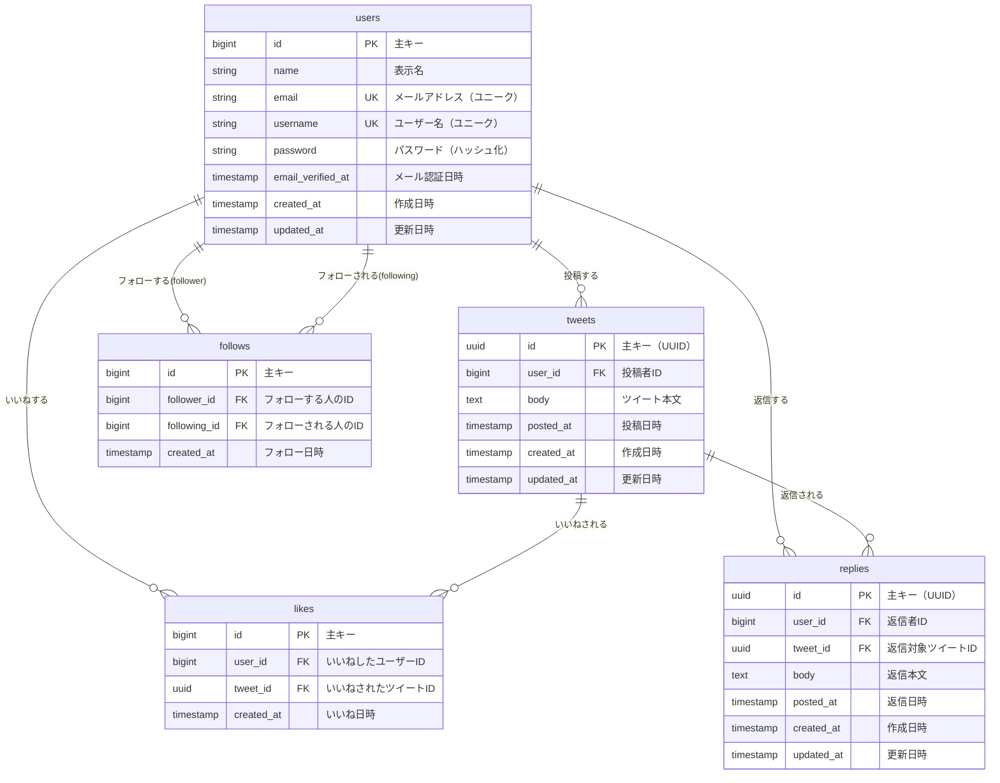

# タスク5: データベース設計（コアテーブル）

> 💡 **このタスクの目的**
> Twitterクローンアプリケーションの中核となるデータベース設計を、**正規化・制約・パフォーマンス**を注意深く考慮しながら行います。
> TDDで実装を進める前に、しっかりとしたデータモデルを設計することで、**後からの手戻りを防ぎます**。

---

## 📋 目次

1. [なぜ今データベース設計をするのか？](#1-なぜ今データベース設計をするのか)
2. [データベース設計の原則](#2-データベース設計の原則)
3. [ER図（Entity-Relationship Diagram）](#3-er図entity-relationship-diagram)
4. [テーブル設計の詳細](#4-テーブル設計の詳細)
5. [正規化の確認](#5-正規化の確認)
6. [制約とインデックスの設計](#6-制約とインデックスの設計)
7. [マイグレーション作成の実施手順](#7-マイグレーション作成の実施手順)
8. [設計上の重要な判断](#8-設計上の重要な判断)
9. [次のステップ](#9-次のステップ)
10. [将来の拡張](#10-将来の拡張)

---

## 1. なぜ今データベース設計をするのか？

### ❌ 後回しにすると起こる問題

**シナリオ: 後から設計を変更する場合**

```
タスク6: ツイート投稿実装
  ↓
タスク7: いいね機能実装
  ↓ 「あれ、likesテーブルにユニーク制約を忘れた！」
  ↓ 「重複いいねができてしまう...」
  ↓
❌ マイグレーションやり直し（既存データの整合性が崩れる）
  ↓
タスク8: フォロー機能実装
  ↓ 「あれ、自分自身をフォローできてしまう...」
  ↓
❌ またマイグレーションやり直し
```

### ✅ 早めに設計するメリット

1. **手戻りなし**: 一度マイグレーションを実行したら、変更はロールバックが必要
2. **全体像の把握**: テーブル間の関係性を事前に理解できる
3. **正規化の徹底**: データの冗長性を排除し、整合性を保つ
4. **制約の漏れ防止**: ユニーク制約、外部キー制約などを事前に定義
5. **パフォーマンス**: インデックス戦略を最初から計画できる

---

## 2. データベース設計の原則

### 2.1. 正規化（Normalization）

> 📖 **正規化とは？**
> データの重複や矛盾を排除し、整合性を保つためのルールです。

**第1正規形（1NF）**: 各セルは単一の値を持つ
- ❌ 悪い例: `tags: "プログラミング,技術,Web"`
- ✅ 良い例: 別テーブル `tweet_tags` で管理

**第2正規形（2NF）**: 部分関数従属を排除
- ❌ 悪い例: `tweets` テーブルに `user_name` を保存（ユーザー名が変わったら全ツイートを更新）
- ✅ 良い例: `user_id` で `users` テーブルを参照

**第3正規形（3NF）**: 推移的関数従属を排除
- ❌ 悪い例: `tweets` テーブルに `user_follower_count` を保存
- ✅ 良い例: `follows` テーブルから COUNT で計算

### 2.2. 制約（Constraints）

| 制約 | 目的 | 例 |
|-----|------|---|
| **PRIMARY KEY** | 一意の識別子 | `id` カラム |
| **FOREIGN KEY** | 参照整合性 | `user_id` は `users.id` を参照 |
| **UNIQUE** | 重複防止 | `email`, `username` |
| **NOT NULL** | 必須項目 | `body`, `posted_at` |
| **CHECK** | 値の範囲制限 | `follower_id <> following_id` |

### 2.3. インデックス（Index）

**目的**: クエリのパフォーマンスを向上させる

**原則**:
- ✅ WHERE句で頻繁に使うカラム
- ✅ JOIN で使うカラム（外部キー）
- ✅ ORDER BY で使うカラム
- ❌ 更新が頻繁なカラムは慎重に（インデックス更新のコスト）

### 2.4. カスケード削除（Cascade Delete）

**目的**: 親レコードが削除されたとき、子レコードも自動削除

**例**:
- ユーザーが削除されたら → そのユーザーのツイートも削除
- ツイートが削除されたら → そのツイートのいいねも削除

---

## 3. ER図（Entity-Relationship Diagram）

### 3.1. 全体のER図



### 3.2. リレーションシップの説明

| 関係 | カーディナリティ | 説明 |
|-----|----------------|------|
| `users` → `tweets` | 1対多 | 1人のユーザーは複数のツイートを投稿できる |
| `users` → `likes` | 1対多 | 1人のユーザーは複数のいいねができる |
| `tweets` → `likes` | 1対多 | 1つのツイートは複数のいいねを受ける |
| `users` → `follows` (follower) | 1対多 | 1人のユーザーは複数のユーザーをフォローできる |
| `users` → `follows` (following) | 1対多 | 1人のユーザーは複数のユーザーからフォローされる |
| `tweets` → `replies` | 1対多 | 1つのツイートは複数の返信を受ける |
| `users` → `replies` | 1対多 | 1人のユーザーは複数の返信ができる |

---

## 4. テーブル設計の詳細

### 4.1. users（ユーザー）

**目的**: ユーザー情報を保存する

| カラム | 型 | NULL | デフォルト | 説明 |
|-------|---|------|----------|------|
| `id` | bigint | NO | AUTO_INCREMENT | 主キー |
| `name` | varchar(255) | NO | - | 表示名（例: "山田太郎"） |
| `email` | varchar(255) | NO | - | メールアドレス |
| `username` | varchar(50) | NO | - | ユーザー名（例: "yamada123"） |
| `password` | varchar(255) | NO | - | パスワード（bcryptハッシュ化） |
| `email_verified_at` | timestamp | YES | NULL | メール認証日時 |
| `remember_token` | varchar(100) | YES | NULL | Remember Me トークン |
| `created_at` | timestamp | NO | CURRENT_TIMESTAMP | 作成日時 |
| `updated_at` | timestamp | NO | CURRENT_TIMESTAMP | 更新日時 |

**制約**:
- PRIMARY KEY: `id`
- UNIQUE: `email`
- UNIQUE: `username`

**インデックス**:
- `email` （ログイン時の検索）
- `username` （プロフィール検索）

**既に作成済み**: ✅（タスク3で作成）

---

### 4.2. tweets（ツイート）

**目的**: ツイート本文と投稿情報を保存する

| カラム | 型 | NULL | デフォルト | 説明 |
|-------|---|------|----------|------|
| `id` | uuid | NO | - | 主キー（UUID） |
| `user_id` | bigint | NO | - | 投稿者ID（外部キー） |
| `body` | text | NO | - | ツイート本文（最大280文字） |
| `posted_at` | timestamp | NO | CURRENT_TIMESTAMP | 投稿日時 |
| `created_at` | timestamp | NO | CURRENT_TIMESTAMP | 作成日時 |
| `updated_at` | timestamp | NO | CURRENT_TIMESTAMP | 更新日時 |

**制約**:
- PRIMARY KEY: `id`
- FOREIGN KEY: `user_id` REFERENCES `users(id)` ON DELETE CASCADE

**インデックス**:
- `user_id, posted_at DESC` （特定ユーザーのツイート一覧を新しい順に取得）
- `posted_at DESC` （タイムライン表示）

**既に作成済み**: ✅（タスク3で作成）

---

### 4.3. likes（いいね）

**目的**: ユーザーがツイートに「いいね」した情報を保存する

| カラム | 型 | NULL | デフォルト | 説明 |
|-------|---|------|----------|------|
| `id` | bigint | NO | AUTO_INCREMENT | 主キー |
| `user_id` | bigint | NO | - | いいねしたユーザーID（外部キー） |
| `tweet_id` | uuid | NO | - | いいねされたツイートID（外部キー） |
| `created_at` | timestamp | NO | CURRENT_TIMESTAMP | いいね日時 |

**制約**:
- PRIMARY KEY: `id`
- FOREIGN KEY: `user_id` REFERENCES `users(id)` ON DELETE CASCADE
- FOREIGN KEY: `tweet_id` REFERENCES `tweets(id)` ON DELETE CASCADE
- **UNIQUE**: `(user_id, tweet_id)` ← **重複いいね防止（最重要）**

**インデックス**:
- `tweet_id` （特定ツイートのいいね数をカウント）

**注意**: 複合ユニーク制約 `(user_id, tweet_id)` が `user_id` 単独のクエリにも効率的に使えるため、`user_id` 単独のインデックスは不要です。

**新規作成**: 🆕

---

### 4.4. follows（フォロー）

**目的**: ユーザー間のフォロー関係を保存する（自己参照の多対多）

| カラム | 型 | NULL | デフォルト | 説明 |
|-------|---|------|----------|------|
| `id` | bigint | NO | AUTO_INCREMENT | 主キー |
| `follower_id` | bigint | NO | - | フォローする人のID（外部キー） |
| `following_id` | bigint | NO | - | フォローされる人のID（外部キー） |
| `created_at` | timestamp | NO | CURRENT_TIMESTAMP | フォロー日時 |

**制約**:
- PRIMARY KEY: `id`
- FOREIGN KEY: `follower_id` REFERENCES `users(id)` ON DELETE CASCADE
- FOREIGN KEY: `following_id` REFERENCES `users(id)` ON DELETE CASCADE
- **UNIQUE**: `(follower_id, following_id)` ← **重複フォロー防止**
- **CHECK**: `follower_id <> following_id` ← **自分自身をフォロー禁止（重要）**

**インデックス**:
- `following_id` （特定ユーザーをフォローしている人一覧）

**注意点**:
- これは「自己参照」の多対多関係です（usersテーブルが2回参照される）
- `follower_id` と `following_id` の違いを明確にする必要があります
- 複合ユニーク制約 `(follower_id, following_id)` が `follower_id` 単独のクエリにも効率的に使えるため、`follower_id` 単独のインデックスは不要です

**新規作成**: 🆕

---

### 4.5. replies（返信）

**目的**: ツイートへの返信を保存する

> 📖 **設計上の選択肢**
> 返信の実装には2つのアプローチがあります：
>
> **アプローチA: 独立したrepliesテーブル（本プロジェクトの選択）**
> - ✅ ツイートと返信を明確に区別できる
> - ✅ 返信専用の機能を追加しやすい
> - ❌ コードの重複が発生する可能性（TweetController vs ReplyController）
>
> **アプローチB: tweetsテーブルに統合（実際のTwitterに近い）**
> - ✅ 返信もツイートの一種として扱える（いいね、リツイートなど）
> - ✅ ネストした返信（返信への返信）が簡単
> - ✅ タイムラインで返信も含めて表示しやすい
> - ❌ テーブルが大きくなる
>
> **本プロジェクトの選択理由**: 学習のため、まずはシンプルに独立させる。将来的に統合も検討可能。

| カラム | 型 | NULL | デフォルト | 説明 |
|-------|---|------|----------|------|
| `id` | uuid | NO | - | 主キー（UUID） |
| `user_id` | bigint | NO | - | 返信者ID（外部キー） |
| `tweet_id` | uuid | NO | - | 返信対象ツイートID（外部キー） |
| `body` | text | NO | - | 返信本文（最大280文字） |
| `posted_at` | timestamp | NO | CURRENT_TIMESTAMP | 返信日時 |
| `created_at` | timestamp | NO | CURRENT_TIMESTAMP | 作成日時 |
| `updated_at` | timestamp | NO | CURRENT_TIMESTAMP | 更新日時 |

**制約**:
- PRIMARY KEY: `id`
- FOREIGN KEY: `user_id` REFERENCES `users(id)` ON DELETE CASCADE
- FOREIGN KEY: `tweet_id` REFERENCES `tweets(id)` ON DELETE CASCADE

**インデックス**:
- `tweet_id, posted_at DESC` （特定ツイートへの返信一覧を新しい順に取得）
- `user_id, posted_at DESC` （特定ユーザーの返信一覧）

**新規作成**: 🆕

---

## 5. 正規化の確認

### 5.1. 第1正規形（1NF）の確認

✅ **すべてのカラムは単一の値を持つ**

```
❌ 悪い例:
tweets.tags = "プログラミング,技術,Web"  ← カンマ区切りの複数値

✅ 良い例:
tweet_tags テーブルで管理
  - tweet_id
  - tag_id
```

**本プロジェクトでの確認**:
- ✅ すべてのカラムは単一の値を持つ
- ✅ 配列型やJSON型は使用しない（PostgreSQLでは可能だが、今回は使わない）

### 5.2. 第2正規形（2NF）の確認

✅ **部分関数従属を排除**

```
❌ 悪い例:
tweets.user_name = "山田太郎"  ← ユーザー名が変わったら全ツイートを更新

✅ 良い例:
tweets.user_id = 1  ← users テーブルを参照
```

**本プロジェクトでの確認**:
- ✅ `tweets.user_id` で `users` テーブルを参照（`user_name` は保存しない）
- ✅ `likes.user_id` と `likes.tweet_id` で参照（他のデータは保存しない）
- ✅ `follows.follower_id` と `follows.following_id` で参照

### 5.3. 第3正規形（3NF）の確認

✅ **推移的関数従属を排除**

```
❌ 悪い例:
tweets.user_follower_count = 100  ← 計算で求められる値を保存

✅ 良い例:
SELECT COUNT(*) FROM follows WHERE following_id = ?
```

**本プロジェクトでの確認**:
- ✅ いいね数、フォロワー数などは保存せず、クエリで計算する
- ✅ 派生データは保存しない

---

## 6. 制約とインデックスの設計

### 6.1. 外部キー制約の一覧

| テーブル | 外部キー | 参照先 | CASCADE DELETE |
|---------|---------|-------|---------------|
| `tweets` | `user_id` | `users(id)` | ✅ YES |
| `likes` | `user_id` | `users(id)` | ✅ YES |
| `likes` | `tweet_id` | `tweets(id)` | ✅ YES |
| `follows` | `follower_id` | `users(id)` | ✅ YES |
| `follows` | `following_id` | `users(id)` | ✅ YES |
| `replies` | `user_id` | `users(id)` | ✅ YES |
| `replies` | `tweet_id` | `tweets(id)` | ✅ YES |

**CASCADE DELETE の理由**:
- ユーザーが削除されたら、そのユーザーのツイート・いいね・フォローも削除すべき
- ツイートが削除されたら、そのツイートのいいね・返信も削除すべき

### 6.2. ユニーク制約の一覧

| テーブル | カラム | 理由 |
|---------|-------|------|
| `users` | `email` | 同じメールアドレスで複数アカウント作成を防止 |
| `users` | `username` | 同じユーザー名で複数アカウント作成を防止 |
| `likes` | `(user_id, tweet_id)` | **重複いいね防止（最重要）** |
| `follows` | `(follower_id, following_id)` | **重複フォロー防止（最重要）** |

### 6.3. チェック制約

| テーブル | 制約 | 理由 |
|---------|-----|------|
| `follows` | `follower_id <> following_id` | **自分自身をフォロー禁止** |

**注意**: MySQLではチェック制約のサポートが8.0.16以降。PostgreSQLは完全サポート。

### 6.4. インデックス戦略

**原則**: WHERE句、JOIN、ORDER BY で頻繁に使うカラムにインデックスを追加

| テーブル | インデックス | 目的 |
|---------|------------|------|
| `users` | `email` | ログイン時の検索 |
| `users` | `username` | プロフィール検索 |
| `tweets` | `(user_id, posted_at DESC)` | 特定ユーザーのツイート一覧（新しい順） |
| `tweets` | `posted_at DESC` | タイムライン表示（全ツイート） |
| `likes` | `(user_id, tweet_id)` UNIQUE | 重複いいね防止 + user_id での検索 |
| `likes` | `tweet_id` | 特定ツイートのいいね数カウント |
| `follows` | `(follower_id, following_id)` UNIQUE | 重複フォロー防止 + follower_id での検索 |
| `follows` | `following_id` | 特定ユーザーをフォローしている人一覧 |
| `replies` | `(tweet_id, posted_at DESC)` | 特定ツイートへの返信一覧（新しい順） |
| `replies` | `(user_id, posted_at DESC)` | 特定ユーザーの返信一覧 |

**複合インデックスの順序**:
```php
// ❌ 悪い例: posted_at が先
$table->index(['posted_at', 'user_id']);

// ✅ 良い例: WHERE句で使う user_id が先
$table->index(['user_id', 'posted_at']);
```

**理由**: `WHERE user_id = ? ORDER BY posted_at DESC` というクエリで効率的に使える

---

## 7. マイグレーション作成の実施手順

### 7.1. 作成するマイグレーションファイル

| # | ファイル | 説明 | 状態 |
|---|---------|------|-----|
| 1 | `0001_01_01_000000_create_users_table.php` | usersテーブル | ✅ 完了（タスク3） |
| 2 | `2025_11_16_083648_create_tweets_table.php` | tweetsテーブル | ✅ 完了（タスク3） |
| 3 | `2025_11_16_XXXXXX_create_likes_table.php` | likesテーブル | 🆕 新規作成 |
| 4 | `2025_11_16_XXXXXX_create_follows_table.php` | followsテーブル | 🆕 新規作成 |
| 5 | `2025_11_16_XXXXXX_create_replies_table.php` | repliesテーブル | 🆕 新規作成 |

### 7.2. likes テーブルのマイグレーション

**作成コマンド**:
```bash
cd backend
php artisan make:migration create_likes_table
```

**実装内容**:
```php
<?php

use Illuminate\Database\Migrations\Migration;
use Illuminate\Database\Schema\Blueprint;
use Illuminate\Support\Facades\Schema;

return new class extends Migration
{
    public function up(): void
    {
        Schema::create('likes', function (Blueprint $table) {
            $table->id();

            // 外部キー: いいねしたユーザー
            $table->foreignId('user_id')
                ->constrained('users')
                ->cascadeOnDelete();

            // 外部キー: いいねされたツイート
            $table->uuid('tweet_id');
            $table->foreign('tweet_id')
                ->references('id')
                ->on('tweets')
                ->cascadeOnDelete();

            $table->timestamp('created_at')->useCurrent();

            // ユニーク制約: 重複いいね防止（最重要）
            $table->unique(['user_id', 'tweet_id'], 'unique_user_tweet_like');

            // インデックス: パフォーマンス最適化
            $table->index('tweet_id');  // いいね数カウント用
            // 注意: user_id の単独インデックスは不要（複合ユニーク制約でカバー）
        });
    }

    public function down(): void
    {
        Schema::dropIfExists('likes');
    }
};
```

**重要ポイント**:
1. ✅ 複合ユニーク制約 `(user_id, tweet_id)` で重複いいね防止
2. ✅ CASCADE DELETE: ユーザーやツイートが削除されたら、いいねも削除
3. ✅ インデックス最適化: `tweet_id` のみ単独インデックス（`user_id` は複合ユニーク制約でカバー）

### 7.3. follows テーブルのマイグレーション

**作成コマンド**:
```bash
php artisan make:migration create_follows_table
```

**実装内容**:
```php
<?php

use Illuminate\Database\Migrations\Migration;
use Illuminate\Database\Schema\Blueprint;
use Illuminate\Support\Facades\Schema;

return new class extends Migration
{
    public function up(): void
    {
        Schema::create('follows', function (Blueprint $table) {
            $table->id();

            // 外部キー: フォローする人
            $table->foreignId('follower_id')
                ->constrained('users')
                ->cascadeOnDelete();

            // 外部キー: フォローされる人
            $table->foreignId('following_id')
                ->constrained('users')
                ->cascadeOnDelete();

            $table->timestamp('created_at')->useCurrent();

            // ユニーク制約: 重複フォロー防止（最重要）
            $table->unique(['follower_id', 'following_id'], 'unique_follower_following');

            // インデックス: パフォーマンス最適化
            $table->index('following_id');  // フォロワー一覧用
            // 注意: follower_id の単独インデックスは不要（複合ユニーク制約でカバー）
        });

        // チェック制約: 自分自身をフォロー禁止（PostgreSQLのみ）
        if (DB::getDriverName() === 'pgsql') {
            DB::statement('ALTER TABLE follows ADD CONSTRAINT check_no_self_follow CHECK (follower_id <> following_id)');
        }
    }

    public function down(): void
    {
        Schema::dropIfExists('follows');
    }
};
```

**重要ポイント**:
1. ✅ 複合ユニーク制約 `(follower_id, following_id)` で重複フォロー防止
2. ✅ CHECK制約: `follower_id <> following_id` で自分自身をフォロー禁止
3. ✅ 自己参照: `users` テーブルを2回参照（フォローする人、される人）
4. ✅ CASCADE DELETE: ユーザーが削除されたら、そのユーザーのフォロー関係も削除
5. ✅ インデックス最適化: `following_id` のみ単独インデックス（`follower_id` は複合ユニーク制約でカバー）

### 7.4. replies テーブルのマイグレーション

**作成コマンド**:
```bash
php artisan make:migration create_replies_table
```

**実装内容**:
```php
<?php

use Illuminate\Database\Migrations\Migration;
use Illuminate\Database\Schema\Blueprint;
use Illuminate\Support\Facades\Schema;

return new class extends Migration
{
    public function up(): void
    {
        Schema::create('replies', function (Blueprint $table) {
            $table->uuid('id')->primary();

            // 外部キー: 返信者
            $table->foreignId('user_id')
                ->constrained('users')
                ->cascadeOnDelete();

            // 外部キー: 返信対象ツイート
            $table->uuid('tweet_id');
            $table->foreign('tweet_id')
                ->references('id')
                ->on('tweets')
                ->cascadeOnDelete();

            $table->text('body');
            $table->timestamp('posted_at')->useCurrent();
            $table->timestamps();

            // インデックス: パフォーマンス最適化
            $table->index(['tweet_id', 'posted_at']);  // 特定ツイートへの返信一覧
            $table->index(['user_id', 'posted_at']);   // 特定ユーザーの返信一覧
        });
    }

    public function down(): void
    {
        Schema::dropIfExists('replies');
    }
};
```

**重要ポイント**:
1. ✅ UUID主キー（tweetsと同じ）
2. ✅ CASCADE DELETE: ユーザーやツイートが削除されたら、返信も削除
3. ✅ 複合インデックス: `(tweet_id, posted_at)` と `(user_id, posted_at)` で高速検索

### 7.5. 実行順序の確認

**マイグレーションの実行順序**:

1. ✅ `users` テーブル（依存なし）
2. ✅ `tweets` テーブル（`users` に依存）
3. 🆕 `likes` テーブル（`users`, `tweets` に依存）
4. 🆕 `follows` テーブル（`users` に依存）
5. 🆕 `replies` テーブル（`users`, `tweets` に依存）

**確認コマンド**:
```bash
# マイグレーション実行（まだ実行しない）
# php artisan migrate

# マイグレーション状態確認
php artisan migrate:status
```

**注意**: このタスクでは**マイグレーションファイルの作成のみ**行います。実行はタスク6以降で行います。

---

## 8. 設計上の重要な判断

### 8.1. UUID vs 連番（AUTO_INCREMENT）

| 項目 | UUID | 連番（AUTO_INCREMENT） |
|-----|------|----------------------|
| **セキュリティ** | ✅ 予測不可能 | ❌ 予測可能（1, 2, 3...） |
| **分散システム** | ✅ 一意性保証 | ❌ 重複の可能性 |
| **パフォーマンス** | △ やや遅い | ✅ 高速 |
| **サイズ** | 36文字（16バイト） | 8バイト |

**本プロジェクトの選択**:
- ✅ `tweets`, `replies`: **UUID** （公開URLに使うため、予測不可能性が重要）
- ✅ `users`, `likes`, `follows`: **連番** （内部IDなので、パフォーマンス優先）

### 8.2. timestamp vs datetime

**PostgreSQL**: `timestamp` を使用
- `timestamp`: タイムゾーンなし（アプリケーション側で管理）
- `timestamptz`: タイムゾーンあり

**本プロジェクトの選択**: `timestamp` （タイムゾーンはアプリケーション側で統一）

### 8.3. CASCADE DELETE vs SET NULL

| 削除時の動作 | CASCADE | SET NULL |
|-----------|---------|----------|
| **親が削除されたら** | 子も削除 | 子の外部キーを NULL に |

**本プロジェクトの選択**: **CASCADE DELETE**

**理由**:
- ユーザーが削除されたら、そのユーザーのツイート・いいね・フォローも削除すべき
- ツイートが削除されたら、そのツイートのいいね・返信も削除すべき
- 「存在しないユーザーのツイート」は意味がない

#### CASCADE DELETEの影響範囲

**ユーザー削除時の連鎖削除**:
```
ユーザーAを削除
  ↓
【直接削除されるもの】
  - ユーザーAのツイート（tweets.user_id）
  - ユーザーAのいいね（likes.user_id）
  - ユーザーAのフォロー関係（follows.follower_id, following_id）
  - ユーザーAの返信（replies.user_id）
  ↓
【間接的に削除されるもの】
  - ユーザーAのツイートへの他人のいいね（likes.tweet_id）
  - ユーザーAのツイートへの他人の返信（replies.tweet_id）
```

**⚠️ 注意**: ユーザーAのツイートが削除されると、そのツイートに対する**他のユーザーのリアクション**も削除されます。これは意図した動作ですが、重要な点です。

#### 代替案: ソフトデリート（将来の検討事項）

本プロジェクトでは実装しませんが、本番環境では**ソフトデリート**が推奨されます：

```php
// usersテーブルに deleted_at を追加
Schema::table('users', function (Blueprint $table) {
    $table->softDeletes();
});

// Userモデル
use Illuminate\Database\Eloquent\SoftDeletes;

class User extends Model
{
    use SoftDeletes;
}
```

**ソフトデリートのメリット**:
- ✅ データは物理的に削除されない（deleted_at に日時が記録されるのみ）
- ✅ 「削除されたユーザー」として表示できる
- ✅ 誤削除からの復元が可能
- ✅ 監査ログとしてデータを保持できる

**実際のTwitter**: ユーザーが退会しても、ツイートは「削除されたユーザー」として残る場合があります

### 8.4. 正規化 vs 非正規化（パフォーマンス）

**正規化の原則**: データの重複を排除

**非正規化の誘惑**: パフォーマンスのために計算結果を保存したい

```
❌ 非正規化の例:
tweets.likes_count = 10  ← いいね数をカウントして保存

問題点:
- likesテーブルとの整合性が崩れる可能性
- 更新のたびに複雑なトランザクション管理が必要
```

**本プロジェクトの選択**: **正規化を優先**

**理由**:
- まずは正しく動くシステムを作る
- パフォーマンス問題が発生したら、その時に最適化する
- キャッシュ（Redis）で対応できる

---

## 9. 次のステップ

### タスク5完了後の状態

- ✅ ER図が完成している
- ✅ すべてのテーブル定義が明確になっている
- ✅ 制約・インデックスが設計されている
- ✅ マイグレーションファイルが作成されている
- ❌ マイグレーションはまだ実行していない

### 推奨: タスク6 - 最初のTDDサイクル（ツイート投稿機能）

**内容**:
- TDDの「Red → Green → Refactor」サイクルを実践
- ツイート投稿API（POST /api/tweets）のテストを先に書く
- テストを通すための最小限の実装
- この時点で `users`, `tweets` のマイグレーションを実行

**流れ**:
1. フィーチャーテスト作成（Red）
2. マイグレーション実行（`php artisan migrate`）
3. コントローラー・UseCase・Entity 実装（Green）
4. リファクタリング（Refactor）

### その他の候補

#### タスク7 - いいね機能の実装（TDD）
- いいねAPI（POST/DELETE /api/tweets/{id}/like）のテスト作成
- `likes` テーブルのマイグレーション実行
- いいね機能の実装

#### タスク8 - フォロー機能の実装（TDD）
- フォローAPI（POST/DELETE /api/users/{id}/follow）のテスト作成
- `follows` テーブルのマイグレーション実行
- フォロー機能の実装

---

## 10. 将来の拡張

### 10.1. リツイート（リポスト）機能

**現在の設計**: リツイート機能は含まれていません

**実際のTwitter**: リツイートは重要な機能です

**追加すべきテーブル設計**:

```sql
CREATE TABLE retweets (
    id BIGINT PRIMARY KEY AUTO_INCREMENT,
    user_id BIGINT NOT NULL,           -- リツイートした人
    tweet_id UUID NOT NULL,             -- 元のツイート
    created_at TIMESTAMP NOT NULL DEFAULT CURRENT_TIMESTAMP,

    FOREIGN KEY (user_id) REFERENCES users(id) ON DELETE CASCADE,
    FOREIGN KEY (tweet_id) REFERENCES tweets(id) ON DELETE CASCADE,

    UNIQUE (user_id, tweet_id),         -- 重複リツイート防止
    INDEX (tweet_id),                   -- リツイート数カウント用
    INDEX (user_id, created_at)         -- ユーザーのリツイート一覧用
);
```

**マイグレーション例**:
```php
Schema::create('retweets', function (Blueprint $table) {
    $table->id();

    // 外部キー: リツイートした人
    $table->foreignId('user_id')
        ->constrained('users')
        ->cascadeOnDelete();

    // 外部キー: 元のツイート
    $table->uuid('tweet_id');
    $table->foreign('tweet_id')
        ->references('id')
        ->on('tweets')
        ->cascadeOnDelete();

    $table->timestamp('created_at')->useCurrent();

    // ユニーク制約: 重複リツイート防止
    $table->unique(['user_id', 'tweet_id']);

    // インデックス: パフォーマンス最適化
    $table->index('tweet_id');               // リツイート数カウント用
    $table->index(['user_id', 'created_at']); // ユーザーのリツイート一覧用
});
```

**実装時期**: タスク9以降で追加を検討

### 10.2. ブックマーク機能

**likesテーブルと同じ構造**:
```php
Schema::create('bookmarks', function (Blueprint $table) {
    $table->id();
    $table->foreignId('user_id')->constrained('users')->cascadeOnDelete();
    $table->uuid('tweet_id');
    $table->foreign('tweet_id')->references('id')->on('tweets')->cascadeOnDelete();
    $table->timestamp('created_at')->useCurrent();

    $table->unique(['user_id', 'tweet_id']);
    $table->index('tweet_id');
});
```

### 10.3. ダイレクトメッセージ（DM）

**messagesテーブルとconversationsテーブル**:
```php
// 会話（1対1）
Schema::create('conversations', function (Blueprint $table) {
    $table->id();
    $table->foreignId('user1_id')->constrained('users')->cascadeOnDelete();
    $table->foreignId('user2_id')->constrained('users')->cascadeOnDelete();
    $table->timestamp('created_at')->useCurrent();
    $table->timestamp('updated_at')->useCurrent();

    $table->unique(['user1_id', 'user2_id']);
});

// メッセージ
Schema::create('messages', function (Blueprint $table) {
    $table->id();
    $table->foreignId('conversation_id')->constrained('conversations')->cascadeOnDelete();
    $table->foreignId('sender_id')->constrained('users')->cascadeOnDelete();
    $table->text('body');
    $table->boolean('is_read')->default(false);
    $table->timestamps();

    $table->index(['conversation_id', 'created_at']);
});
```

### 10.4. ハッシュタグ・メンション

**多対多の関係**:
```php
// ハッシュタグマスタ
Schema::create('hashtags', function (Blueprint $table) {
    $table->id();
    $table->string('name', 100)->unique();
    $table->timestamps();
});

// ツイートとハッシュタグの中間テーブル
Schema::create('tweet_hashtag', function (Blueprint $table) {
    $table->id();
    $table->uuid('tweet_id');
    $table->foreign('tweet_id')->references('id')->on('tweets')->cascadeOnDelete();
    $table->foreignId('hashtag_id')->constrained('hashtags')->cascadeOnDelete();
    $table->timestamp('created_at')->useCurrent();

    $table->unique(['tweet_id', 'hashtag_id']);
    $table->index('hashtag_id');
});
```

### 10.5. メディア（画像・動画）

**mediaテーブル**:
```php
Schema::create('media', function (Blueprint $table) {
    $table->id();
    $table->uuid('tweet_id');
    $table->foreign('tweet_id')->references('id')->on('tweets')->cascadeOnDelete();
    $table->string('type'); // 'image', 'video', 'gif'
    $table->string('url');
    $table->string('thumbnail_url')->nullable();
    $table->integer('order')->default(0); // 表示順
    $table->timestamps();

    $table->index('tweet_id');
});
```

---

## 📚 参考リソース

### データベース設計
- [PostgreSQL 公式ドキュメント](https://www.postgresql.org/docs/)
- [データベース設計の基礎](https://www.amazon.co.jp/dp/4774171972)
- [SQL アンチパターン](https://www.amazon.co.jp/dp/4873115892)

### Laravel マイグレーション
- [Laravel 11 Migrations](https://laravel.com/docs/11.x/migrations)
- [Laravel Database: Schema Builder](https://laravel.com/docs/11.x/migrations#creating-tables)

### 正規化
- [Database Normalization](https://en.wikipedia.org/wiki/Database_normalization)
- [正規化とパフォーマンス](https://use-the-index-luke.com/)

---

## ✅ タスク完了チェックリスト

このタスクを完了するには、以下をすべて実施してください:

### 設計ドキュメント
- [ ] ER図が完成している（Mermaid形式）
- [ ] すべてのテーブル定義が明確になっている
- [ ] 制約（PK, FK, UNIQUE, CHECK）がすべて定義されている
- [ ] インデックス戦略が決定している
- [ ] カスケード削除の方針が決定している

### マイグレーションファイル
- [ ] `create_likes_table` マイグレーションが作成されている
- [ ] `create_follows_table` マイグレーションが作成されている
- [ ] `create_replies_table` マイグレーションが作成されている
- [ ] すべてのマイグレーションに適切な制約が含まれている
- [ ] すべてのマイグレーションに適切なインデックスが含まれている

### 正規化の確認
- [ ] 第1正規形（1NF）を満たしている
- [ ] 第2正規形（2NF）を満たしている（部分関数従属がない）
- [ ] 第3正規形（3NF）を満たしている（推移的関数従属がない）

### セキュリティ・パフォーマンス
- [ ] ユニーク制約で重複を防止している（likes, follows）
- [ ] チェック制約で不正なデータを防止している（自己フォロー）
- [ ] 外部キー制約で参照整合性を保証している
- [ ] 適切なインデックスでクエリを最適化している

### コミット
- [ ] すべての変更がコミットされている
- [ ] コミットメッセージが明確である
- [ ] ブランチにpushされている

---

**タスクステータス**: 📝 未着手（設計フェーズ）
**次のタスク**: タスク6 - 最初のTDDサイクル（ツイート投稿機能）

**最終更新日**: 2025-11-16
**更新履歴**:
- v2.0.0 (2025-11-16): インデックス最適化、CASCADE DELETE詳細化、将来の拡張追加
  - likesテーブル: user_id の単独インデックス削除（複合ユニーク制約でカバー）
  - followsテーブル: follower_id の単独インデックス削除（複合ユニーク制約でカバー）
  - CASCADE DELETEの影響範囲を明記、ソフトデリート案を追加
  - repliesテーブルの設計哲学を追記（独立 vs 統合）
  - 将来の拡張（リツイート、ブックマーク、DM、ハッシュタグ、メディア）を追加
- v1.0.0 (2025-11-16): 初版リリース
