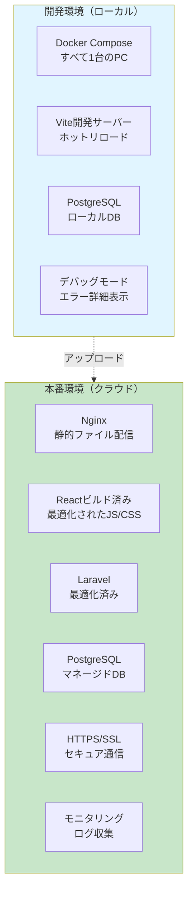
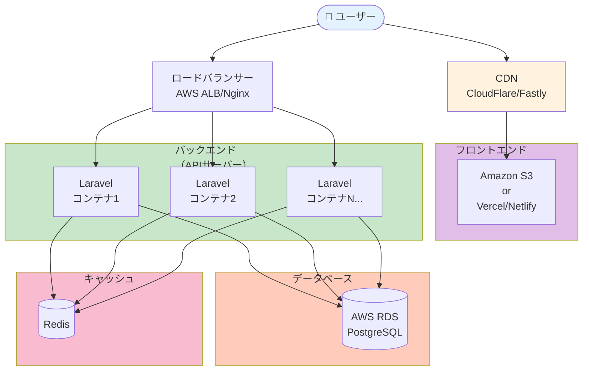
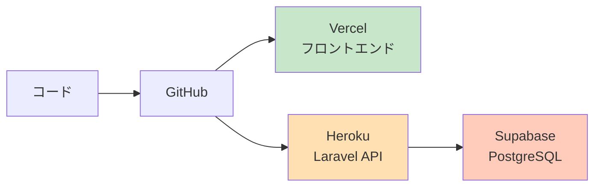
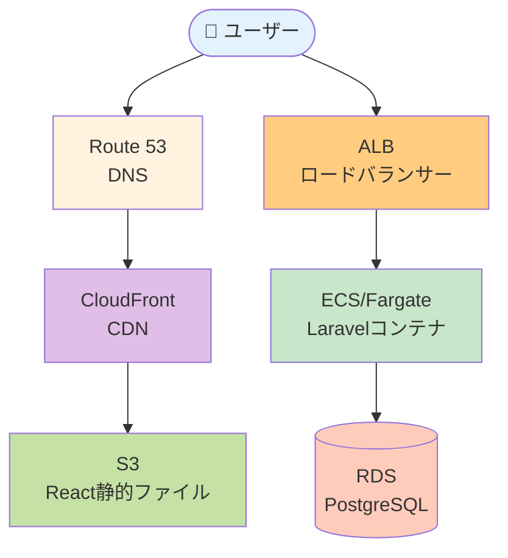
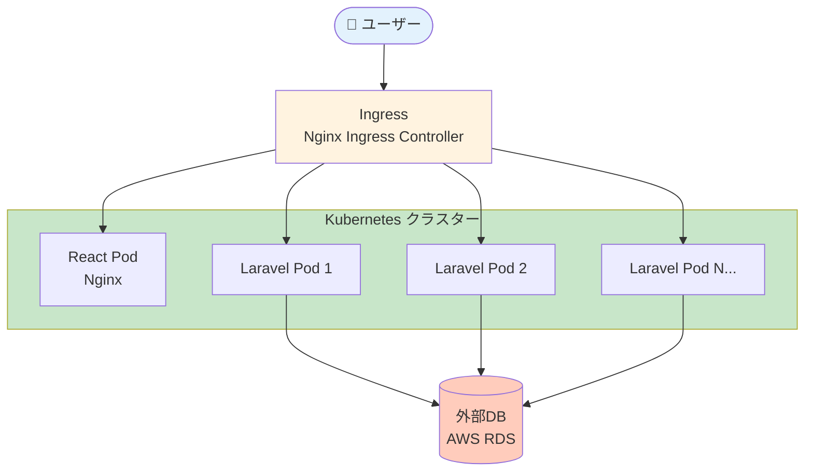
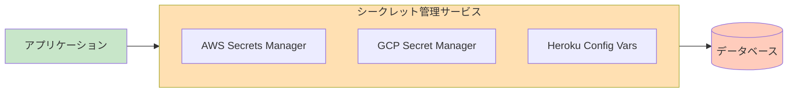
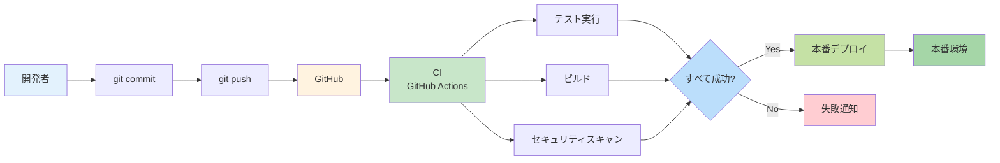
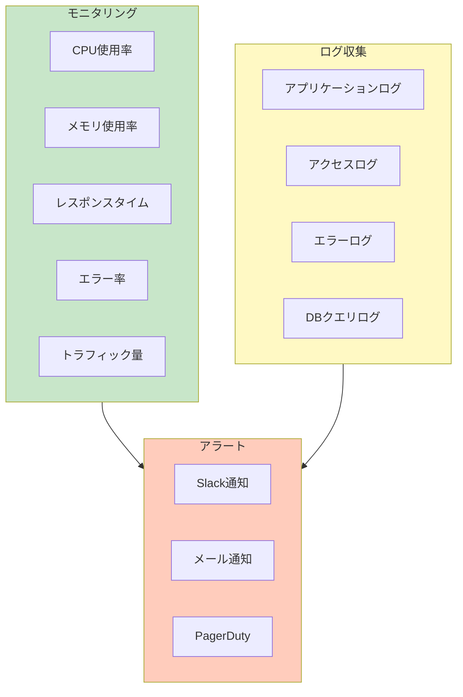

# タスク12: 本番環境へのデプロイ

## 📋 タスク概要

このドキュメントでは、開発環境（Docker Compose）で作ったアプリケーションを、本番環境にデプロイする方法を説明します。

> 💡 **重要な前提**
> 開発環境と本番環境は**別物**です。開発環境の `docker-compose.yml` をそのまま本番環境で使うことは**推奨されません**。

---

## 🤔 なぜ開発環境と本番環境を分けるのか？

### 開発環境の特徴
- ✅ **開発のしやすさ優先**: ホットリロード、デバッグ機能
- ✅ **すべてローカル**: 1台のマシンですべてが動く
- ✅ **セキュリティは緩め**: パスワードは `secret` で固定など
- ✅ **パフォーマンスは二の次**: 多少遅くても問題ない

### 本番環境の特徴
- ✅ **安定性・セキュリティ優先**: ダウンタイムを避ける
- ✅ **スケーラビリティ**: アクセス増加に対応できる
- ✅ **厳格なセキュリティ**: 本物のユーザーのデータを守る
- ✅ **高パフォーマンス**: 最適化されたビルド

---

## 🔄 開発環境 vs 本番環境の違い



### 主要な違い

| 項目 | 開発環境 | 本番環境 |
|-----|---------|---------|
| **Reactの配信** | Vite開発サーバー（:5173） | Nginxで静的ファイル配信 |
| **デバッグ** | エラー詳細を表示 | エラーは隠す（ログに記録） |
| **環境変数** | `.env` ファイル | クラウドのシークレット管理 |
| **HTTPS** | HTTP（暗号化なし） | HTTPS必須（SSL証明書） |
| **データベース** | ローカルPostgreSQL | マネージドDB（AWS RDS等） |
| **スケーリング** | 1台のみ | 複数サーバーで負荷分散 |
| **モニタリング** | なし | ログ収集、アラート設定 |

---

## 🏗️ 本番環境のアーキテクチャ

### 推奨構成（クラウドサービス利用）



**各コンポーネントの役割**:

| コンポーネント | 役割 | 具体例 |
|-------------|------|-------|
| **CDN** | 静的ファイルを高速配信 | CloudFlare, Fastly |
| **静的ファイルホスティング** | ReactのビルドファイルをホストGoogle | S3 + CloudFront, Vercel, Netlify |
| **ロードバランサー** | 複数サーバーに負荷分散 | AWS ALB, Nginx |
| **APIサーバー** | Laravelコンテナ（複数台） | ECS, Kubernetes, Heroku |
| **マネージドDB** | データベース（自動バックアップ） | AWS RDS, Supabase |
| **キャッシュ** | パフォーマンス向上 | Redis, Memcached |

---

## 🚀 デプロイ方法の選択肢

### オプション1: フルマネージド（初心者におすすめ）

**メリット**: 設定が簡単、メンテナンス不要、自動スケーリング



**構成**:
- **フロントエンド**: Vercel または Netlify
- **バックエンド**: Heroku または Railway
- **データベース**: Supabase または Heroku Postgres

**コスト**: 月額 $20〜50（小規模アプリ）

**手順**:
1. GitHubにコードをプッシュ
2. Vercelと連携（自動デプロイ）
3. Herokuと連携（自動デプロイ）
4. 環境変数を設定

---

### オプション2: AWS（中級者向け）

**メリット**: 柔軟性が高い、スケーラブル、業界標準



**構成**:
- **Route 53**: DNS管理
- **CloudFront + S3**: React静的ファイル配信
- **ALB**: ロードバランサー
- **ECS/Fargate**: Laravelコンテナ実行
- **RDS**: PostgreSQL

**コスト**: 月額 $50〜200（トラフィックによる）

**Docker活用**: ✅ **活かせる！**
- 開発環境のDockerfileをそのまま使える
- ECS/Fargateでコンテナをデプロイ

---

### オプション3: Kubernetes（上級者向け）

**メリット**: 最も柔軟、大規模対応、マルチクラウド



**構成**:
- **GKE/EKS**: Kubernetesマネージドサービス
- **Helm**: パッケージ管理
- **Ingress**: トラフィック制御

**Docker活用**: ✅ **完全に活かせる！**
- DockerイメージをそのままKubernetesで使用

---

## 📦 Dockerを本番環境で活かす方法

### 開発環境のDockerfileを本番用に調整

**現在の開発環境用Dockerfile（Laravel）**:
```dockerfile
FROM php:8.2-fpm-alpine
# ... 開発用設定
```

**本番環境用Dockerfile（最適化版）**:
```dockerfile
# マルチステージビルド
FROM php:8.2-fpm-alpine AS base
WORKDIR /var/www/html

# 依存関係のインストール
RUN apk add --no-cache \
    postgresql-dev \
    libzip-dev \
    && docker-php-ext-install \
        pdo_pgsql \
        pgsql \
        zip \
        opcache

# Composerのインストール
COPY --from=composer:latest /usr/bin/composer /usr/bin/composer

# 本番用設定
FROM base AS production
ENV APP_ENV=production
ENV APP_DEBUG=false

# ソースコードコピー
COPY . /var/www/html

# 依存関係インストール（本番用）
RUN composer install --no-dev --optimize-autoloader

# キャッシュ生成
RUN php artisan config:cache && \
    php artisan route:cache && \
    php artisan view:cache

# 権限設定
RUN chown -R www-data:www-data /var/www/html/storage

EXPOSE 9000
CMD ["php-fpm"]
```

**違い**:
- ✅ **マルチステージビルド**: イメージサイズ削減
- ✅ **本番モード**: `APP_DEBUG=false`
- ✅ **最適化**: キャッシュ生成、`--no-dev`
- ✅ **セキュリティ**: 適切な権限設定

---

## 🔒 環境変数の管理

### 開発環境（`.env` ファイル）

```env
APP_ENV=local
APP_DEBUG=true
DB_HOST=db
DB_PASSWORD=secret
```

### 本番環境（シークレット管理サービス）



**絶対にGitにコミットしてはいけない情報**:
- ❌ データベースパスワード
- ❌ APIキー（Stripe、AWS等）
- ❌ `APP_KEY`（Laravel）
- ❌ JWT秘密鍵

**本番環境での設定方法**:

**AWS ECS の場合**:
```json
{
  "environment": [
    {
      "name": "APP_ENV",
      "value": "production"
    }
  ],
  "secrets": [
    {
      "name": "DB_PASSWORD",
      "valueFrom": "arn:aws:secretsmanager:..."
    }
  ]
}
```

**Heroku の場合**:
```bash
heroku config:set APP_ENV=production
heroku config:set DB_PASSWORD=actual_secure_password
```

---

## 🔐 セキュリティ対策

### 本番環境で必須の対策

| 対策 | 開発環境 | 本番環境 |
|-----|---------|---------|
| **HTTPS** | ❌ 不要 | ✅ 必須（SSL証明書） |
| **ファイアウォール** | ❌ なし | ✅ 設定必須 |
| **環境変数** | `.env` ファイル | シークレット管理 |
| **デバッグモード** | ON | ✅ 必ず OFF |
| **エラー表示** | 詳細表示 | ✅ 隠す（ログに記録） |
| **CORS** | すべて許可 | ✅ 特定オリジンのみ |
| **レート制限** | なし | ✅ API制限設定 |

### SSL証明書の設定

**無料SSL証明書**: Let's Encrypt

**設定方法**:
```bash
# Certbot（Let's Encrypt）でSSL証明書取得
certbot --nginx -d yourdomain.com
```

**Nginx設定（HTTPS）**:
```nginx
server {
    listen 443 ssl http2;
    server_name yourdomain.com;

    ssl_certificate /etc/letsencrypt/live/yourdomain.com/fullchain.pem;
    ssl_certificate_key /etc/letsencrypt/live/yourdomain.com/privkey.pem;

    location /api {
        proxy_pass http://laravel:9000;
    }

    location / {
        root /var/www/html/public;
        try_files $uri $uri/ /index.html;
    }
}
```

---

## 🔄 CI/CDパイプライン

### 自動デプロイの流れ



### GitHub Actions 設定例

**.github/workflows/deploy-production.yml**:
```yaml
name: Deploy to Production

on:
  push:
    branches: [main]

jobs:
  deploy-frontend:
    runs-on: ubuntu-latest
    steps:
      - uses: actions/checkout@v4

      - name: Setup Node.js
        uses: actions/setup-node@v4
        with:
          node-version: 20

      - name: Build React
        working-directory: frontend
        run: |
          npm ci
          npm run build

      - name: Deploy to S3
        run: |
          aws s3 sync frontend/dist s3://your-bucket-name
        env:
          AWS_ACCESS_KEY_ID: ${{ secrets.AWS_ACCESS_KEY_ID }}
          AWS_SECRET_ACCESS_KEY: ${{ secrets.AWS_SECRET_ACCESS_KEY }}

  deploy-backend:
    runs-on: ubuntu-latest
    steps:
      - uses: actions/checkout@v4

      - name: Configure AWS credentials
        uses: aws-actions/configure-aws-credentials@v4
        with:
          aws-access-key-id: ${{ secrets.AWS_ACCESS_KEY_ID }}
          aws-secret-access-key: ${{ secrets.AWS_SECRET_ACCESS_KEY }}
          aws-region: ap-northeast-1

      - name: Build Docker image
        working-directory: docker/laravel
        run: |
          docker build -t laravel-app .

      - name: Push to ECR
        run: |
          aws ecr get-login-password | docker login --username AWS --password-stdin ${{ secrets.ECR_REGISTRY }}
          docker tag laravel-app:latest ${{ secrets.ECR_REGISTRY }}/laravel-app:latest
          docker push ${{ secrets.ECR_REGISTRY }}/laravel-app:latest

      - name: Deploy to ECS
        run: |
          aws ecs update-service --cluster my-cluster --service laravel-service --force-new-deployment
```

---

## 📊 モニタリングとログ

### 本番環境で監視すべき項目



### ツール

| カテゴリ | ツール | 用途 |
|---------|-------|------|
| **APM** | New Relic, DataDog | パフォーマンス監視 |
| **ログ** | CloudWatch, Loggly | ログ収集・検索 |
| **エラー追跡** | Sentry, Bugsnag | エラー通知・分析 |
| **死活監視** | Pingdom, UptimeRobot | サーバーダウン検知 |

---

## 💰 コスト比較

### 小規模アプリ（月間1万PV程度）

| 方式 | 月額コスト | 難易度 |
|-----|-----------|-------|
| **Vercel + Heroku** | $20〜50 | ⭐ 簡単 |
| **AWS（EC2小）** | $30〜80 | ⭐⭐ 中級 |
| **AWS（ECS/Fargate）** | $50〜150 | ⭐⭐⭐ 上級 |
| **Kubernetes** | $100〜300 | ⭐⭐⭐⭐ 専門 |

### 中規模アプリ（月間10万PV程度）

| 方式 | 月額コスト | 難易度 |
|-----|-----------|-------|
| **Vercel + Heroku** | $100〜200 | ⭐ 簡単 |
| **AWS（ECS/Fargate）** | $150〜400 | ⭐⭐⭐ 上級 |
| **Kubernetes** | $300〜800 | ⭐⭐⭐⭐ 専門 |

---

## 🎯 推奨デプロイ方法（段階別）

### ステージ1: 学習・プロトタイプ
**推奨**: Vercel + Heroku + Supabase
- **理由**: 無料枠で始められる、設定が簡単
- **コスト**: $0〜20/月

### ステージ2: 小規模本番運用
**推奨**: Vercel + Railway/Render + Supabase
- **理由**: 設定が簡単、自動スケール
- **コスト**: $20〜100/月

### ステージ3: 中規模本番運用
**推奨**: AWS（S3 + CloudFront + ECS + RDS）
- **理由**: 柔軟性、スケーラビリティ
- **コスト**: $100〜500/月

### ステージ4: 大規模本番運用
**推奨**: Kubernetes（GKE/EKS）
- **理由**: 最大の柔軟性、マルチクラウド
- **コスト**: $500〜数千/月

---

## ✅ まとめ

### Dockerで作った構成は本番で活かせる？

**✅ はい、活かせます！**

| 項目 | 開発環境 | 本番環境 |
|-----|---------|---------|
| **Dockerfile** | ✅ そのまま使える | 最適化が必要 |
| **docker-compose.yml** | ✅ 開発用 | ❌ 使わない |
| **アプリケーションコード** | ✅ 同じ | ✅ 同じ |
| **環境変数** | `.env` | シークレット管理 |

### 重要なポイント

1. **Docker Composeは開発専用**: 本番ではオーケストレーションツール（ECS、Kubernetes）を使う
2. **Dockerfileは調整が必要**: マルチステージビルド、最適化
3. **環境変数は分離**: 開発と本番で別管理
4. **セキュリティは必須**: HTTPS、ファイアウォール、シークレット管理
5. **モニタリングは重要**: エラー検知、パフォーマンス監視

---

**作成日**: 2025-11-16
**関連ドキュメント**: `CLAUDE.md`, `ARCHITECTURE.md`, `タスク1.md`
**次のタスク**: 実際のデプロイ手順（ステージ1から順に）
