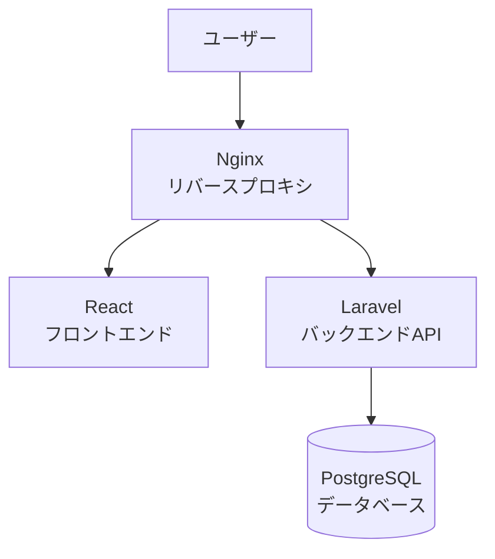
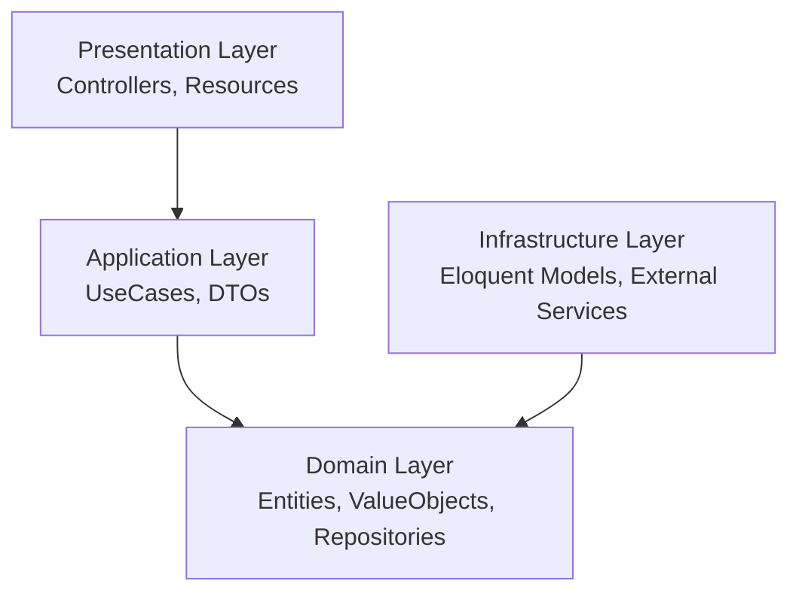
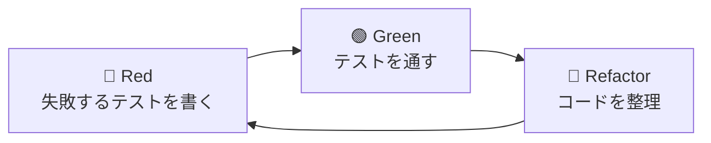
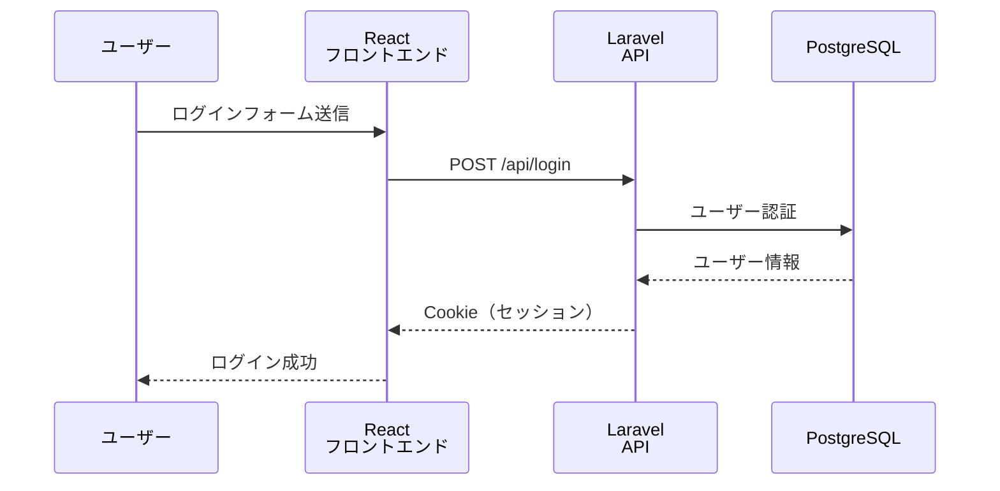
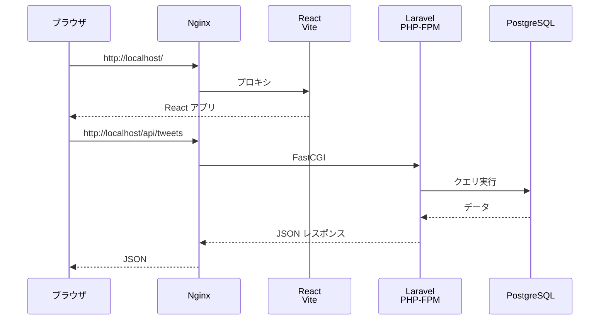

# タスク2: ARCHITECTURE.md の作成

## 📋 タスク概要

このタスクでは、プロジェクト全体の設計思想とベストプラクティスをドキュメント化します。
**新人エンジニアでも理解できるよう**、以下のポイントを重視します：

- ✅ **わかりやすさ優先**: 専門用語は丁寧に説明
- ✅ **理由を明確に**: 「なぜそうするのか」を常に説明
- ✅ **視覚化**: マーメイド図を活用して直感的に理解できるように
- ✅ **具体例**: コードサンプルを豊富に含める

---

## 🎯 ARCHITECTURE.md の目的

### 1. オンボーディング（新規参加者の受け入れ）
新しくプロジェクトに参加したエンジニアが、以下を素早く理解できるようにする：
- プロジェクトの全体像
- 技術選定の理由
- コードの書き方のルール
- テストの方針

### 2. 設計意図の共有
「なぜこの設計にしたのか」という**意思決定の背景**を記録する：
- 将来の自分が見返したときに理解できる
- チームメンバー全員が同じ理解を持てる
- 新しい機能を追加するときの指針になる

### 3. 品質の維持
プロジェクトが成長しても、一貫した品質を保つための基準を定める：
- コーディング規約
- テスト戦略
- レビュー観点

---

## 📝 ARCHITECTURE.md に含める内容

### 1. プロジェクト概要
```
- プロジェクト名
- 目的・ゴール
- 主要な機能
- 対象ユーザー
```

### 2. 技術スタック
```
- なぜこの技術を選んだのか（理由付き）
- 各技術の役割
- バージョン情報
```

**マーメイド図で視覚化**:
- システム全体のアーキテクチャ図
- リクエストフロー図

### 3. ディレクトリ構成
```
- フロントエンド（React）の構成
- バックエンド（Laravel）の構成（DDD対応）
- 各ディレクトリの役割と責務
```

**わかりやすく説明**:
- 「なぜこのディレクトリ構成なのか」
- 「どこに何を置くべきか」の判断基準

### 4. アーキテクチャパターン
```
- DDD（ドメイン駆動設計）の採用理由
- レイヤードアーキテクチャの説明
- 依存関係の方向
```

**マーメイド図で視覚化**:
- レイヤードアーキテクチャ図
- データフロー図

### 5. TDD/テスト戦略
```
- TDDとは何か（初心者向け説明）
- Red-Green-Refactor サイクル
- テストの種類と使い分け
- テストカバレッジの目標
```

**具体例**:
- 実際のテストコード例
- テストを書く順序

### 6. API設計
```
- RESTful API の設計原則
- エンドポイント命名規則
- レスポンスフォーマット
- エラーハンドリング
```

**具体例**:
- エンドポイント一覧
- リクエスト/レスポンス例

### 7. 認証・認可
```
- Laravel Sanctum（SPA認証）の仕組み
- Cookie vs Token の選択理由
- セキュリティ対策
```

**マーメイド図で視覚化**:
- 認証フロー図

### 8. データベース設計
```
- PostgreSQL を選んだ理由
- ER図（主要なテーブル関係）
- マイグレーション戦略
```

**マーメイド図で視覚化**:
- ER図

### 9. コード品質
```
- コーディング規約
- リンター/フォーマッター設定
- コードレビューの観点
- 保守性を高めるための原則
```

### 10. 開発ワークフロー
```
- Git ブランチ戦略
- コミットメッセージ規約
- CI/CD パイプライン
- デプロイフロー
```

**マーメイド図で視覚化**:
- Git フロー図
- CI/CD パイプライン図

---

## 🎨 マーメイド図の活用例

### 1. システムアーキテクチャ図


### 2. レイヤードアーキテクチャ図


### 3. TDD サイクル図


### 4. 認証フロー図


### 5. リクエストフロー図


---

## ✍️ 記述スタイルガイド

### 1. 見出しの使い方
```markdown
# 大見出し（H1）: ドキュメントタイトル
## 中見出し（H2）: セクション
### 小見出し（H3）: サブセクション
```

### 2. 強調の使い方
```markdown
**太字**: 重要なキーワード
*斜体*: 補足説明
`コード`: コマンドや関数名
```

### 3. コードブロックの使い方
```markdown
```php
// PHP コード例
```

```typescript
// TypeScript コード例
```
```

### 4. リストの使い方
```markdown
- 順序なしリスト
  - ネストも可能

1. 順序ありリスト
2. 番号付き
```

### 5. 注意書き・ヒント
```markdown
> 💡 **ヒント**: 初心者向けのアドバイス

> ⚠️ **注意**: 気をつけるべきポイント

> 📖 **参考**: 詳しく学べるリソース
```

---

## 🎯 完了条件

このタスクは、以下の条件を満たした時点で完了とします：

1. ✅ `ARCHITECTURE.md` が作成されている
2. ✅ 10のセクション（上記）すべてが含まれている
3. ✅ 最低5つのマーメイド図が含まれている
4. ✅ 各技術選定に「理由」が明記されている
5. ✅ 具体的なコード例が含まれている
6. ✅ 新人エンジニアが読んで理解できる内容になっている
7. ✅ 専門用語には説明が付いている

---

## 📌 重要なポイント

### 1. 読者を意識する
- **対象**: 新人エンジニア、このプロジェクトに初めて触れる人
- **目的**: 素早くキャッチアップできるようにする
- **トーン**: 教えるように、丁寧に

### 2. 「なぜ」を説明する
```markdown
❌ 悪い例:
PostgreSQL を使用します。

✅ 良い例:
PostgreSQL を使用します。理由は以下の通りです：
- 完全なオープンソースで無料
- Laravelで完全サポート
- 高い信頼性と堅牢性
```

### 3. 視覚化を活用する
- 文字だけでは理解しづらい概念は図で説明
- フロー図、アーキテクチャ図、ER図など
- マーメイド記法を使えば、コードで図を描ける

### 4. 具体例を示す
- 抽象的な説明だけでなく、実際のコード例を含める
- 「こういう場合はこう書く」という指針を示す

---

## 🚀 次のステップ（タスク3以降）

タスク2が完了したら、次のステップに進みます：

### タスク3: Laravel プロジェクトのセットアップ
- Laravel 11のインストール
- DDD対応のディレクトリ構成の準備
- Pest（テストフレームワーク）のセットアップ
- Laravel Pint（コードフォーマッター）のセットアップ

### タスク4: React プロジェクトのセットアップ
- React + Vite + TypeScript + Tailwindのプロジェクト作成
- Biome（リンター/フォーマッター）のセットアップ
- Vitest（テストフレームワーク）のセットアップ

---

**作成日**: 2025-11-16
**関連ドキュメント**: `CLAUDE.md`, `タスク1.md`
**次のタスク**: `タスク3.md` (Laravelプロジェクトのセットアップ)
