# 開発ロードマップ（タスク6以降）

**作成日**: 2025-11-16
**バージョン**: 1.0.0

---

## 📋 目次

1. [全体像](#全体像)
2. [開発フロー図](#開発フロー図)
3. [各タスクの詳細](#各タスクの詳細)
   - [タスク6: ツイート投稿機能（最初のTDDサイクル）](#タスク6-ツイート投稿機能最初のtddサイクル)
   - [タスク7: 認証機能（Laravel Sanctum）](#タスク7-認証機能laravel-sanctum)
   - [タスク8: ツイートCRUD完成（一覧・削除・詳細）](#タスク8-ツイートcrud完成一覧削除詳細)
   - [タスク9: いいね機能](#タスク9-いいね機能)
   - [タスク10: フォロー機能](#タスク10-フォロー機能)
   - [タスク11: 返信機能](#タスク11-返信機能)
   - [タスク12: タイムライン表示](#タスク12-タイムライン表示)
   - [タスク13: フロントエンド基盤（React）](#タスク13-フロントエンド基盤react)
   - [タスク14: フロントエンド認証UI](#タスク14-フロントエンド認証ui)
   - [タスク15: フロントエンド機能実装](#タスク15-フロントエンド機能実装)
4. [マイルストーン](#マイルストーン)
5. [注意事項](#注意事項)

---

## 全体像

### プロジェクトの進行状況

| タスク | 状態 | 説明 |
|-------|------|------|
| タスク1 | ✅ 完了 | プロジェクト計画 |
| タスク2 | ✅ 完了 | Docker環境構築 |
| タスク3 | ✅ 完了 | Laravelプロジェクトセットアップ |
| タスク4 | ✅ 完了 | アーキテクチャ設計 |
| タスク5 | ✅ 完了 | データベース設計（コアテーブル） |
| **タスク6** | 🔜 次 | ツイート投稿機能（最初のTDDサイクル） |
| タスク7 | 📅 予定 | 認証機能（Laravel Sanctum） |
| タスク8 | 📅 予定 | ツイートCRUD完成 |
| タスク9 | 📅 予定 | いいね機能 |
| タスク10 | 📅 予定 | フォロー機能 |
| タスク11 | 📅 予定 | 返信機能 |
| タスク12 | 📅 予定 | タイムライン表示 |
| タスク13 | 📅 予定 | フロントエンド基盤（React） |
| タスク14 | 📅 予定 | フロントエンド認証UI |
| タスク15 | 📅 予定 | フロントエンド機能実装 |

### 開発の3フェーズ

```
【フェーズ1: バックエンド基盤】タスク6〜8
├─ タスク6: ツイート投稿機能（TDDサイクル確立）
├─ タスク7: 認証機能（Sanctum導入）
└─ タスク8: ツイートCRUD完成

【フェーズ2: バックエンド機能拡張】タスク9〜12
├─ タスク9: いいね機能
├─ タスク10: フォロー機能
├─ タスク11: 返信機能
└─ タスク12: タイムライン表示

【フェーズ3: フロントエンド実装】タスク13〜15
├─ タスク13: React基盤（Vite + TypeScript）
├─ タスク14: 認証UI（登録・ログイン）
└─ タスク15: 機能UI（ツイート・いいね・フォローなど）
```

---

## 開発フロー図

```mermaid
graph TD
    T5[タスク5: DB設計完了] --> T6[タスク6: ツイート投稿]
    T6 --> T6a[users/tweetsマイグレーション実行]
    T6a --> T6b[TDDサイクル確立]
    T6b --> T7[タスク7: 認証機能]

    T7 --> T7a[Sanctumインストール]
    T7a --> T7b[登録・ログインAPI]
    T7b --> T8[タスク8: ツイートCRUD完成]

    T8 --> T8a[一覧・削除・詳細API]
    T8a --> T9[タスク9: いいね機能]

    T9 --> T9a[likesマイグレーション実行]
    T9a --> T9b[いいねAPI]
    T9b --> T10[タスク10: フォロー機能]

    T10 --> T10a[followsマイグレーション実行]
    T10a --> T10b[フォローAPI]
    T10b --> T11[タスク11: 返信機能]

    T11 --> T11a[repliesマイグレーション実行]
    T11a --> T11b[返信API]
    T11b --> T12[タスク12: タイムライン]

    T12 --> T12a[タイムラインアルゴリズム実装]
    T12a --> T13[タスク13: フロントエンド基盤]

    T13 --> T13a[Reactプロジェクト作成]
    T13a --> T13b[基本コンポーネント]
    T13b --> T14[タスク14: 認証UI]

    T14 --> T14a[登録・ログインフォーム]
    T14a --> T14b[認証コンテキスト]
    T14b --> T15[タスク15: 機能UI]

    T15 --> T15a[ツイート投稿UI]
    T15a --> T15b[いいね・フォローUI]
    T15b --> T15c[タイムラインUI]
    T15c --> T16[完成]

    style T6 fill:#ffeb3b
    style T7 fill:#ffeb3b
    style T8 fill:#ffeb3b
    style T9 fill:#81c784
    style T10 fill:#81c784
    style T11 fill:#81c784
    style T12 fill:#81c784
    style T13 fill:#64b5f6
    style T14 fill:#64b5f6
    style T15 fill:#64b5f6
    style T16 fill:#f06292
```



**凡例**:
- 🟡 黄色: フェーズ1（バックエンド基盤）
- 🟢 緑色: フェーズ2（バックエンド機能拡張）
- 🔵 青色: フェーズ3（フロントエンド実装）
- 🔴 ピンク: プロジェクト完成

---

## 各タスクの詳細

---

## タスク6: ツイート投稿機能（最初のTDDサイクル）

### 🎯 目的

- **TDDサイクル（Red → Green → Refactor）の確立**
- ツイート投稿APIの実装（`POST /api/tweets`）
- users/tweetsマイグレーションの実行
- プロジェクト全体の開発リズムを作る

### 📋 前提条件

- ✅ タスク5（データベース設計）が完了していること
- ✅ `backend/`ディレクトリにLaravelプロジェクトが存在すること
- ✅ Dockerコンテナが起動していること

### 🔄 TDDサイクル

#### ステップ1: Red（失敗するテストを書く）

**ファイル**: `backend/tests/Feature/Tweet/TweetTest.php`

```php
<?php

use App\Models\User;
use Illuminate\Foundation\Testing\RefreshDatabase;

uses(RefreshDatabase::class);

it('認証されていないユーザーはツイートを投稿できない', function () {
    $response = $this->postJson('/api/tweets', [
        'body' => 'これはテストツイートです',
    ]);

    $response->assertStatus(401);
});

it('認証済みユーザーはツイートを投稿できる', function () {
    $user = User::factory()->create();

    $response = $this->actingAs($user)->postJson('/api/tweets', [
        'body' => 'これはテストツイートです',
    ]);

    $response->assertStatus(201)
        ->assertJsonStructure(['id', 'body', 'user', 'created_at']);

    $this->assertDatabaseHas('tweets', [
        'body' => 'これはテストツイートです',
        'user_id' => $user->id,
    ]);
});

it('ツイート本文が空の場合バリデーションエラーが返る', function () {
    $user = User::factory()->create();

    $response = $this->actingAs($user)->postJson('/api/tweets', [
        'body' => '',
    ]);

    $response->assertStatus(422)
        ->assertJsonValidationErrors(['body']);
});

it('ツイート本文が280文字を超える場合バリデーションエラーが返る', function () {
    $user = User::factory()->create();

    $response = $this->actingAs($user)->postJson('/api/tweets', [
        'body' => str_repeat('あ', 281),
    ]);

    $response->assertStatus(422)
        ->assertJsonValidationErrors(['body']);
});
```

**実行コマンド**:
```bash
cd backend
./vendor/bin/pest tests/Feature/Tweet/TweetTest.php
```

**期待される結果**: すべてのテストが失敗（Red）

#### ステップ2: Green（テストを通す最小限の実装）

**2-1. マイグレーション実行**

```bash
cd backend

# usersテーブル（既に存在する場合はスキップ）
php artisan migrate

# tweetsマイグレーション作成（タスク5で設計済み）
php artisan make:migration create_tweets_table
```

**マイグレーション内容** (`database/migrations/xxxx_create_tweets_table.php`):

```php
<?php

use Illuminate\Database\Migrations\Migration;
use Illuminate\Database\Schema\Blueprint;
use Illuminate\Support\Facades\Schema;

return new class extends Migration
{
    public function up(): void
    {
        Schema::create('tweets', function (Blueprint $table) {
            $table->uuid('id')->primary();
            $table->foreignId('user_id')->constrained()->onDelete('cascade');
            $table->string('body', 280);
            $table->timestamps();

            // インデックス
            $table->index('user_id');
            $table->index('created_at');
        });
    }

    public function down(): void
    {
        Schema::dropIfExists('tweets');
    }
};
```

```bash
php artisan migrate
```

**2-2. モデル作成**

```bash
php artisan make:model Tweet
```

**内容** (`app/Models/Tweet.php`):

```php
<?php

namespace App\Models;

use Illuminate\Database\Eloquent\Concerns\HasUuids;
use Illuminate\Database\Eloquent\Factories\HasFactory;
use Illuminate\Database\Eloquent\Model;
use Illuminate\Database\Eloquent\Relations\BelongsTo;

class Tweet extends Model
{
    use HasFactory, HasUuids;

    protected $fillable = [
        'body',
        'user_id',
    ];

    protected $casts = [
        'created_at' => 'datetime',
        'updated_at' => 'datetime',
    ];

    public function user(): BelongsTo
    {
        return $this->belongsTo(User::class);
    }
}
```

**2-3. FormRequest作成**

```bash
php artisan make:request StoreTweetRequest
```

**内容** (`app/Http/Requests/StoreTweetRequest.php`):

```php
<?php

namespace App\Http\Requests;

use Illuminate\Foundation\Http\FormRequest;

class StoreTweetRequest extends FormRequest
{
    public function authorize(): bool
    {
        return $this->user() !== null;
    }

    public function rules(): array
    {
        return [
            'body' => ['required', 'string', 'min:1', 'max:280'],
        ];
    }

    public function messages(): array
    {
        return [
            'body.required' => 'ツイート本文は必須です。',
            'body.min' => 'ツイート本文は1文字以上である必要があります。',
            'body.max' => 'ツイート本文は280文字以内である必要があります。',
        ];
    }
}
```

**2-4. コントローラー作成**

```bash
php artisan make:controller TweetController --api
```

**内容** (`app/Http/Controllers/TweetController.php`):

```php
<?php

namespace App\Http\Controllers;

use App\Http\Requests\StoreTweetRequest;
use App\Models\Tweet;
use Illuminate\Http\JsonResponse;

class TweetController extends Controller
{
    public function __construct()
    {
        $this->middleware('auth:sanctum');
    }

    public function store(StoreTweetRequest $request): JsonResponse
    {
        $tweet = Tweet::create([
            'body' => $request->input('body'),
            'user_id' => $request->user()->id,
        ]);

        $tweet->load('user');

        return response()->json($tweet, 201);
    }
}
```

**2-5. ルート定義**

**ファイル**: `routes/api.php`

```php
<?php

use App\Http\Controllers\TweetController;
use Illuminate\Support\Facades\Route;

Route::middleware('auth:sanctum')->group(function () {
    Route::post('/tweets', [TweetController::class, 'store']);
});
```

**2-6. テスト実行**

```bash
./vendor/bin/pest tests/Feature/Tweet/TweetTest.php
```

**期待される結果**: すべてのテストが成功（Green）

#### ステップ3: Refactor（リファクタリング）

**リファクタリングポイント**:

1. **APIリソースの作成** （JSON変換を専用クラスに分離）

```bash
php artisan make:resource TweetResource
```

**内容** (`app/Http/Resources/TweetResource.php`):

```php
<?php

namespace App\Http\Resources;

use Illuminate\Http\Request;
use Illuminate\Http\Resources\Json\JsonResource;

class TweetResource extends JsonResource
{
    public function toArray(Request $request): array
    {
        return [
            'id' => $this->id,
            'body' => $this->body,
            'user' => [
                'id' => $this->user->id,
                'name' => $this->user->name,
                'username' => $this->user->username,
            ],
            'created_at' => $this->created_at->toIso8601String(),
            'updated_at' => $this->updated_at->toIso8601String(),
        ];
    }
}
```

**コントローラーを更新**:

```php
public function store(StoreTweetRequest $request): JsonResponse
{
    $tweet = Tweet::create([
        'body' => $request->input('body'),
        'user_id' => $request->user()->id,
    ]);

    $tweet->load('user');

    return (new TweetResource($tweet))
        ->response()
        ->setStatusCode(201);
}
```

2. **テスト実行（リファクタリング後も通ることを確認）**

```bash
./vendor/bin/pest tests/Feature/Tweet/TweetTest.php
```

### 📦 成果物

- ✅ `tests/Feature/Tweet/TweetTest.php` （4つのテストケース）
- ✅ `database/migrations/xxxx_create_tweets_table.php`
- ✅ `app/Models/Tweet.php`
- ✅ `app/Http/Requests/StoreTweetRequest.php`
- ✅ `app/Http/Controllers/TweetController.php`
- ✅ `app/Http/Resources/TweetResource.php`
- ✅ `routes/api.php` （ツイート投稿ルート追加）

### ✅ 完了条件

- [ ] すべてのテストが成功している
- [ ] コードがリファクタリングされている（TweetResource使用）
- [ ] マイグレーションが実行されている（`tweets`テーブルが存在）
- [ ] コミットメッセージが適切（例: `feat(tweet): ツイート投稿機能を実装`）
- [ ] ブランチにプッシュされている

### ➡️ 次のタスクへ

タスク6が完了したら、**タスク7: 認証機能（Laravel Sanctum）** に進みます。

認証を導入することで、ツイート投稿機能に本格的なユーザー認証が追加されます。

---

## タスク7: 認証機能（Laravel Sanctum）

### 🎯 目的

- **Laravel Sanctumの導入**（SPA認証）
- ユーザー登録API（`POST /api/register`）
- ログインAPI（`POST /api/login`）
- ログアウトAPI（`POST /api/logout`）
- 認証済みユーザー情報取得API（`GET /api/user`）
- ツイート投稿機能に認証を統合

### 📋 前提条件

- ✅ タスク6が完了していること（ツイート投稿機能が動作）
- ✅ `users`テーブルが存在すること

### 🔄 TDDサイクル

#### ステップ1: Red（失敗するテストを書く）

**ファイル**: `backend/tests/Feature/Auth/AuthenticationTest.php`

```php
<?php

use App\Models\User;
use Illuminate\Foundation\Testing\RefreshDatabase;
use Illuminate\Support\Facades\Hash;

uses(RefreshDatabase::class);

describe('ユーザー登録', function () {
    it('新しいユーザーを登録できる', function () {
        $response = $this->postJson('/api/register', [
            'name' => 'Test User',
            'username' => 'testuser',
            'email' => 'test@example.com',
            'password' => 'password123',
            'password_confirmation' => 'password123',
        ]);

        $response->assertStatus(201)
            ->assertJsonStructure(['user', 'token']);

        $this->assertDatabaseHas('users', [
            'email' => 'test@example.com',
            'username' => 'testuser',
        ]);
    });

    it('重複したメールアドレスでは登録できない', function () {
        User::factory()->create(['email' => 'test@example.com']);

        $response = $this->postJson('/api/register', [
            'name' => 'Test User',
            'username' => 'testuser',
            'email' => 'test@example.com',
            'password' => 'password123',
            'password_confirmation' => 'password123',
        ]);

        $response->assertStatus(422)
            ->assertJsonValidationErrors(['email']);
    });

    it('パスワードが8文字未満の場合登録できない', function () {
        $response = $this->postJson('/api/register', [
            'name' => 'Test User',
            'username' => 'testuser',
            'email' => 'test@example.com',
            'password' => 'pass',
            'password_confirmation' => 'pass',
        ]);

        $response->assertStatus(422)
            ->assertJsonValidationErrors(['password']);
    });
});

describe('ログイン', function () {
    it('正しい認証情報でログインできる', function () {
        $user = User::factory()->create([
            'email' => 'test@example.com',
            'password' => Hash::make('password123'),
        ]);

        $response = $this->postJson('/api/login', [
            'email' => 'test@example.com',
            'password' => 'password123',
        ]);

        $response->assertStatus(200)
            ->assertJsonStructure(['user', 'token']);
    });

    it('間違った認証情報ではログインできない', function () {
        $user = User::factory()->create([
            'email' => 'test@example.com',
            'password' => Hash::make('password123'),
        ]);

        $response = $this->postJson('/api/login', [
            'email' => 'test@example.com',
            'password' => 'wrongpassword',
        ]);

        $response->assertStatus(401)
            ->assertJson(['message' => 'Invalid credentials']);
    });
});

describe('ログアウト', function () {
    it('認証済みユーザーはログアウトできる', function () {
        $user = User::factory()->create();

        $response = $this->actingAs($user, 'sanctum')
            ->postJson('/api/logout');

        $response->assertStatus(200)
            ->assertJson(['message' => 'Logged out successfully']);
    });
});

describe('認証済みユーザー情報取得', function () {
    it('認証済みユーザーは自分の情報を取得できる', function () {
        $user = User::factory()->create();

        $response = $this->actingAs($user, 'sanctum')
            ->getJson('/api/user');

        $response->assertStatus(200)
            ->assertJson([
                'id' => $user->id,
                'email' => $user->email,
            ]);
    });

    it('未認証ユーザーは情報を取得できない', function () {
        $response = $this->getJson('/api/user');

        $response->assertStatus(401);
    });
});
```

**実行**:
```bash
./vendor/bin/pest tests/Feature/Auth/AuthenticationTest.php
```

**期待される結果**: すべてのテストが失敗（Red）

#### ステップ2: Green（テストを通す最小限の実装）

**2-1. Sanctumインストール**

```bash
cd backend

# Sanctumパッケージインストール（Laravel 11には標準で含まれる）
php artisan install:api

# 設定ファイル公開
php artisan vendor:publish --provider="Laravel\Sanctum\SanctumServiceProvider"

# マイグレーション実行
php artisan migrate
```

**2-2. CORS設定**

**ファイル**: `config/cors.php`

```php
<?php

return [
    'paths' => ['api/*', 'sanctum/csrf-cookie'],
    'allowed_methods' => ['*'],
    'allowed_origins' => [env('FRONTEND_URL', 'http://localhost:5173')],
    'allowed_origins_patterns' => [],
    'allowed_headers' => ['*'],
    'exposed_headers' => [],
    'max_age' => 0,
    'supports_credentials' => true,
];
```

**2-3. Sanctum設定**

**ファイル**: `config/sanctum.php`

```php
<?php

return [
    'stateful' => explode(',', env('SANCTUM_STATEFUL_DOMAINS', sprintf(
        '%s%s',
        'localhost,localhost:5173,127.0.0.1,127.0.0.1:8000,::1',
        env('APP_URL') ? ','.parse_url(env('APP_URL'), PHP_URL_HOST) : ''
    ))),

    'guard' => ['web'],
    'expiration' => null,
    'middleware' => [
        'verify_csrf_token' => App\Http\Middleware\VerifyCsrfToken::class,
        'encrypt_cookies' => App\Http\Middleware\EncryptCookies::class,
    ],
];
```

**2-4. Userモデルに`HasApiTokens`を追加**

**ファイル**: `app/Models/User.php`

```php
<?php

namespace App\Models;

use Illuminate\Database\Eloquent\Factories\HasFactory;
use Illuminate\Foundation\Auth\User as Authenticatable;
use Illuminate\Notifications\Notifiable;
use Laravel\Sanctum\HasApiTokens;

class User extends Authenticatable
{
    use HasApiTokens, HasFactory, Notifiable;

    protected $fillable = [
        'name',
        'username',
        'email',
        'password',
    ];

    protected $hidden = [
        'password',
        'remember_token',
    ];

    protected function casts(): array
    {
        return [
            'email_verified_at' => 'datetime',
            'password' => 'hashed',
        ];
    }
}
```

**2-5. FormRequest作成**

```bash
php artisan make:request RegisterRequest
php artisan make:request LoginRequest
```

**内容** (`app/Http/Requests/RegisterRequest.php`):

```php
<?php

namespace App\Http\Requests;

use Illuminate\Foundation\Http\FormRequest;
use Illuminate\Validation\Rules\Password;

class RegisterRequest extends FormRequest
{
    public function authorize(): bool
    {
        return true;
    }

    public function rules(): array
    {
        return [
            'name' => ['required', 'string', 'max:255'],
            'username' => ['required', 'string', 'max:50', 'unique:users,username', 'alpha_dash'],
            'email' => ['required', 'string', 'email', 'max:255', 'unique:users,email'],
            'password' => ['required', 'string', 'confirmed', Password::min(8)],
        ];
    }
}
```

**内容** (`app/Http/Requests/LoginRequest.php`):

```php
<?php

namespace App\Http\Requests;

use Illuminate\Foundation\Http\FormRequest;

class LoginRequest extends FormRequest
{
    public function authorize(): bool
    {
        return true;
    }

    public function rules(): array
    {
        return [
            'email' => ['required', 'string', 'email'],
            'password' => ['required', 'string'],
        ];
    }
}
```

**2-6. AuthController作成**

```bash
php artisan make:controller AuthController
```

**内容** (`app/Http/Controllers/AuthController.php`):

```php
<?php

namespace App\Http\Controllers;

use App\Http\Requests\LoginRequest;
use App\Http\Requests\RegisterRequest;
use App\Models\User;
use Illuminate\Http\JsonResponse;
use Illuminate\Http\Request;
use Illuminate\Support\Facades\Hash;

class AuthController extends Controller
{
    public function register(RegisterRequest $request): JsonResponse
    {
        $user = User::create([
            'name' => $request->input('name'),
            'username' => $request->input('username'),
            'email' => $request->input('email'),
            'password' => Hash::make($request->input('password')),
        ]);

        $token = $user->createToken('auth-token')->plainTextToken;

        return response()->json([
            'user' => $user,
            'token' => $token,
        ], 201);
    }

    public function login(LoginRequest $request): JsonResponse
    {
        $user = User::where('email', $request->input('email'))->first();

        if (!$user || !Hash::check($request->input('password'), $user->password)) {
            return response()->json([
                'message' => 'Invalid credentials',
            ], 401);
        }

        $token = $user->createToken('auth-token')->plainTextToken;

        return response()->json([
            'user' => $user,
            'token' => $token,
        ], 200);
    }

    public function logout(Request $request): JsonResponse
    {
        $request->user()->currentAccessToken()->delete();

        return response()->json([
            'message' => 'Logged out successfully',
        ], 200);
    }

    public function user(Request $request): JsonResponse
    {
        return response()->json($request->user());
    }
}
```

**2-7. ルート定義**

**ファイル**: `routes/api.php`

```php
<?php

use App\Http\Controllers\AuthController;
use App\Http\Controllers\TweetController;
use Illuminate\Support\Facades\Route;

// 認証不要
Route::post('/register', [AuthController::class, 'register']);
Route::post('/login', [AuthController::class, 'login']);

// 認証必要
Route::middleware('auth:sanctum')->group(function () {
    Route::post('/logout', [AuthController::class, 'logout']);
    Route::get('/user', [AuthController::class, 'user']);

    // ツイート
    Route::post('/tweets', [TweetController::class, 'store']);
});
```

**2-8. テスト実行**

```bash
./vendor/bin/pest tests/Feature/Auth/AuthenticationTest.php
```

**期待される結果**: すべてのテストが成功（Green）

#### ステップ3: Refactor（リファクタリング）

**リファクタリングポイント**:

1. **UserResourceの作成**

```bash
php artisan make:resource UserResource
```

```php
<?php

namespace App\Http\Resources;

use Illuminate\Http\Request;
use Illuminate\Http\Resources\Json\JsonResource;

class UserResource extends JsonResource
{
    public function toArray(Request $request): array
    {
        return [
            'id' => $this->id,
            'name' => $this->name,
            'username' => $this->username,
            'email' => $this->email,
            'created_at' => $this->created_at->toIso8601String(),
        ];
    }
}
```

2. **AuthControllerをリファクタリング**

```php
public function register(RegisterRequest $request): JsonResponse
{
    $user = User::create([
        'name' => $request->input('name'),
        'username' => $request->input('username'),
        'email' => $request->input('email'),
        'password' => Hash::make($request->input('password')),
    ]);

    $token = $user->createToken('auth-token')->plainTextToken;

    return response()->json([
        'user' => new UserResource($user),
        'token' => $token,
    ], 201);
}
```

### 📦 成果物

- ✅ `tests/Feature/Auth/AuthenticationTest.php` （9つのテストケース）
- ✅ `app/Http/Requests/RegisterRequest.php`
- ✅ `app/Http/Requests/LoginRequest.php`
- ✅ `app/Http/Controllers/AuthController.php`
- ✅ `app/Http/Resources/UserResource.php`
- ✅ `routes/api.php` （認証ルート追加）
- ✅ `config/cors.php` （CORS設定）
- ✅ `config/sanctum.php` （Sanctum設定）

### ✅ 完了条件

- [ ] すべてのテストが成功している
- [ ] Sanctumが正常に動作している（トークン認証）
- [ ] CORS設定が適切である
- [ ] コミットメッセージが適切（例: `feat(auth): Laravel Sanctum認証を実装`）
- [ ] ブランチにプッシュされている

### ➡️ 次のタスクへ

タスク7が完了したら、**タスク8: ツイートCRUD完成（一覧・削除・詳細）** に進みます。

---

## タスク8: ツイートCRUD完成（一覧・削除・詳細）

### 🎯 目的

- ツイート一覧取得API（`GET /api/tweets`）
- ツイート詳細取得API（`GET /api/tweets/{id}`）
- ツイート削除API（`DELETE /api/tweets/{id}`）
- **ポリシーによる認可**（自分のツイートのみ削除可能）

### 📋 前提条件

- ✅ タスク7が完了していること（認証機能が動作）

### 🔄 TDDサイクル

#### ステップ1: Red（失敗するテストを書く）

**ファイル**: `backend/tests/Feature/Tweet/TweetTest.php`（既存ファイルに追加）

```php
describe('ツイート一覧取得', function () {
    it('ツイート一覧を取得できる', function () {
        $user = User::factory()->create();
        Tweet::factory()->count(5)->create(['user_id' => $user->id]);

        $response = $this->actingAs($user, 'sanctum')
            ->getJson('/api/tweets');

        $response->assertStatus(200)
            ->assertJsonCount(5, 'data');
    });

    it('ツイートが新しい順に並んでいる', function () {
        $user = User::factory()->create();
        $oldTweet = Tweet::factory()->create([
            'user_id' => $user->id,
            'created_at' => now()->subHours(2),
        ]);
        $newTweet = Tweet::factory()->create([
            'user_id' => $user->id,
            'created_at' => now(),
        ]);

        $response = $this->actingAs($user, 'sanctum')
            ->getJson('/api/tweets');

        $response->assertStatus(200);
        expect($response->json('data.0.id'))->toBe($newTweet->id);
        expect($response->json('data.1.id'))->toBe($oldTweet->id);
    });
});

describe('ツイート詳細取得', function () {
    it('ツイート詳細を取得できる', function () {
        $user = User::factory()->create();
        $tweet = Tweet::factory()->create(['user_id' => $user->id]);

        $response = $this->actingAs($user, 'sanctum')
            ->getJson("/api/tweets/{$tweet->id}");

        $response->assertStatus(200)
            ->assertJson([
                'id' => $tweet->id,
                'body' => $tweet->body,
            ]);
    });

    it('存在しないツイートは404エラーが返る', function () {
        $user = User::factory()->create();

        $response = $this->actingAs($user, 'sanctum')
            ->getJson('/api/tweets/nonexistent-id');

        $response->assertStatus(404);
    });
});

describe('ツイート削除', function () {
    it('自分のツイートを削除できる', function () {
        $user = User::factory()->create();
        $tweet = Tweet::factory()->create(['user_id' => $user->id]);

        $response = $this->actingAs($user, 'sanctum')
            ->deleteJson("/api/tweets/{$tweet->id}");

        $response->assertStatus(204);
        $this->assertDatabaseMissing('tweets', ['id' => $tweet->id]);
    });

    it('他人のツイートは削除できない', function () {
        $user1 = User::factory()->create();
        $user2 = User::factory()->create();
        $tweet = Tweet::factory()->create(['user_id' => $user1->id]);

        $response = $this->actingAs($user2, 'sanctum')
            ->deleteJson("/api/tweets/{$tweet->id}");

        $response->assertStatus(403);
        $this->assertDatabaseHas('tweets', ['id' => $tweet->id]);
    });
});
```

**実行**:
```bash
./vendor/bin/pest tests/Feature/Tweet/TweetTest.php
```

#### ステップ2: Green（実装）

**2-1. TweetFactory作成**

```bash
php artisan make:factory TweetFactory
```

**内容** (`database/factories/TweetFactory.php`):

```php
<?php

namespace Database\Factories;

use App\Models\User;
use Illuminate\Database\Eloquent\Factories\Factory;

class TweetFactory extends Factory
{
    public function definition(): array
    {
        return [
            'body' => fake()->realText(280),
            'user_id' => User::factory(),
        ];
    }
}
```

**2-2. TweetPolicy作成**

```bash
php artisan make:policy TweetPolicy --model=Tweet
```

**内容** (`app/Policies/TweetPolicy.php`):

```php
<?php

namespace App\Policies;

use App\Models\Tweet;
use App\Models\User;

class TweetPolicy
{
    public function delete(User $user, Tweet $tweet): bool
    {
        return $user->id === $tweet->user_id;
    }
}
```

**2-3. TweetController更新**

**内容** (`app/Http/Controllers/TweetController.php`):

```php
<?php

namespace App\Http\Controllers;

use App\Http\Requests\StoreTweetRequest;
use App\Http\Resources\TweetResource;
use App\Models\Tweet;
use Illuminate\Http\JsonResponse;
use Illuminate\Http\Resources\Json\AnonymousResourceCollection;

class TweetController extends Controller
{
    public function __construct()
    {
        $this->middleware('auth:sanctum');
    }

    public function index(): AnonymousResourceCollection
    {
        $tweets = Tweet::with('user')
            ->orderBy('created_at', 'desc')
            ->paginate(20);

        return TweetResource::collection($tweets);
    }

    public function show(Tweet $tweet): TweetResource
    {
        $tweet->load('user');

        return new TweetResource($tweet);
    }

    public function store(StoreTweetRequest $request): JsonResponse
    {
        $tweet = Tweet::create([
            'body' => $request->input('body'),
            'user_id' => $request->user()->id,
        ]);

        $tweet->load('user');

        return (new TweetResource($tweet))
            ->response()
            ->setStatusCode(201);
    }

    public function destroy(Tweet $tweet): JsonResponse
    {
        $this->authorize('delete', $tweet);

        $tweet->delete();

        return response()->json(null, 204);
    }
}
```

**2-4. ルート更新**

**ファイル**: `routes/api.php`

```php
Route::middleware('auth:sanctum')->group(function () {
    Route::post('/logout', [AuthController::class, 'logout']);
    Route::get('/user', [AuthController::class, 'user']);

    // ツイート
    Route::get('/tweets', [TweetController::class, 'index']);
    Route::get('/tweets/{tweet}', [TweetController::class, 'show']);
    Route::post('/tweets', [TweetController::class, 'store']);
    Route::delete('/tweets/{tweet}', [TweetController::class, 'destroy']);
});
```

**2-5. テスト実行**

```bash
./vendor/bin/pest tests/Feature/Tweet/TweetTest.php
```

### 📦 成果物

- ✅ `database/factories/TweetFactory.php`
- ✅ `app/Policies/TweetPolicy.php`
- ✅ `app/Http/Controllers/TweetController.php` （CRUD完成）
- ✅ `routes/api.php` （ツイートCRUDルート追加）

### ✅ 完了条件

- [ ] すべてのテストが成功している
- [ ] ポリシーによる認可が正常に動作している
- [ ] ページネーションが正常に動作している
- [ ] コミットメッセージが適切（例: `feat(tweet): ツイートCRUDを完成`）

### ➡️ 次のタスクへ

タスク8が完了したら、**タスク9: いいね機能** に進みます。

---

## タスク9: いいね機能

### 🎯 目的

- いいね追加API（`POST /api/tweets/{tweet}/like`）
- いいね削除API（`DELETE /api/tweets/{tweet}/like`）
- ツイートのいいね数取得
- ユーザーがいいねしたかどうかの判定

### 📋 前提条件

- ✅ タスク8が完了していること（ツイートCRUDが動作）

### 🔄 TDDサイクル（概要）

1. **Red**: いいね機能のテスト作成
2. **Green**:
   - `likes`マイグレーション実行
   - Likeモデル作成
   - LikeController作成
   - ルート追加
3. **Refactor**: リソースクラスでいいね情報を含める

### 📦 成果物（概要）

- ✅ `database/migrations/xxxx_create_likes_table.php`
- ✅ `app/Models/Like.php`
- ✅ `app/Http/Controllers/LikeController.php`
- ✅ `tests/Feature/Like/LikeTest.php`

### ➡️ 次のタスクへ

タスク9が完了したら、**タスク10: フォロー機能** に進みます。

---

## タスク10: フォロー機能

### 🎯 目的

- フォロー追加API（`POST /api/users/{user}/follow`）
- フォロー解除API（`DELETE /api/users/{user}/follow`）
- フォロワー一覧API（`GET /api/users/{user}/followers`）
- フォロー中一覧API（`GET /api/users/{user}/following`）

### 📋 前提条件

- ✅ タスク9が完了していること（いいね機能が動作）

### 🔄 TDDサイクル（概要）

1. **Red**: フォロー機能のテスト作成
2. **Green**:
   - `follows`マイグレーション実行
   - Follow モデル作成（または User モデルにリレーション追加）
   - FollowController作成
   - ルート追加
3. **Refactor**: 自己フォロー禁止のバリデーション追加

### 📦 成果物（概要）

- ✅ `database/migrations/xxxx_create_follows_table.php`
- ✅ `app/Models/Follow.php`
- ✅ `app/Http/Controllers/FollowController.php`
- ✅ `tests/Feature/Follow/FollowTest.php`

### ➡️ 次のタスクへ

タスク10が完了したら、**タスク11: 返信機能** に進みます。

---

## タスク11: 返信機能

### 🎯 目的

- 返信追加API（`POST /api/tweets/{tweet}/replies`）
- 返信一覧取得API（`GET /api/tweets/{tweet}/replies`）
- 返信削除API（`DELETE /api/replies/{reply}`）

### 📋 前提条件

- ✅ タスク10が完了していること（フォロー機能が動作）

### 🔄 TDDサイクル（概要）

1. **Red**: 返信機能のテスト作成
2. **Green**:
   - `replies`マイグレーション実行
   - Reply モデル作成
   - ReplyController作成
   - ルート追加
3. **Refactor**: ネストした返信の考慮（将来の拡張）

### 📦 成果物（概要）

- ✅ `database/migrations/xxxx_create_replies_table.php`
- ✅ `app/Models/Reply.php`
- ✅ `app/Http/Controllers/ReplyController.php`
- ✅ `tests/Feature/Reply/ReplyTest.php`

### ➡️ 次のタスクへ

タスク11が完了したら、**タスク12: タイムライン表示** に進みます。

---

## タスク12: タイムライン表示

### 🎯 目的

- タイムライン取得API（`GET /api/timeline`）
  - フォロー中のユーザーのツイート
  - 自分のツイート
  - 新しい順に表示
- パフォーマンス最適化（N+1問題の解決）

### 📋 前提条件

- ✅ タスク11が完了していること（返信機能が動作）
- ✅ フォロー機能が動作していること

### 🔄 TDDサイクル（概要）

1. **Red**: タイムラインのテスト作成
2. **Green**:
   - TimelineController作成
   - Eager Loadingによる最適化
   - ルート追加
3. **Refactor**: キャッシング戦略（将来の拡張）

### 📦 成果物（概要）

- ✅ `app/Http/Controllers/TimelineController.php`
- ✅ `tests/Feature/Timeline/TimelineTest.php`

### ➡️ 次のタスクへ

**バックエンドAPIの実装が完了！**

タスク12が完了したら、**タスク13: フロントエンド基盤（React）** に進みます。

---

## タスク13: フロントエンド基盤（React）

### 🎯 目的

- Reactプロジェクトのセットアップ（Vite + TypeScript）
- Tailwind CSSの導入
- Axiosの設定（API通信）
- ルーティング設定（React Router）
- 基本コンポーネントの作成（Layout, Header, Footer）

### 📋 前提条件

- ✅ タスク12が完了していること（バックエンドAPIが完成）

### 実装手順（概要）

1. **Reactプロジェクト作成**

```bash
cd /home/user/twitter-app
npm create vite@latest frontend -- --template react-ts
cd frontend
npm install
```

2. **依存パッケージインストール**

```bash
npm install axios react-router-dom
npm install -D tailwindcss postcss autoprefixer
npx tailwindcss init -p
```

3. **基本ディレクトリ構成作成**

```
frontend/
├── src/
│   ├── components/
│   │   ├── common/
│   │   │   ├── Header.tsx
│   │   │   ├── Footer.tsx
│   │   │   └── Layout.tsx
│   ├── services/
│   │   └── api.ts
│   ├── types/
│   │   └── index.ts
│   ├── App.tsx
│   └── main.tsx
```

4. **Axios設定**

```typescript
// src/services/api.ts
import axios from 'axios';

const api = axios.create({
  baseURL: import.meta.env.VITE_API_URL || 'http://localhost:8000/api',
  withCredentials: true,
  headers: {
    'Content-Type': 'application/json',
    'Accept': 'application/json',
  },
});

export default api;
```

### 📦 成果物（概要）

- ✅ `frontend/` ディレクトリ（Reactプロジェクト）
- ✅ Tailwind CSS設定
- ✅ Axiosインスタンス
- ✅ 基本レイアウトコンポーネント

### ➡️ 次のタスクへ

タスク13が完了したら、**タスク14: フロントエンド認証UI** に進みます。

---

## タスク14: フロントエンド認証UI

### 🎯 目的

- 認証コンテキストの作成（AuthContext）
- ユーザー登録フォーム
- ログインフォーム
- ログアウト機能
- 認証状態の管理

### 📋 前提条件

- ✅ タスク13が完了していること（React基盤が完成）
- ✅ バックエンド認証APIが動作していること（タスク7）

### 実装手順（概要）

1. **AuthContext作成**

```typescript
// src/contexts/AuthContext.tsx
import { createContext, useContext, useState, useEffect } from 'react';
import api from '../services/api';

interface User {
  id: number;
  name: string;
  username: string;
  email: string;
}

interface AuthContextType {
  user: User | null;
  login: (email: string, password: string) => Promise<void>;
  register: (data: RegisterData) => Promise<void>;
  logout: () => Promise<void>;
  loading: boolean;
}

const AuthContext = createContext<AuthContextType | undefined>(undefined);

export const AuthProvider = ({ children }) => {
  // 実装...
};

export const useAuth = () => {
  const context = useContext(AuthContext);
  if (!context) {
    throw new Error('useAuth must be used within AuthProvider');
  }
  return context;
};
```

2. **登録・ログインフォーム作成**

```typescript
// src/components/auth/LoginForm.tsx
// src/components/auth/RegisterForm.tsx
```

3. **ProtectedRoute作成**

```typescript
// src/components/common/ProtectedRoute.tsx
import { Navigate } from 'react-router-dom';
import { useAuth } from '../../contexts/AuthContext';

export const ProtectedRoute = ({ children }) => {
  const { user, loading } = useAuth();

  if (loading) return <div>Loading...</div>;
  if (!user) return <Navigate to="/login" />;

  return children;
};
```

### 📦 成果物（概要）

- ✅ `src/contexts/AuthContext.tsx`
- ✅ `src/components/auth/LoginForm.tsx`
- ✅ `src/components/auth/RegisterForm.tsx`
- ✅ `src/components/common/ProtectedRoute.tsx`

### ➡️ 次のタスクへ

タスク14が完了したら、**タスク15: フロントエンド機能実装** に進みます。

---

## タスク15: フロントエンド機能実装

### 🎯 目的

- ツイート投稿フォーム
- ツイート一覧表示
- いいねボタン
- フォローボタン
- タイムライン表示
- 返信フォーム

### 📋 前提条件

- ✅ タスク14が完了していること（認証UIが完成）
- ✅ すべてのバックエンドAPIが完成していること

### 実装手順（概要）

1. **カスタムフック作成**

```typescript
// src/hooks/useTweets.ts
// src/hooks/useLikes.ts
// src/hooks/useFollows.ts
```

2. **コンポーネント作成**

```typescript
// src/components/tweets/TweetForm.tsx
// src/components/tweets/TweetList.tsx
// src/components/tweets/TweetCard.tsx
// src/components/tweets/LikeButton.tsx
// src/components/users/FollowButton.tsx
// src/components/timeline/Timeline.tsx
```

3. **ページ作成**

```typescript
// src/pages/Home.tsx
// src/pages/Profile.tsx
// src/pages/TweetDetail.tsx
```

### 📦 成果物（概要）

- ✅ すべてのUIコンポーネント
- ✅ カスタムフック
- ✅ ページコンポーネント
- ✅ 完全に動作するフロントエンド

### 🎉 完成！

**タスク15が完了したら、Twitter クローンアプリケーションが完成します！**

---

## マイルストーン

### マイルストーン1: バックエンド基盤（タスク6〜8）

**目標**: TDDサイクルを確立し、認証とツイートCRUDを完成させる

**完了条件**:
- [ ] ツイート投稿・一覧・詳細・削除が動作
- [ ] Laravel Sanctum認証が動作
- [ ] すべてのテストが成功
- [ ] API仕様書が作成されている（手動またはSwagger）

**期間**: 約1〜2週間

---

### マイルストーン2: バックエンド機能拡張（タスク9〜12）

**目標**: Twitter の主要機能（いいね、フォロー、返信、タイムライン）を実装

**完了条件**:
- [ ] いいね機能が動作（重複防止）
- [ ] フォロー機能が動作（自己フォロー禁止）
- [ ] 返信機能が動作
- [ ] タイムラインが正常に表示される（N+1問題なし）
- [ ] すべてのテストが成功

**期間**: 約2〜3週間

---

### マイルストーン3: フロントエンド実装（タスク13〜15）

**目標**: React でフルスタックアプリケーションを完成させる

**完了条件**:
- [ ] 認証UI（登録・ログイン）が動作
- [ ] ツイート投稿・表示が動作
- [ ] いいね・フォロー機能のUI が動作
- [ ] タイムラインが表示される
- [ ] レスポンシブデザインが実装されている
- [ ] E2Eテストが成功（Cypress または Playwright）

**期間**: 約3〜4週間

---

### マイルストーン4: 本番デプロイ（オプション）

**目標**: アプリケーションを本番環境にデプロイ

**完了条件**:
- [ ] Docker Composeで本番環境構築
- [ ] HTTPS設定（Let's Encrypt）
- [ ] CI/CDパイプライン構築（GitHub Actions）
- [ ] パフォーマンス最適化
- [ ] セキュリティ監査

**期間**: 約1〜2週間

---

## 注意事項

### TDD の厳守

**すべてのタスクで「Red → Green → Refactor」のサイクルを守る**

```
❌ 悪い例:
1. 実装を書く
2. テストを書く
3. テストが通ることを確認

✅ 良い例:
1. 失敗するテストを書く（Red）
2. テストを通す最小限の実装（Green）
3. リファクタリング（Refactor）
```

### マイグレーションの実行タイミング

| タスク | マイグレーション | 実行タイミング |
|-------|----------------|--------------|
| タスク6 | `users`, `tweets` | ステップ2（Green）で実行 |
| タスク9 | `likes` | ステップ2（Green）で実行 |
| タスク10 | `follows` | ステップ2（Green）で実行 |
| タスク11 | `replies` | ステップ2（Green）で実行 |

**重要**: 必要になったタイミングで初めてマイグレーションを実行する（YAGNI原則）

### Git ブランチ戦略

```
main (本番)
  ↑
develop (開発)
  ↑
feature/task-6-tweet-posting   ← タスク6
feature/task-7-authentication  ← タスク7
feature/task-8-tweet-crud      ← タスク8
...
```

**プルリクエストのタイミング**:
- 各タスク完了後にPRを作成
- レビュー後にdevelopブランチにマージ
- マイルストーン完了後にmainブランチにマージ

### コミットメッセージ規約

**Conventional Commits**に従う:

```
feat(tweet): ツイート投稿機能を実装
fix(auth): ログイン時のバリデーションエラーを修正
test(tweet): ツイート削除のテストを追加
refactor(tweet): TweetResourceを導入
docs(readme): タスク6の完了を記載
```

### パフォーマンス最適化のタイミング

**最適化は後回し（Premature Optimization を避ける）**

1. **タスク6〜12**: 機能実装に集中（TDD）
2. **タスク12完了後**: パフォーマンス測定
3. **必要に応じて最適化**:
   - N+1問題の解決（Eager Loading）
   - インデックスの追加
   - キャッシング戦略

### セキュリティチェックポイント

| タスク | チェック項目 |
|-------|-------------|
| タスク6 | マスアサインメント対策（`$fillable`） |
| タスク7 | パスワードハッシュ化、CSRF保護 |
| タスク8 | ポリシーによる認可 |
| タスク9 | 重複いいね防止（UNIQUE制約） |
| タスク10 | 自己フォロー禁止（CHECK制約） |

---

## 次のアクション

**✅ 現在地**: タスク5完了、タスク6開始準備完了

**🔜 次のタスク**: タスク6（ツイート投稿機能）

**推奨される進め方**:

1. **新しいセッションを開始**（コンテキスト長の管理）
2. **タスク6の詳細を確認**（このドキュメントの「タスク6」セクション）
3. **ステップ1（Red）から開始**:
   ```bash
   cd backend
   # テストファイル作成
   touch tests/Feature/Tweet/TweetTest.php
   ```

---

**最終更新日**: 2025-11-16
**バージョン**: 1.0.0

---

**関連ドキュメント**:
- `CLAUDE.md`: 開発ガイドライン全体
- `ARCHITECTURE.md`: システム設計書
- `タスク5.md`: データベース設計詳細
- `PR_DESCRIPTION.md`: タスク5のPR説明
