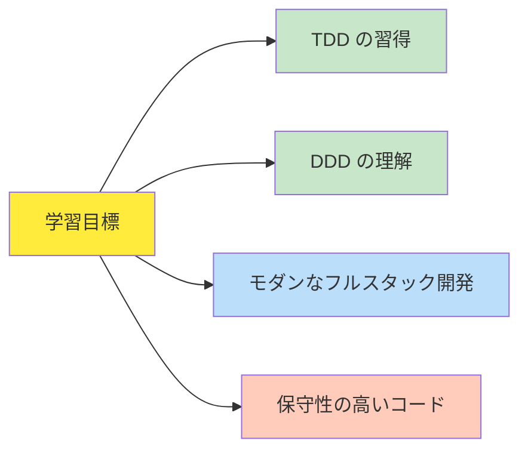
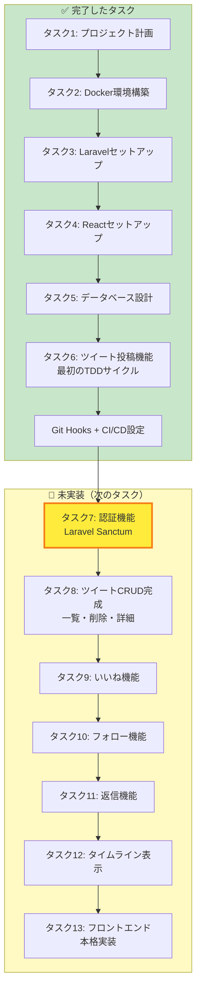
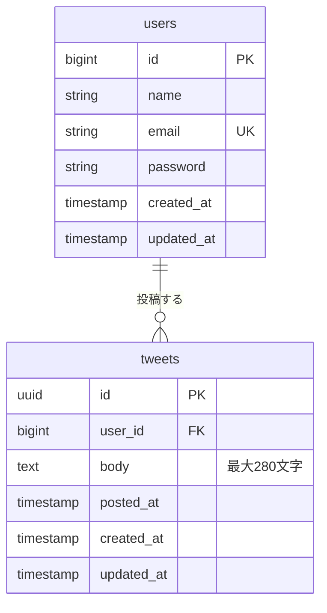
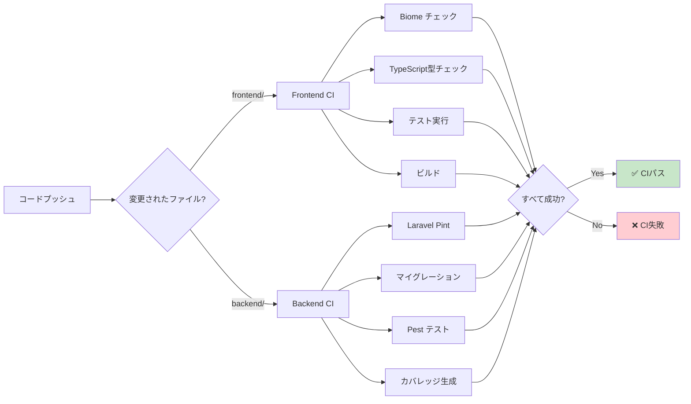
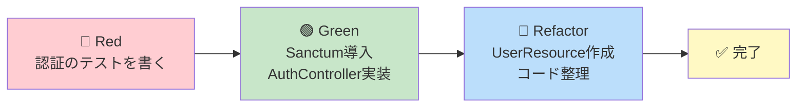
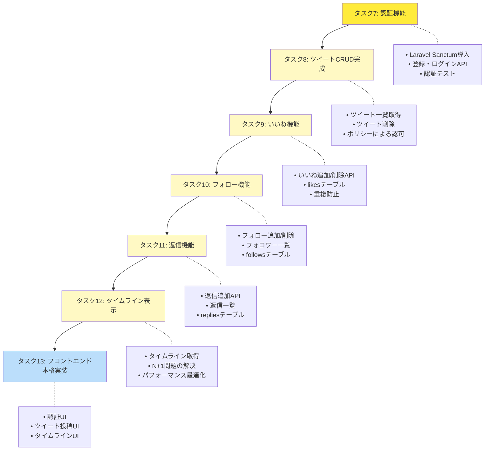
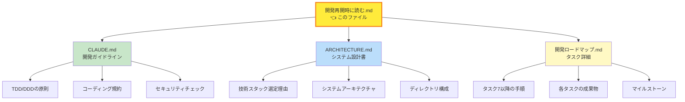
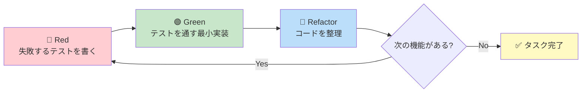
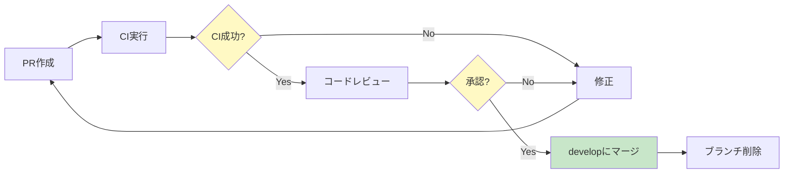
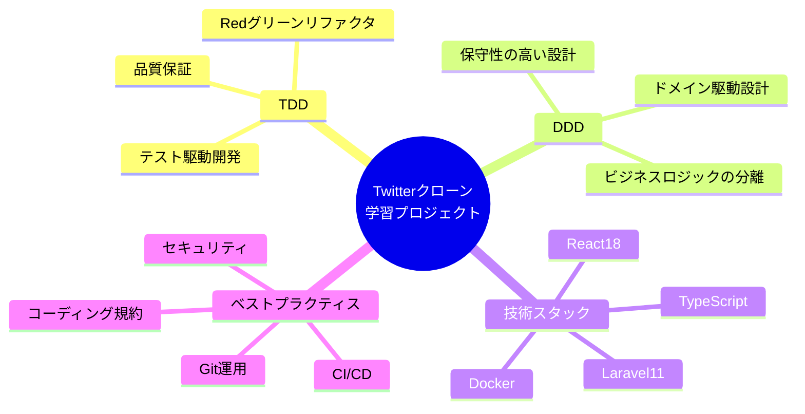

# 📚 開発再開時に読むドキュメント

**作成日**: 2025-11-17
**対象者**: 新人エンジニア、開発を再開する方
**目的**: プロジェクトの現状を素早く理解し、スムーズに開発を再開できるようにする

---

## 📋 目次

1. [プロジェクト概要](#1-プロジェクト概要)
2. [現在の開発状況（一目で分かる）](#2-現在の開発状況一目で分かる)
3. [開発再開の手順（最初にやること）](#3-開発再開の手順最初にやること)
4. [プロジェクト構成の理解](#4-プロジェクト構成の理解)
5. [実装済み機能の詳細](#5-実装済み機能の詳細)
6. [次にやるべきタスク](#6-次にやるべきタスク)
7. [重要なドキュメント一覧](#7-重要なドキュメント一覧)
8. [よくある問題と解決方法](#8-よくある問題と解決方法)
9. [開発の進め方](#9-開発の進め方)

---

## 1. プロジェクト概要

### プロジェクト名
**Twitter クローン - TDD/DDD 学習プロジェクト**

### 何を作っているのか？

シンプルなTwitterクローンアプリケーションを、**TDD（テスト駆動開発）** と **DDD（ドメイン駆動設計）** のベストプラクティスを学びながら開発しています。



### 技術スタック

| レイヤー | 技術 | バージョン |
|---------|------|----------|
| **フロントエンド** | React + Vite + TypeScript | React 18, Vite 5 |
| **スタイリング** | Tailwind CSS | 3.x |
| **バックエンド** | Laravel | 11.x |
| **言語** | PHP | 8.2+ |
| **データベース** | PostgreSQL | 16 |
| **開発環境** | Docker Compose | - |
| **テスト（FE）** | Vitest + React Testing Library | - |
| **テスト（BE）** | Pest | 2.x |
| **認証** | Laravel Sanctum | 4.x |
| **コード品質** | Biome（FE）+ Laravel Pint（BE） | - |
| **CI/CD** | GitHub Actions | - |

---

## 2. 現在の開発状況（一目で分かる）

### 📊 プロジェクト進捗マップ



### 現在地

| 項目 | 状態 |
|------|------|
| **最後に完了したタスク** | タスク6: ツイート投稿機能（TDDサイクル） |
| **次のタスク** | タスク7: 認証機能（Laravel Sanctum） |
| **開発フェーズ** | フェーズ1: バックエンド基盤（タスク6〜8） |
| **全体の進捗** | 約 35% 完了 |

### 実装済み機能

✅ **バックエンド（Laravel）**
- ツイート投稿API（`POST /api/tweets`）
- Tweetモデル + Userモデル
- マイグレーション（users, tweets, personal_access_tokens）
- TDDによるフィーチャーテスト（4つのテストケース）
- バリデーション（FormRequest）
- Git Hooks（コミット時の自動チェック）
- GitHub Actions CI/CD（自動テスト・ビルド）

✅ **フロントエンド（React）**
- Vite + TypeScript プロジェクトセットアップ
- Tailwind CSS 設定
- 基本的なコンポーネント構造
- Biome（リンター・フォーマッター）設定

⚠️ **未実装**
- ❌ 認証機能（ログイン・登録）
- ❌ ツイート一覧・削除・詳細
- ❌ いいね機能
- ❌ フォロー機能
- ❌ 返信機能
- ❌ タイムライン表示
- ❌ フロントエンドUIの本格実装

---

## 3. 開発再開の手順（最初にやること）

### ステップ1: 環境の確認と起動

```bash
# 1. プロジェクトディレクトリに移動
cd /home/user/twitter-app

# 2. Dockerコンテナが起動しているか確認
docker ps

# 3. 起動していない場合は起動
docker-compose up -d

# 4. コンテナの状態確認
docker-compose ps
```

**期待される出力**:
```
NAME                  STATUS    PORTS
twitter-app-nginx     Up        0.0.0.0:80->80/tcp
twitter-app-laravel   Up        9000/tcp
twitter-app-react     Up        5173/tcp
twitter-app-db        Up        5432/tcp
```

### ステップ2: 依存関係のインストール

**バックエンド（Laravel）**:
```bash
# Laravel コンテナに入る
docker-compose exec laravel bash

# Composer 依存関係をインストール
composer install

# 環境ファイルが存在するか確認
ls -la .env

# .env がない場合は作成
cp .env.example .env
php artisan key:generate

# マイグレーション実行（データベースセットアップ）
php artisan migrate

# テストが通るか確認
composer test

# コンテナから出る
exit
```

**フロントエンド（React）**:
```bash
# プロジェクトルート（twitter-app/）で
# Git Hooks用の依存関係をインストール
npm install

# フロントエンドディレクトリに移動
cd frontend

# npm 依存関係をインストール
npm install

# 開発サーバーを起動して確認
npm run dev

# 別のターミナルでテストを実行
npm test
```

### ステップ3: 動作確認

| 確認項目 | アクセス先 | 期待される結果 |
|---------|----------|---------------|
| **フロントエンド** | http://localhost:80 | Reactアプリが表示される |
| **バックエンドAPI** | http://localhost:80/api/tweets | 401エラー（認証が必要）が返る |
| **データベース** | `docker-compose exec db psql -U twitter_user -d twitter_db` | PostgreSQL に接続できる |

### ステップ4: Git の状態確認

```bash
# 現在のブランチを確認
git branch

# 最新のコミットを確認
git log --oneline -5

# リモートの状態を確認
git fetch origin
git status
```

---

## 4. プロジェクト構成の理解

### ディレクトリツリー（全体像）

```
twitter-app/
├── 📂 backend/                    # Laravel プロジェクト
│   ├── app/
│   │   ├── Http/
│   │   │   ├── Controllers/       # TweetController.php
│   │   │   └── Requests/          # StoreTweetRequest.php
│   │   └── Models/                # Tweet.php, User.php
│   ├── database/
│   │   └── migrations/            # マイグレーションファイル
│   ├── tests/
│   │   └── Feature/
│   │       └── Tweet/
│   │           └── TweetTest.php  # ツイート投稿のテスト
│   ├── routes/
│   │   └── api.php                # APIルート定義
│   ├── .env.example               # 環境変数テンプレート
│   ├── composer.json              # PHP依存関係
│   └── pint.json                  # Laravel Pint設定
│
├── 📂 frontend/                   # React プロジェクト
│   ├── src/
│   │   ├── components/            # Reactコンポーネント
│   │   ├── services/              # API通信
│   │   ├── types/                 # TypeScript型定義
│   │   ├── App.tsx                # メインコンポーネント
│   │   └── main.tsx               # エントリーポイント
│   ├── package.json               # npm依存関係
│   ├── biome.json                 # Biome設定
│   ├── tailwind.config.js         # Tailwind設定
│   └── vite.config.ts             # Vite設定
│
├── 📂 docker/                     # Docker設定
│   ├── nginx/
│   │   └── default.conf           # Nginxリバースプロキシ設定
│   ├── laravel/
│   │   └── Dockerfile
│   └── react/
│       └── Dockerfile
│
├── 📂 .github/
│   └── workflows/                 # GitHub Actions CI/CD
│       ├── frontend-ci.yml        # フロントエンドCI
│       └── backend-ci.yml         # バックエンドCI
│
├── 📂 .husky/                     # Git Hooks設定
│   └── pre-commit                 # コミット前の自動チェック
│
├── 📂 docs/                       # ドキュメント
│   ├── タスク6.md                 # タスク6の詳細
│   ├── GIT_HOOKS_AND_CI_SETUP.md  # Git Hooks/CI設定
│   └── ...
│
├── 📄 CLAUDE.md                   # 🌟 開発ガイドライン（最重要）
├── 📄 ARCHITECTURE.md             # 🌟 システム設計書（最重要）
├── 📄 開発ロードマップ.md          # 🌟 全タスクの詳細（最重要）
├── 📄 開発再開時に読む.md          # 👈 このファイル
├── 📄 README.md                   # プロジェクト概要
├── 📄 docker-compose.yml          # Docker構成
└── 📄 package.json                # ルートのnpm設定（Husky用）
```

### 重要なファイル・ディレクトリの役割

| ファイル/ディレクトリ | 役割 | いつ見る？ |
|---------------------|------|-----------|
| **CLAUDE.md** | 開発の基本方針、TDD/DDD の詳細 | 開発の考え方を確認したいとき |
| **ARCHITECTURE.md** | システム全体の設計思想 | アーキテクチャを理解したいとき |
| **開発ロードマップ.md** | タスク6以降の詳細な手順 | 次のタスクの実装方法を知りたいとき |
| **backend/tests/** | すべてのテストコード | テストを書く・実行するとき |
| **backend/routes/api.php** | APIエンドポイント定義 | APIルートを確認・追加するとき |
| **frontend/src/** | Reactアプリのソースコード | UIを実装するとき |
| **docker-compose.yml** | Docker環境の定義 | 環境構築・トラブルシューティング |

---

## 5. 実装済み機能の詳細

### 5-1. データベーススキーマ



**実装済みテーブル**:
- ✅ `users` - ユーザー情報
- ✅ `tweets` - ツイート情報
- ✅ `personal_access_tokens` - Sanctum認証用トークン（準備済み）
- ✅ `cache` - キャッシュ用
- ✅ `jobs` - ジョブキュー用

**マイグレーションファイル**:
```
backend/database/migrations/
├── 0001_01_01_000000_create_users_table.php
├── 0001_01_01_000001_create_cache_table.php
├── 0001_01_01_000002_create_jobs_table.php
├── 2025_11_16_083648_create_tweets_table.php
└── 2025_11_16_093952_create_personal_access_tokens_table.php
```

### 5-2. バックエンドAPI

**実装済みエンドポイント**:

| メソッド | エンドポイント | 説明 | 認証 | 実装状況 |
|---------|--------------|------|-----|---------|
| POST | `/api/tweets` | ツイート投稿 | 必要 | ✅ 完了 |

**エンドポイントの詳細**:

#### POST /api/tweets（ツイート投稿）

**リクエスト例**:
```json
{
  "body": "これは私の最初のツイートです！"
}
```

**成功レスポンス（201 Created）**:
```json
{
  "id": "123e4567-e89b-12d3-a456-426614174000",
  "body": "これは私の最初のツイートです！",
  "user": {
    "id": 1,
    "name": "太郎"
  },
  "created_at": "2025-11-16T10:30:00Z",
  "posted_at": "2025-11-16T10:30:00Z"
}
```

**バリデーションルール**:
- `body`: 必須、文字列、最大280文字

**テストカバレッジ**:
- ✅ 認証されていないユーザーは投稿できない（401エラー）
- ✅ 認証済みユーザーは投稿できる（201成功）
- ✅ 本文が空の場合はバリデーションエラー（422エラー）
- ✅ 本文が280文字を超える場合はバリデーションエラー（422エラー）

### 5-3. フロントエンド

**実装済み**:
- ✅ Vite + React + TypeScript プロジェクト
- ✅ Tailwind CSS 設定
- ✅ Biome（リンター・フォーマッター）
- ✅ 基本的なディレクトリ構成

**未実装**:
- ❌ 認証UI（ログイン・登録フォーム）
- ❌ ツイート投稿フォーム
- ❌ ツイート一覧表示
- ❌ いいね・フォローボタン

### 5-4. Git Hooks と CI/CD

**Git Hooks（ローカル）**:
- ✅ Husky + lint-staged による自動チェック
- ✅ コミット時にBiome（フロントエンド）とLaravel Pint（バックエンド）が自動実行
- ✅ コード品質を自動的に保つ

**GitHub Actions CI/CD**:



**CIで実行される内容**:

**フロントエンドCI**（`.github/workflows/frontend-ci.yml`）:
1. Node.js 20.x のセットアップ
2. 依存関係のインストール
3. Biome による lint + format チェック
4. TypeScript 型チェック
5. テスト実行（Vitest）
6. ビルド（Vite）

**バックエンドCI**（`.github/workflows/backend-ci.yml`）:
1. PHP 8.2, 8.3 のマトリックスビルド
2. MySQL サービスコンテナの起動
3. Composer 依存関係のインストール
4. Laravel Pint（コードスタイルチェック）
5. マイグレーション実行
6. Pest テスト実行
7. カバレッジレポート生成

---

## 6. 次にやるべきタスク

### 📍 現在地: タスク6完了 → タスク7へ

### タスク7: 認証機能（Laravel Sanctum）

**目的**:
- Laravel Sanctum を使ったSPA認証の実装
- ユーザー登録・ログイン・ログアウトAPI
- ツイート投稿機能に本格的な認証を統合

**実装する機能**:

| # | 機能 | エンドポイント | 説明 |
|---|------|--------------|------|
| 1 | ユーザー登録 | `POST /api/register` | 新規ユーザー作成 |
| 2 | ログイン | `POST /api/login` | 認証トークン発行 |
| 3 | ログアウト | `POST /api/logout` | 認証トークン削除 |
| 4 | ユーザー情報取得 | `GET /api/user` | ログインユーザー情報 |

**TDDサイクル**:



**詳細な手順**:
👉 **`開発ロードマップ.md`** の「タスク7」セクションを参照してください。

### その後のロードマップ（概要）



---

## 7. 重要なドキュメント一覧

### 必読ドキュメント（優先度順）

| # | ドキュメント | 役割 | いつ読む？ |
|---|------------|------|-----------|
| 1 | **開発再開時に読む.md** | このファイル | 👈 **今ここ！** 開発を再開するとき |
| 2 | **CLAUDE.md** | 開発ガイドライン全体、TDD/DDDの詳細 | 開発の考え方を確認したいとき |
| 3 | **ARCHITECTURE.md** | システム設計書、技術選定の理由 | アーキテクチャを理解したいとき |
| 4 | **開発ロードマップ.md** | タスク6以降の詳細手順 | 次のタスクの実装方法を知りたいとき |
| 5 | **docs/タスク6.md** | タスク6の詳細解説 | TDDサイクルを復習したいとき |
| 6 | **docs/GIT_HOOKS_AND_CI_SETUP.md** | Git Hooks/CI設定 | Git Hooksの使い方を知りたいとき |
| 7 | **README.md** | プロジェクト概要 | 全体の概要を素早く把握したいとき |

### ドキュメントの関係図



---

## 8. よくある問題と解決方法

### 問題1: Dockerコンテナが起動しない

**症状**:
```bash
docker-compose up -d
# エラー: Cannot start service...
```

**原因**:
- ポート80が既に使用されている
- Dockerデーモンが起動していない
- docker-compose.ymlの設定ミス

**解決方法**:
```bash
# 1. ポート使用状況を確認
sudo lsof -i :80

# 2. 既存のコンテナを停止
docker-compose down

# 3. Dockerデーモンを再起動（必要に応じて）
sudo systemctl restart docker

# 4. 再度起動
docker-compose up -d
```

### 問題2: `composer install` が失敗する

**症状**:
```bash
composer install
# エラー: Your requirements could not be resolved...
```

**原因**:
- PHPバージョンが要件を満たしていない
- composer.lockとcomposer.jsonの不整合
- メモリ不足

**解決方法**:
```bash
# 1. PHPバージョンを確認
php -v  # 8.2以上が必要

# 2. Composerキャッシュをクリア
composer clear-cache

# 3. composer.lockを削除して再インストール
rm composer.lock
composer install

# 4. メモリ制限を解除して実行
COMPOSER_MEMORY_LIMIT=-1 composer install
```

### 問題3: マイグレーションが失敗する

**症状**:
```bash
php artisan migrate
# エラー: SQLSTATE[HY000] [2002] Connection refused
```

**原因**:
- データベースコンテナが起動していない
- .envのDB設定が間違っている
- データベースが作成されていない

**解決方法**:
```bash
# 1. データベースコンテナの状態確認
docker-compose ps db

# 2. .envファイルの設定確認
cat .env | grep DB_

# 3. データベースコンテナに接続してDB存在確認
docker-compose exec db psql -U twitter_user -l

# 4. データベースを再作成
docker-compose exec db psql -U twitter_user -c "DROP DATABASE IF EXISTS twitter_db;"
docker-compose exec db psql -U twitter_user -c "CREATE DATABASE twitter_db;"

# 5. マイグレーション再実行
php artisan migrate
```

### 問題4: テストが失敗する

**症状**:
```bash
composer test
# FAILED: tests/Feature/Tweet/TweetTest.php
```

**原因**:
- テスト用データベースが未設定
- マイグレーションが実行されていない
- 環境変数の不整合

**解決方法**:
```bash
# 1. .env.testingファイルを確認
cat .env.testing

# 2. テスト用データベースのマイグレーション
php artisan migrate --env=testing

# 3. データベースをリフレッシュしてテスト実行
php artisan migrate:fresh --env=testing
composer test

# 4. 特定のテストのみ実行してデバッグ
./vendor/bin/pest tests/Feature/Tweet/TweetTest.php --verbose
```

### 問題5: Git Hooksが動作しない

**症状**:
```bash
git commit -m "test"
# pre-commitフックが実行されない
```

**原因**:
- Huskyがインストールされていない
- フックの実行権限がない
- package.jsonの設定ミス

**解決方法**:
```bash
# 1. プロジェクトルートでnpm installを実行
cd /home/user/twitter-app
npm install

# 2. フックの実行権限を確認・付与
ls -la .husky/pre-commit
chmod +x .husky/pre-commit

# 3. フックを手動で再インストール
npx husky install

# 4. 動作確認
git add .
git commit -m "test: verify hooks"
```

### 問題6: フロントエンドのビルドが失敗する

**症状**:
```bash
npm run build
# Error: Build failed...
```

**原因**:
- node_modulesの破損
- TypeScript型エラー
- Vite設定ミス

**解決方法**:
```bash
cd frontend

# 1. node_modulesを削除して再インストール
rm -rf node_modules package-lock.json
npm install

# 2. TypeScript型エラーを確認
npx tsc --noEmit

# 3. Biomeチェックを実行
npm run check

# 4. 開発サーバーで動作確認
npm run dev
```

---

## 9. 開発の進め方

### 9-1. 開発サイクル（TDDの基本）

すべての機能開発は、以下の **Red → Green → Refactor** サイクルで進めます。



**重要な原則**:
1. **テストを先に書く** - 実装前に「期待する動き」を明確にする
2. **最小限の実装** - テストを通すための最小限のコードのみ書く
3. **リファクタリングは最後** - テストが通ってから、コードをきれいにする

### 9-2. 推奨される作業フロー

#### ステップ1: タスクの理解

```bash
# 1. 開発ロードマップを読む
cat 開発ロードマップ.md

# 2. 該当タスクのドキュメントを読む（例: タスク7）
cat docs/タスク7.md  # まだ存在しない場合は開発ロードマップ.mdを参照
```

#### ステップ2: ブランチ作成

```bash
# 1. 最新のdevelopブランチを取得
git checkout develop
git pull origin develop

# 2. 新しいブランチを作成（命名規則: feature/task-X-description）
git checkout -b feature/task-7-authentication

# 3. ブランチの状態確認
git branch
```

#### ステップ3: TDDサイクルを回す

```bash
# 【Red】失敗するテストを書く
cd backend
touch tests/Feature/Auth/AuthenticationTest.php
# テストコードを記述...

# テスト実行（失敗することを確認）
composer test

# 【Green】実装する
# - Sanctumインストール
# - AuthController作成
# - ルート定義

# テスト実行（成功することを確認）
composer test

# 【Refactor】リファクタリング
# - UserResource作成
# - コード整理

# テスト実行（引き続き成功することを確認）
composer test
```

#### ステップ4: コミット

```bash
# 1. 変更をステージング
git add .

# 2. コミット（Git Hooksが自動実行される）
git commit -m "feat(auth): Laravel Sanctum認証を実装"

# 3. リモートにプッシュ
git push -u origin feature/task-7-authentication
```

#### ステップ5: プルリクエスト作成

```bash
# GitHubでプルリクエストを作成
# - タイトル: feat(auth): Laravel Sanctum認証を実装
# - 説明: タスク7の実装内容を記載
# - ベースブランチ: develop
```

### 9-3. コミットメッセージ規約

**Conventional Commits** に従います：

```
<type>(<scope>): <subject>

<body>

<footer>
```

**type の例**:

| type | 意味 | 例 |
|------|------|---|
| `feat` | 新機能 | `feat(auth): ユーザー認証機能を追加` |
| `fix` | バグ修正 | `fix(tweet): 投稿時のバリデーションを修正` |
| `test` | テスト追加・修正 | `test(tweet): ツイート削除のテストを追加` |
| `refactor` | リファクタリング | `refactor(tweet): TweetServiceを分割` |
| `docs` | ドキュメント | `docs(readme): セットアップ手順を更新` |
| `style` | コードスタイル | `style: Laravel Pintでフォーマット` |
| `chore` | ビルド、ツール変更 | `chore: Docker設定を更新` |

**良いコミットメッセージの例**:
```bash
feat(auth): Laravel Sanctum認証を実装

- RegisterRequest, LoginRequest を作成
- AuthController に register, login, logout メソッドを実装
- 認証テスト（9つのテストケース）を追加
- CORS設定を更新

Closes #7
```

### 9-4. レビュー・マージ



---

## 10. 開発再開チェックリスト

開発を再開する前に、以下を確認してください：

### 環境チェック

- [ ] Dockerコンテナが起動している（`docker-compose ps`）
- [ ] データベースに接続できる
- [ ] バックエンドの依存関係がインストールされている（`vendor/`が存在）
- [ ] フロントエンドの依存関係がインストールされている（`frontend/node_modules/`が存在）
- [ ] ルートの依存関係がインストールされている（`node_modules/`が存在 - Husky用）

### 動作確認

- [ ] バックエンドのテストが通る（`composer test`）
- [ ] フロントエンドのテストが通る（`npm test`）
- [ ] フロントエンドがブラウザで表示される（http://localhost:80）
- [ ] バックエンドAPIにアクセスできる（http://localhost:80/api/tweets で401エラー）

### Git確認

- [ ] 最新のコミットを確認した（`git log --oneline -5`）
- [ ] 作業ブランチを確認した（`git branch`）
- [ ] リモートの状態を同期した（`git fetch origin`）
- [ ] コミットされていない変更を確認した（`git status`）

### ドキュメント確認

- [ ] 次のタスク（タスク7）の内容を理解した
- [ ] TDDサイクルの流れを復習した
- [ ] 開発ロードマップを確認した

---

## 11. 新人エンジニア向けアドバイス

### 学習のポイント

1. **焦らず、一つずつ理解する**
   - すべてを一度に理解しようとしない
   - わからないことがあれば、ドキュメントを読み返す
   - 小さな成功を積み重ねる

2. **テストファーストを体で覚える**
   - 最初は違和感があるが、慣れると自然になる
   - テストがあると安心してリファクタリングできる
   - テストは「仕様書」であり「品質保証」

3. **コードを書く前に設計を考える**
   - 「何を作るか」を明確にする
   - データ構造を先に考える
   - 必要なテストケースをリストアップする

4. **わからないことは調べる・質問する**
   - Laravel公式ドキュメントを活用
   - React公式ドキュメントを活用
   - エラーメッセージをよく読む

### 推奨される学習順序

1. **まず全体像を把握**
   - このドキュメント（開発再開時に読む.md）を読む
   - ARCHITECTURE.mdで技術スタックを理解する

2. **TDDサイクルを体験**
   - docs/タスク6.mdを読んで、TDDの流れを理解する
   - 実際にテストを書いて、実装して、リファクタリングする

3. **次のタスクに挑戦**
   - 開発ロードマップ.mdでタスク7の詳細を確認
   - ステップバイステップで実装する

4. **定期的に振り返る**
   - 学んだことをメモする
   - うまくいったこと・うまくいかなかったことを記録する

---

## 12. まとめ

### このプロジェクトで学べること



### 開発再開の最初のステップ

1. ✅ **環境起動**: `docker-compose up -d`
2. ✅ **依存関係インストール**: `composer install` & `npm install`
3. ✅ **テスト実行**: `composer test` & `npm test`
4. ✅ **ドキュメント確認**: 開発ロードマップ.md → タスク7
5. ✅ **ブランチ作成**: `git checkout -b feature/task-7-authentication`
6. ✅ **TDDサイクル開始**: Red → Green → Refactor

### 困ったときは

1. **このドキュメント** の「よくある問題と解決方法」を確認
2. **開発ロードマップ.md** で詳細な手順を確認
3. **CLAUDE.md** で開発の基本方針を確認
4. **GitHub Issues** を確認・作成
5. **エラーメッセージ** をよく読んで調査

---

**最後に**:

このプロジェクトは、あなたがプロフェッショナルなエンジニアになるための実践的な学習教材です。焦らず、楽しみながら、一つずつ積み重ねていきましょう！

**成功の鍵**:
- ✅ 一度に一つのタスクに集中する
- ✅ テストファーストを徹底する
- ✅ わからないことはドキュメントで調べる
- ✅ 小さな成功を喜ぶ

**次のアクション**:
👉 **タスク7（認証機能）** の実装を始めましょう！詳細は `開発ロードマップ.md` を参照してください。

---

**最終更新日**: 2025-11-17
**バージョン**: 1.0.0
**作成者**: Claude（AIアシスタント）

**関連ドキュメント**:
- [CLAUDE.md](./CLAUDE.md) - 開発ガイドライン
- [ARCHITECTURE.md](./ARCHITECTURE.md) - システム設計書
- [開発ロードマップ.md](./開発ロードマップ.md) - タスク詳細
- [README.md](./README.md) - プロジェクト概要
